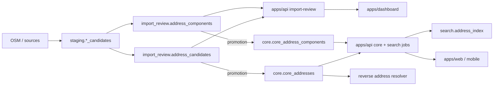

# Address system architecture (developer note)

Internal reference for backend, dashboard, web, mobile, and search engineers. Describes the **target** address model before full implementation. PostgreSQL/PostGIS remains the source of truth; clients never read address tables directly.

**Related:** admin-area boundary and composition policy — [admin-area-boundary-and-address-usage.md](./admin-area-boundary-and-address-usage.md).

**Status:** documentation only (no schema or app changes in this phase).

---

## 1. Layer rules

| Layer | Role for addresses |
|-------|-------------------|
| **PostgreSQL / PostGIS** | Source of truth: structured components, matched entity IDs, geometry, review/promotion state, generated full-address cache |
| **apps/api** | Only layer that reads/writes address tables; validates edits; generates full address text; promotes import_review → core; builds search index rows |
| **apps/dashboard** | Import review and core review UIs; edits **components and match/review fields only** — never persisted full-address strings |
| **apps/web** / **apps/mobile** | Call API for search, display, reverse lookup |
| **Tiles (PMTiles / Martin)** | Map rendering only — **not** address storage or search |

### Table naming (required)

Use these names in migrations, SQL, API, and docs:

| Use | Do not use |
|-----|------------|
| `import_review.address_candidates` | `import_review.import_review_address_candidates` |
| `import_review.address_components` | `import_review.import_review_address_components` |

---

## 2. Design principles

1. **Address components are the structured source of truth.** House number, street name, locality lines, postcode, etc. live as typed rows with `component_type_code`, `component_value`, and `language_code`.
2. **Full address text is readonly and derived.** `full_address`, `full_address_en`, and `full_address_my` (and any neutral display string) are **generated caches** for display and search materialization — not fields the dashboard types into.
3. **Bilingual + neutral language codes** follow the same pattern as core name tables (`core.core_*_names`): `en`, `my`, `und`.
4. **Neutral / non-linguistic values** use `language_code = 'und'`: house number, unit, postcode, plus code, country code, and similar tokens that are not language-specific prose.
5. **Matched IDs vs free text.** Production and review rows link to core entities (`street_id`, `admin_area_id`, `building_id`, `place_id`) where possible; component rows carry resolved names and match metadata when geometry or heuristics produced the line.
6. **Honest confidence.** Reverse and forward address flows expose `confidence_score` and `match_type`; partial or locality-only matches must not be presented as exact street-level addresses.

---

## 3. End-to-end data flow



1. **Ingest** — pipeline fills local staging (`staging_address_candidates`, `staging_address_component_candidates`) from real `addr:*` (and related) tags, not invented polygons for addressing.
2. **Remote review upload** — packages land in `import_review.address_candidates` and child `import_review.address_components`.
3. **Dashboard review** — editors fix components, matched core IDs, review status, and validation; API regenerates preview full addresses.
4. **Promotion** — approved candidates become `core.core_addresses` + `core.core_address_components`.
5. **Search materialization** (later) — batch job builds `search.address_index` from core components + generated full text + geometry.
6. **Runtime** — web/mobile call API search and reverse endpoints; tiles stay unrelated.

---

## 4. Schema responsibilities

### 4.1 `import_review.address_candidates`

Review-unit for one address pin or entrance. Holds workflow and geometry; **not** the primary store for bilingual prose lines (those live in `address_components`).

| Concern | Fields / behavior |
|---------|-------------------|
| **Identity** | `id`, `public_id`, `review_batch_id`, `source_snapshot_version`, `local_staging_id`, `entity_family`, `external_id` |
| **Geometry** | `point_geom`, `entrance_geom` (WGS84 points) |
| **Matched core entities** | `matched_admin_area_id`, `matched_street_id`, `matched_building_id`, `matched_place_id` (and generic `matched_core_id` / `matched_core_table` when needed for diff tooling) |
| **Review workflow** | `review_status`, `review_decision`, `review_note`, `reviewed_by`, `reviewed_at`, assignment/lock fields |
| **Validation** | `validation_warnings`, `validation_errors`, `confidence_score`, `match_status`, `auto_action` |
| **Promotion** | `promotion_status`, `promoted_core_id`, `promoted_at`, `promoted_by` |
| **Source lineage** | `source_refs`, `source_tags` (or tags inside `normalized_data` / `source_refs` per pipeline convention), `normalized_data` |
| **Generated preview (readonly in UI)** | `full_address`, `full_address_en`, `full_address_my` — API-generated from components for list/detail; dashboard must not PATCH these |

Legacy flat columns on the current `address_candidates` row (`street_name`, `township`, etc.) are import/staging convenience; **new work should treat `address_components` as authoritative** and migrate UI/API toward component editing.

---

### 4.2 `import_review.address_components`

Child rows: **editable structured address parts** for one `address_candidate_id`.

| Field | Purpose |
|-------|---------|
| `address_candidate_id` | FK to parent candidate |
| `component_type_code` | Role in the address (from `ref.ref_address_component_types`, e.g. `house_number`, `street`, `village`, `township`, `postcode`) |
| `component_value` | Text token for that role and language |
| `language_code` | `en`, `my`, or `und` (see §5) |
| `confidence` | 0–100 confidence for **this line in this address** |
| `match_metadata` | JSON: `match_type`, `admin_area_id`, `boundary_status`, `address_usage`, etc. when the line came from admin-area or entity matching |
| `source_metadata` | JSON: OSM tag keys, import pass, reviewer overrides |
| `sort_order` | Display / generation order |
| `source_refs` | Lineage |

Dashboard and import-review API may **create, update, delete** component rows. They must **not** expose direct edit of parent `full_address*` columns.

---

### 4.3 `core.core_addresses`

Production address identity after promotion.

| Concern | Storage |
|---------|---------|
| **Identity** | `id`, `public_id`, `source_type_id`, `source_refs`, soft-delete |
| **Geometry** | `point_geom`, `entrance_geom` (and optional `geom` if needed) |
| **Structural FKs** | `street_id`, `admin_area_id`; links to building/place via junction tables where applicable (`core.core_place_addresses`, building relations) |
| **Scalar shortcuts** | `house_number`, `unit_number`, `postal_code` — denormalized convenience; still subordinate to `core_address_components` |
| **Generated cache** | `full_address` (and `full_address_en` / `full_address_my` when added) — **regenerated** when components or matched IDs change |

`core.core_addresses` is not a second source of truth for bilingual strings; components are.

---

### 4.4 `core.core_address_components`

Production bilingual structured components — same conceptual model as import_review, keyed by `address_id`.

- `component_type_code`, `component_value`, `language_code`, `sort_order`
- Uniqueness policy: one row per (`address_id`, `component_type_code`, `language_code`, `component_value`) unless product rules allow duplicates with disambiguation
- Promotion copies validated import_review components; API may enrich from matched `street_id` / `admin_area_id` name tables

Continue the **separate name table** pattern used elsewhere in core (`core_admin_area_names`, `core_place_names`, …): entity names live in `*_names` with `language_code`; address **lines** live in `core_address_components`.

---

### 4.5 `search.address_index`

**Generated later** (batch/materialized), not edited by dashboard.

| Role | Notes |
|------|-------|
| Partial and full address search | Tokenized/normalized text per language |
| Geometry | Point (and optional bounds) for spatial bias |
| Provenance | `address_id` → `core.core_addresses` |

> **Note:** Migration `023_prepare_core_search_routing_address.sql` introduced `search.search_addresses` as an early placeholder. The target production search table name is **`search.address_index`**; rename or replace when the indexer is implemented.

Indexer inputs: generated `full_address*`, component tokens, matched street/admin names from core name tables, postcode/plus code (`und`), and coordinates.

---

## 5. Language codes

| Code | Use |
|------|-----|
| `en` | English display strings (street name, locality names when entered in English) |
| `my` | Myanmar script strings |
| `und` | Undetermined / language-neutral: house number, unit, postcode, postal code, plus code, country code `MM`, numeric tokens |

**Rule:** Do not store the same semantic line twice under `en` and `my` unless both translations exist; missing language falls back per API display policy (often `und` → `en` → `my`).

---

## 6. Full address generation

- **Input:** ordered `address_components` + matched `street_id` / `admin_area_id` (names from core name tables) + scalar fields on `core_addresses`.
- **Output:** `full_address` (default/neutral), `full_address_en`, `full_address_my` — single concatenation ruleset in **apps/api** only.
- **Wording policy:** respect admin-area `address_usage` (see related doc): official vs locality-hint vs excluded — e.g. prefix “Near …” for `locality_hint`, not inside-polygon official copy.
- **Dashboard:** show generated strings as readonly; “Save” persists components and matches only, then refreshes preview from API.

---

## 7. Reverse address resolver

API capability (not a separate truth table): given a map click point, return **zero or more** candidate addresses ranked by confidence.

| Behavior | Requirement |
|----------|-------------|
| Exact match | Point near entrance / building / known address point with high confidence |
| Partial match | Township or locality-only — return with lower `confidence_score` and explicit `match_type` (e.g. `parent_fallback`, `nearest_centroid`, `locality_hint`) |
| Display | Must not label a partial/locality result as a precise street number address |
| Metadata | Reuse per-component `boundary_status`, `address_usage`, `match_type` from admin-area policy ([admin-area-boundary-and-address-usage.md](./admin-area-boundary-and-address-usage.md) §5–§9) |

Resolver reads **core** tables (and ref metadata), not tiles.

---

## 8. Admin areas and official boundaries

**Rule:** Approximate village or `settlement_extent` admin areas must **not** be silently treated as official address boundaries. Use them only as **locality hints** unless `address_usage` allows official use (`official` on a trusted `boundary_status`).

When composition picks an admin-area component:

- Copy `boundary_status`, `address_usage`, and match-derived `confidence_score` into component `match_metadata`.
- Cap confidence for `approximate` / `settlement_extent` / nearest-centroid matches per [admin-area-boundary-and-address-usage.md](./admin-area-boundary-and-address-usage.md) §6.

Never promote `settlement_extent` to official boundary language in generated `full_address*` strings.

---

## 9. Dashboard editing contract

| Editable | Not editable (API readonly / generated) |
|----------|----------------------------------------|
| `import_review.address_components` rows | `full_address`, `full_address_en`, `full_address_my` on candidate or core row |
| `matched_admin_area_id`, `matched_street_id`, `matched_building_id`, `matched_place_id` | Direct PATCH to `core.core_addresses.full_address*` from dashboard |
| `review_status`, `review_decision`, `review_note` | Tiles or client-side string assembly |
| Validation resolution (clear errors, approve/reject) | |

All persistence goes through **apps/api** → database.

---

## 10. Promotion summary

| From | To |
|------|-----|
| `import_review.address_candidates` (approved) | `core.core_addresses` |
| `import_review.address_components` | `core.core_address_components` |
| Matched IDs on candidate | `street_id`, `admin_area_id`, place/building links |
| Post-promotion job | `search.address_index` rows |

Promotion SQL and verification live under `apps/api/src/modules/import-review/` (entity family `addresses` → `core.core_addresses`).

---

## 11. Quick reference

```
import_review.address_candidates     → review identity, geometry, matched IDs, workflow
import_review.address_components     → editable structured parts (source of truth in review)

core.core_addresses                  → production identity, geometry, FKs, generated full_address*
core.core_address_components         → production bilingual components

search.address_index                 → generated search index (later)

apps/api                             → DB access, validation, generation, promotion, search, reverse
apps/dashboard / apps/web            → API only; components + matches + review fields
tiles                                → map render only
```

---

## 12. Existing artifacts (implementation map)

| Artifact | Notes |
|----------|-------|
| `infrastructure/database/migrations/supabase/024_create_import_review_schema.sql` | `import_review.address_candidates` (flat columns today) |
| `infrastructure/database/migrations/supabase/023_prepare_core_search_routing_address.sql` | `core.core_addresses`, `core.core_address_components`; early `search.search_addresses` |
| `infrastructure/database/migrations/local/003_prepare_stage_e_staging_candidates.sql` | Staging address + component candidates |
| `tools/data-pipeline/local-osm/remote-review-entity-config.ts` | `address_candidates` + child `address_components` package |
| `docs/import-review/entity-coverage-matrix.md` | P5 addresses / components coverage |
| `docs/admin-area-boundary-and-address-usage.md` | Boundary metadata for composition |

Gaps to close in later phases: `import_review.address_components` table, matched `*_id` column names on review candidates, bilingual `full_address_en` / `full_address_my`, `search.address_index`, import-review dashboard entity, reverse resolver endpoint.
