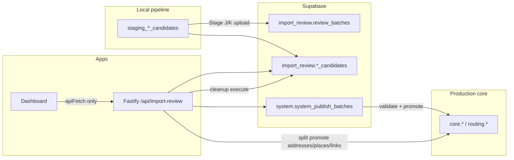

# Import Review — End-to-End Inspection Report

**Scope:** Read-only inspection (no code changes in the inspection pass).  
**API prefix:** `/api/import-review` (registered in `apps/api/src/app.ts`).  
**Architecture check:** Dashboard uses `apiFetch` → API only; no Prisma/DB access under `apps/dashboard` import-review code.

**Related artifacts**

| Artifact | Purpose |
|----------|---------|
| [`apps/api/docs/import-review-auth.md`](../../apps/api/docs/import-review-auth.md) | API authentication |
| [`apps/api/scripts/import-review-admin-curl-examples.sh`](../../apps/api/scripts/import-review-admin-curl-examples.sh) | Curl examples |
| [`entity-coverage-matrix.md`](./entity-coverage-matrix.md) | Pipeline/API coverage (partially outdated — see section G) |
| [`import-review-ui-feature-matrix.md`](./import-review-ui-feature-matrix.md) | Dashboard UI parity (partially outdated — see section G) |

**Last inspected:** 2026-05-29 (entity completeness, database schema, route registration, local build/test checks, validation logic, promotion-to-core, dashboard UX flow)

---

## A. Existing entity families supported

### API canonical families (13)

From `IMPORT_REVIEW_ENTITY_FAMILIES` in `apps/api/src/modules/import-review/import-review-config.ts`:

| API family | `import_review` candidate table | Core target (promotion config) | Risk / notes |
|------------|----------------------------------|--------------------------------|--------------|
| `buildings` | `building_candidates` | `core.core_map_buildings` | Low; reference path |
| `places` | `place_candidates` | `core.core_places` | Low |
| `roads` | `road_candidates` | `core.core_streets` | High; routing validation; env-gated promotion |
| `bus_stops` | `bus_stop_candidates` | `core.core_bus_stops` | Low |
| `bus_routes` | `bus_route_candidates` | `core.core_bus_routes` | Medium |
| `bus_route_variants` | `bus_route_variant_candidates` | `core.core_bus_route_variants` | Medium |
| `bus_route_stops` | `bus_route_stop_candidates` | `core.core_bus_route_stops` | Medium |
| `landuse` | `landuse_candidates` | `core.core_map_landuse` | Low |
| `water_lines` | `water_line_candidates` | `core.core_map_water_lines` | Low |
| `water_polygons` | `water_polygon_candidates` | `core.core_map_water_polygons` | Low |
| `addresses` | `address_candidates` | `core.core_addresses` | Medium; **split promotion**, not batch `PROMOTABLE` |
| `admin_areas` | `admin_area_candidates` | `core.core_admin_areas` | Medium; high-risk tier |
| `routing_barriers` | `routing_barrier_candidates` | `routing.routing_barriers` | High; env-gated |

### Batch promotion tiers (`import-review-promotion-config.ts`)

| Tier | Families |
|------|----------|
| **Default batch create** | buildings, places, landuse, water_lines, water_polygons, bus_routes, bus_route_variants, bus_stops |
| **Validatable in batch runner** | Same as default **except no `roads`** |
| **Promotable in batch runner** | Validatable + **roads**, **admin_areas**, **routing_barriers** (not **addresses**) |
| **High-risk (need `allow_high_risk_families`)** | roads, addresses, admin_areas, routing_barriers |

### Child / staging-only entities (no dedicated `import_review` table)

Documented in [`entity-coverage-matrix.md`](./entity-coverage-matrix.md): place names, road names, admin names, bus stop/route names, address components, routing roads, turn restrictions. These ride in parent `normalized_data` / related migrations, not separate review queues.

### Database foundation

- **`import_review` schema:** [`024_create_import_review_schema.sql`](../../infrastructure/database/migrations/supabase/024_create_import_review_schema.sql) — `review_batches` + per-family candidate tables, review/promotion columns, geometry.
- **`system` schema:** [`022_upgrade_supabase_system_tracking.sql`](../../infrastructure/database/migrations/supabase/022_upgrade_supabase_system_tracking.sql) — `system_publish_batches`, publish items, review logs/tasks; [`025_system_publish_stage_logs.sql`](../../infrastructure/database/migrations/supabase/025_system_publish_stage_logs.sql) — stage logs.
- **Follow-ons:** address components/workflow (`041`–`056`), routing graph/barriers (`049`, `052`, `060`), list indexes (`051`, `059`), promotion repair (`027`), building-type ref (`061`–`064`).

---

## B. Existing dashboard pages/routes

Base: `/dashboard/import-review` (`IMPORT_REVIEW_PATH`).

| Route | Purpose |
|-------|---------|
| `/dashboard/import-review` | Overview: summary, batch picker, family rollups |
| `/dashboard/import-review/buildings` | Shared `ImportReviewEntityPageShell` |
| `/dashboard/import-review/places` | Shared shell |
| `/dashboard/import-review/roads` | Shared `ImportReviewEntityPageShell` (routing editor UX only on `/data-review/roads`) |
| `/dashboard/import-review/bus-routes` | Shared shell |
| `/dashboard/import-review/bus-route-variants` | Shared shell |
| `/dashboard/import-review/bus-route-stops` | Shared shell |
| `/dashboard/import-review/bus-stops` | Shared shell |
| `/dashboard/import-review/landuse` | Shared shell |
| `/dashboard/import-review/water-lines` | Shared shell |
| `/dashboard/import-review/water-polygons` | Shared shell |
| `/dashboard/import-review/addresses` | Shared shell + **`ImportReviewAddressDetailDrawer`** |
| `/dashboard/import-review/admin-areas` | Shared shell |
| `/dashboard/import-review/routing-barriers` | Shared shell |
| `/dashboard/import-review/[family]` | Redirect unknown slugs; roads → `/roads` |
| `/dashboard/import-review/promotion` | Batch create, ready candidates, cleanup panel |
| `/dashboard/import-review/promotion/[batchId]` | Validate / promote / verify / road & barrier dry-runs |
| `/dashboard/import-review/history` | Review + publish batch lists |
| `/dashboard/import-review/history/review-batches/[id]` | Review batch detail |
| `/dashboard/import-review/history/publish-batches/[id]` | Publish batch detail, items, logs |

**Also:** `/data-review/{buildings,places,roads}` reuses legacy clients with sidebar map (`showMapPreview`).

**Nav:** `ImportReviewSubNav` — Overview, all 13 entities, Promotion, History.

**Shared libs:** `apps/dashboard/src/lib/importReview*.ts` (snapshot scope, query client, entity config shim, dev admin token).

---

## C. Existing API endpoints/routes

All under **`/api/import-review`**, guarded by `authenticateImportReview` + `requireImportReviewAdmin` (see auth docs).

### Scope & options

| Method | Path | Role |
|--------|------|------|
| GET | `/summary` | Scoped counts by family |
| GET | `/batches` | Review batch list |
| GET | `/options` | Form options (cached) |
| GET | `/reference-options` | Ref tables for dropdowns |

### Generic family routes (`/:family/...`)

| Method | Path | Role |
|--------|------|------|
| GET | `/:family` | List candidates |
| GET | `/:family/:id` | Detail |
| GET | `/:family/filter-options` | Filter facets |
| PATCH | `/:family/:id/decision` | Review decision |
| PATCH | `/:family/:id/overrides` | Overrides |
| POST | `/:family/bulk-decision` | Bulk decisions |

### Legacy dedicated (still registered alongside generic)

| Method | Path |
|--------|------|
| GET/PATCH | `/buildings`, `/buildings/:id`, `/buildings/bulk-decision`, `/buildings/filter-options` |
| GET/PATCH | `/places`, `/places/:id`, `/places/bulk-decision` |
| GET/PATCH/POST | `/roads`, `/roads/:id`, `/roads/bulk-decision`, `/roads/dry-run-summary`, `/roads/:id/validate-routing` |

### Promotion (system publish batches)

| Method | Path |
|--------|------|
| GET | `/promotion/ready`, `/promotion/ready-candidates`, `/promotion/batch-eligibility` |
| GET | `/promotion/batches`, `/promotion/batches/:id` |
| POST | `/promotion/batches` (create / dry-run) |
| POST | `/promotion/batches/:id/validate` |
| GET | `/promotion/batches/:id/progress`, `/logs`, `/verify` |
| POST | `/promotion/batches/:id/promote` |
| POST/GET | `/promotion/batches/:id/road-dry-run` |
| POST/GET | `/promotion/batches/:id/routing-barrier-dry-run` |
| POST | `/promotion/batches/repair-invalid-promoted` |

### Split promotion (addresses / places / links)

| Method | Path |
|--------|------|
| POST | `/addresses/validate`, `/addresses/promote-dry-run`, `/addresses/promote` |
| POST | `/places/validate`, `/places/promote-dry-run`, `/places/promote` |
| POST | `/place-address-links/validate`, `.../promote-dry-run`, `.../promote` |
| POST | `/addresses/infer-admin-components` |
| GET/PATCH | `/addresses/:id/options`, `/components`, `/matches`, `/place-status` |
| POST | `/addresses/:id/create-place-candidate` |

### History

| Method | Path |
|--------|------|
| GET | `/history/review-batches`, `/history/review-batches/:id` |
| GET | `/history/publish-batches`, `.../:id`, `.../:id/items`, `.../:id/logs` |

### Cleanup

| Method | Path |
|--------|------|
| POST | `/cleanup/promoted/dry-run`, `/cleanup/promoted/execute` |

---

## D. Existing validation flows

1. **Review decisions** — PATCH decision + bulk-decision; updates `review_status`, `review_decision`, `review_note`, reviewer metadata on candidates.
2. **Overrides** — PATCH overrides (family generic + building/road dedicated); essential-field defaults enforced server-side.
3. **Road per-candidate routing** — `POST /roads/:id/validate-routing` + structured validation in legacy roads UI.
4. **Address workflow** — `POST /addresses/validate`; drawer uses matches, components, place-status, create-place-candidate; optional reverse-geocode suggestions.
5. **Place / link validation** — `POST /places/validate`, `POST /place-address-links/validate` (API + `api.ts`; used from address drawer promotion).
6. **Publish batch validation** — `POST /promotion/batches/:id/validate` runs staged pipeline (`load_batch` → … → `validate_entity_specific_rules` → `write_validation_summary`). Per-item stages in `IMPORT_REVIEW_PUBLISH_ITEM_VALIDATION_STAGES`.
7. **Non-validatable families in batch** — Items for families **not** in `VALIDATABLE_PUBLISH_FAMILIES` (e.g. **roads**) are **`markUnsupportedSkipped`** during batch validation.
8. **Pre-promotion dry-runs** — Road dry-run and routing-barrier dry-run on publish batch; address/place/link dry-run on split endpoints.

---

## E. Existing promotion flows

### 1. Unified publish batch (buildings-first, multi-family)

```text
Approved candidates (promotion_status ready)
  → POST /promotion/batches (entity_families, optional dry_run)
  → POST .../validate (async 202)
  → poll GET .../progress, .../logs
  → POST .../promote (confirm_warnings optional)
  → GET .../verify
```

- Writes **`system.system_publish_batches`** / items → **`core.*`** (and `routing.routing_barriers`).
- **Roads:** promotable but batch validation skips them; separate **road-dry-run** endpoints; live promote gated by `ENABLE_IMPORT_REVIEW_ROAD_PROMOTION` / bulk limits.
- **Routing barriers:** similar env flags + dry-run panel on batch detail.

### 2. Split promotion (addresses ecosystem)

In **`ImportReviewAddressDetailDrawer`**: per-row promote/dry-run for address, linked place, and place–address link via dedicated POST endpoints (not publish-batch runner).

### 3. Operational repair

`POST /promotion/batches/repair-invalid-promoted` — API only; **no dashboard UI**.

### Env gates (`import-review-config.ts`)

| Flag | Effect |
|------|--------|
| `ENABLE_IMPORT_REVIEW_PERMANENT_CLEANUP` | Allows cleanup **execute** |
| `ENABLE_IMPORT_REVIEW_ROAD_PROMOTION` | Road batch promote |
| `ENABLE_IMPORT_REVIEW_ROAD_BULK_PROMOTION` | Removes 3-item road cap |
| `ENABLE_IMPORT_REVIEW_ADMIN_AREA_BULK_PROMOTION` | Admin-area bulk cap |
| `ENABLE_IMPORT_REVIEW_ROUTING_BARRIER_PROMOTION` | Barrier live promote |
| `ENABLE_IMPORT_REVIEW_ADDRESS_PROMOTION` | Address split promote execute |

---

## F. Existing history/cleanup flows

### History (dashboard + API)

- **Review batches:** `import_review.review_batches` — upload metadata, status, family list, counters; list/detail in History UI.
- **Publish batches:** `system.system_publish_batches` — validation/promotion status, summaries; detail shows items + **`system_publish_stage_logs`**.
- Overview page uses **`GET /summary`** for live scoped metrics (not the same as history archive, but aligned).

### Cleanup / hiding promoted rows

- **`POST /cleanup/promoted/dry-run`** — counts eligible deletions per family with reasons (`not_promoted`, `core_row_missing`, `verification_failed`, etc.).
- **`POST /cleanup/promoted/execute`** — requires exact confirmation `"DELETE PROMOTED REVIEW DATA"` + `ENABLE_IMPORT_REVIEW_PERMANENT_CLEANUP=true`.
- **Supported families (API):** buildings, places, landuse, water_*, bus_stops, roads, addresses, admin_areas, routing_barriers — **not** bus_routes / variants / route_stops.
- **Dashboard:** `ImportReviewPromotionCleanupPanel` on promotion page (dry-run always; execute when API reports `execute_enabled`).

“Hiding” promoted rows in **lists** is via `include_promoted` query (default false) on list endpoints — UI toggle on entity pages.

---

## G. Missing or broken-looking links (dashboard ↔ API ↔ DB)

| Gap | Detail |
|-----|--------|
| **Stale docs** | `entity-coverage-matrix.md` and `import-review-ui-feature-matrix.md` (2026-05-20) say buildings-only promotion and legacy buildings/places clients — **code has moved on** (shared shell, multi-family batch). |
| **Roads: validate vs promote** | Roads in publish batch are **skipped** in validation runner but listed as **promotable**; promotion relies on road-dry-run + env flags — easy to create a batch that “validates” without exercising roads. |
| **Addresses in promotion UI** | High-risk checkbox includes `addresses`, but **`addresses` ∉ `PROMOTABLE_PUBLISH_FAMILIES`** — batch path won’t promote them; only split drawer APIs work. |
| **`infer-admin-components`** | API exists; **no dashboard caller**. |
| **`repair-invalid-promoted`** | API exists; **no dashboard UI**. |
| **Cleanup vs bus graph** | Dashboard cleanup list matches API mostly; **bus_routes / variants / route_stops** promoted via batch have **no cleanup support** — promoted rows may linger in `import_review`. |
| **Child name tables** | No `import_review.*_name_candidates` tables — names only via parent JSON unless future migrations. |
| **404 error text** | Family routes use `Unknown import-review entity family: ` with **empty** family in message (copy/paste bug in `import-review.routes.ts`). |
| **Legacy dead code** | `ImportReviewBuildingsClient` still in repo; **buildings route uses shared shell** — legacy only for `/data-review/buildings`. |
| **Turn restrictions** | Mentioned in migration 024 comments; **not** in API `IMPORT_REVIEW_ENTITY_FAMILIES`. |

---

## H. Red flags (possible runtime failure)

1. **Production misconfiguration** — `IMPORT_REVIEW_ADMIN_TOKEN` / JWT admin / `NEXT_PUBLIC_IMPORT_REVIEW_ADMIN_TOKEN` mismatch → 401/403 on all import-review calls.
2. **Destructive cleanup** — Dry-run works without flag; **execute** blocked unless `ENABLE_IMPORT_REVIEW_PERMANENT_CLEANUP=true` — operators may think dry-run success implies delete works.
3. **Road promotion without flags** — Promote appears available in UI but fails or no-ops if `ENABLE_IMPORT_REVIEW_ROAD_PROMOTION` is false.
4. **Batch ambiguity** — Multiple `review_batches` per snapshot → **409** unless `review_batch_id` or `latest=true`; dashboard batch picker mitigates but URL bookmarking without batch id can break.
5. **Separate DB URL** — Import review uses `IMPORT_REVIEW_DATABASE_URL` / bootstrap schema check; pointing API at wrong DB → empty lists or schema errors at startup.
6. **`AUTH_BYPASS`** — Correctly **does not** apply to import-review; do not assume global dev bypass covers it.
7. **Prisma raw SQL errors** — Dashboard masks internal errors in production (`importReviewDetailErrors.ts`) — may hide migration drift until logs are checked.
8. **Outdated operator docs** — Following `entity-coverage-matrix.md` alone will mis-plan bus/address promotion.

---

## I. What is already production-safe

- **Layering:** Dashboard → HTTP API → Postgres only on API; aligns with AGENTS.md.
- **Auth:** Dedicated guard; symmetric token or JWT admin; OPTIONS exempt; documented in `import-review-auth.md` + curl script.
- **Input validation:** Zod/OpenAPI schemas on routes; structured error handler.
- **Scoped queries:** `review_batch_id` vs `source_snapshot_version` + `latest` resolution.
- **Promotion safety:** Multi-stage validation, warning confirmation, publish stage logs, batch verify endpoint, repair script (API).
- **Feature flags** for roads, barriers, address promote, permanent cleanup.
- **Cleanup safeguards:** Confirmation string + dry-run first + per-row eligibility reasons.
- **Tests:** OpenAPI family enum, list-query contracts, essential fields, API error shaping, dashboard route/family mapping tests.
- **Performance:** Migration `059` list indexes for building/road lists; form-options caching.
- **Audit trail:** `system.system_publish_stage_logs`, publish batch logs/history endpoints.

---

## J. What to fix first (ranked)

| Priority | Item | Why |
|----------|------|-----|
| **P0** | Refresh **`docs/import-review/*` matrices** to match current API/dashboard | Prevents wrong operational decisions (still says buildings-only promotion). |
| **P0** | Clarify **roads batch workflow** (validate skip vs promote vs road-dry-run) in UI copy and/or align validation runner | Highest risk of “validated” batches that did not validate roads. |
| **P1** | **Addresses:** remove or disable `addresses` in batch family picker unless batch promotion is implemented | Misleading high-risk checkbox vs split-only promote path. |
| **P1** | **Cleanup coverage** for bus_routes / variants / route_stops after promotion | Otherwise `import_review` grows unbounded for transit families. |
| **P1** | Fix **404 family error messages** (include actual family slug) | Support/debugging. |
| **P2** | Dashboard for **`repair-invalid-promoted`** and **`infer-admin-components`** (or drop from API surface) | Operational completeness. |
| **P2** | Remove or clearly mark **legacy clients** (`ImportReviewBuildingsClient`) as data-review-only | Reduces maintenance confusion. |
| **P3** | Pipeline Stage J/K + child tables per **entity-coverage-matrix** priorities | Data must exist in `import_review` before review UI matters. |
| **P3** | Turn restrictions / routing_road candidates | Schema comments vs API families gap. |

---

## Quick reference diagram



---

## Entity support completeness audit

Per-family wiring check across DB, API (`/api/import-review`), dashboard config (`apps/dashboard/src/features/import-review/config/entities/*`), and UI. Static code inspection only — runtime status assumes migrations applied and pipeline upload where noted.

### Inspection criteria (13 checks)

| # | Check |
|---|--------|
| 1 | Candidate table or expected source exists in DB migrations |
| 2 | API list endpoint (`GET /:family` or legacy dedicated list) |
| 3 | API detail endpoint (`GET /:family/:id`) |
| 4 | Dashboard route under `/dashboard/import-review/{slug}` |
| 5 | Entity config registered in `importReviewEntityConfigs.ts` |
| 6 | Table columns align with API list response fields |
| 7 | Detail drawer maps family fields correctly |
| 8 | Validation support (per-candidate, batch, or split) |
| 9 | Review decision + bulk decision (`PATCH …/decision`, `POST …/bulk-decision`) |
| 10 | Promotion support (batch or split) |
| 11 | Promotion dry-run where applicable |
| 12 | Cleanup (`POST /cleanup/promoted/*`) and/or hide promoted (`include_promoted=false`) |
| 13 | Known gaps / TODOs |

### Status legend

| Status | Meaning |
|--------|---------|
| **WORKING_LIKELY** | DB + API + dashboard + config wired; no obvious code-level blockers |
| **PARTIAL** | Wired but missing UX, env gates, cleanup, column/drawer gaps, or pipeline data |
| **MISSING** | Expected capability not implemented |
| **BROKEN_RISK** | Wiring conflict likely to fail or mislead at runtime |
| **UNKNOWN** | Cannot confirm without live DB / uploaded batch data |

### Summary table

| Family | DB table/source | API list | detail | validation | review action | promotion | dashboard page | status | notes |
|--------|-------------------|----------|--------|------------|---------------|-----------|----------------|--------|-------|
| **buildings** | `import_review.building_candidates` | Yes (`GET /buildings`, `GET /buildings`) | Yes | Batch publish validation | Yes + bulk | Batch; dry-run on batch create | `/dashboard/import-review/buildings` | **WORKING_LIKELY** | Reference path. Config + drawer map `effective_name_*`, `building_type_display`. Overrides editor. Cleanup + hide promoted. Pipeline Stage J/K implemented. |
| **places** | `import_review.place_candidates` | Yes (`GET /places`, generic) | Yes | Batch only; `POST /places/validate` exists but not on entity drawer | Yes + bulk | Batch validatable + promotable | `/dashboard/import-review/places` | **WORKING_LIKELY** | Shared shell. `supportsPromotion: false` in config is unused metadata. No per-candidate validate UI on drawer. Child `place_name` rows not separate table. |
| **roads** | `import_review.road_candidates` | Yes (`GET /roads`) | Yes | Per-candidate `POST /roads/:id/validate-routing`; **batch validation skips roads** | Yes; bulk **blocked API-side** (`bulkApprovalAllowed: false`) | Batch promotable; env `ENABLE_IMPORT_REVIEW_ROAD_PROMOTION`; batch road-dry-run | `/dashboard/import-review/roads` | **PARTIAL** | Main route uses shared shell **without** routing editor / validate-routing UI (legacy client only on `/data-review/roads`). Table shows raw `name_mm`/`name_en` not effective fields (config TODO). Drawer summary skips road fields. |
| **addresses** | `import_review.address_candidates` + `import_review.address_components` | Yes | Yes (enriched address response) | `POST /addresses/validate` in address drawer | Yes + bulk | **Split only** (`POST /addresses/promote`, promote-dry-run); **not** batch `PROMOTABLE` | `/dashboard/import-review/addresses` | **WORKING_LIKELY** | Dedicated `ImportReviewAddressDetailDrawer`: components, matches, place/link split promote. Table columns match API (`street`, `locality`, `validation_status`, etc.). `POST /addresses/infer-admin-components` has **no dashboard UI**. Cleanup supported. High-risk checkbox on promotion page is misleading for addresses. |
| **admin-areas** | `import_review.admin_area_candidates` | Yes | Yes | Batch publish validation | Yes + bulk | Batch; high-risk (`allow_high_risk_families`) | `/dashboard/import-review/admin-areas` | **PARTIAL** | Wiring complete. Hierarchy / parent ordering risk. Pipeline Stage J/K often placeholder. Bulk cap via `ENABLE_IMPORT_REVIEW_ADMIN_AREA_BULK_PROMOTION`. Cleanup supported. |
| **bus-stops** | `import_review.bus_stop_candidates` | Yes | Yes | Batch publish validation | Yes + bulk | Batch (default families) | `/dashboard/import-review/bus-stops` | **WORKING_LIKELY** | Columns use `effective_stop_code`, `effective_admin_area_name` (API effective-values). Cleanup supported. Pipeline upload may be placeholder. |
| **bus-routes** | `import_review.bus_route_candidates` | Yes | Yes | Batch + entity-specific rules | Yes + bulk | Batch (default families) | `/dashboard/import-review/bus-routes` | **PARTIAL** | No map (`geometryType: none`). Columns `route_code`, `public_name` match shaped list fields. **No cleanup** after promote. Pipeline Stage J/K not implemented. |
| **bus-route-variants** | `import_review.bus_route_variant_candidates` | Yes | Yes | Batch + entity-specific rules | Yes + bulk | Batch (default families) | `/dashboard/import-review/bus-route-variants` | **PARTIAL** | Line geometry map preview. FK to routes. **No cleanup**. Not always in operator workflow until transit pipeline matures. |
| **bus-route-stops** | `import_review.bus_route_stop_candidates` | Yes | Yes | Batch + entity-specific rules | Yes + bulk | Batch (validatable if selected; not in default create list) | `/dashboard/import-review/bus-route-stops` | **PARTIAL** | Junction table UX; no map. **No cleanup**. Depends on variants + stops promoted first. |
| **landuse** | `import_review.landuse_candidates` (+ `032` class_id) | Yes | Yes | Batch publish validation | Yes + bulk | Batch (default families) | `/dashboard/import-review/landuse` | **WORKING_LIKELY** | `landuse_class_display` / `imported_class_code` formatters match API joins. Cleanup supported. Pipeline upload often placeholder. |
| **water-lines** | `import_review.water_line_candidates` | Yes | Yes | Batch publish validation | Yes + bulk | Batch (default families) | `/dashboard/import-review/water-lines` | **WORKING_LIKELY** | Line geometry + vertices in drawer. Cleanup supported. Pipeline upload often placeholder. |
| **water-polygons** | `import_review.water_polygon_candidates` | Yes | Yes | Batch publish validation | Yes + bulk | Batch (default families) | `/dashboard/import-review/water-polygons` | **WORKING_LIKELY** | Polygon map preview. Cleanup supported. Pipeline upload often placeholder. |
| **routing-barriers** | `import_review.routing_barrier_candidates` (+ `052`) | Yes | Yes | Batch (`validationRequiredBeforePromotion`); barrier batch dry-run | Partial — bulk **blocked API-side** (`bulkApprovalAllowed: false`) but dashboard `supportsBulkActions: true` | Batch high-risk; env `ENABLE_IMPORT_REVIEW_ROUTING_BARRIER_PROMOTION`; routing-barrier dry-run | `/dashboard/import-review/routing-barriers` | **BROKEN_RISK** | Drawer maps `effective_barrier_type` / `effective_class_code`. **Dashboard bulk UI vs API bulk block mismatch**. Cleanup supported. |

### Cross-cutting gaps (all families)

| Gap | Affected families |
|-----|-------------------|
| Pipeline Stage J/K upload not implemented | landuse, water-*, bus-*, admin-areas, addresses (placeholder), routing-barriers |
| No cleanup after batch promote | bus-routes, bus-route-variants, bus-route-stops |
| `supportsPromotion` config flag unused in UI | all (metadata only) |
| Generic drawer validation section reads `validation_errors`/`validation_warnings` JSON only | all except addresses (structured validate) and data-review roads (routing banners) |
| Hide promoted rows | all list endpoints via `include_promoted` toggle |
| Child name / component tables not separate review queues | places, roads, admin-areas, bus-*, addresses (components in `address_components`) |

### Checklist matrix (quick reference)

| Family | 1 DB | 2 list | 3 detail | 4 route | 5 config | 6 columns | 7 drawer | 8 validate | 9 review | 10 promote | 11 dry-run | 12 cleanup/hide |
|--------|------|--------|----------|---------|----------|-----------|----------|------------|----------|------------|------------|-----------------|
| buildings | ✓ | ✓ | ✓ | ✓ | ✓ | ✓ | ✓ | batch | ✓ | batch | batch | ✓ |
| places | ✓ | ✓ | ✓ | ✓ | ✓ | ✓ | ✓ | batch | ✓ | batch | batch | ✓ |
| roads | ✓ | ✓ | ✓ | ✓ | ✓ | ~ | ~ | per-candidate* | ✓† | batch‡ | road batch | ✓ |
| addresses | ✓ | ✓ | ✓ | ✓ | ✓ | ✓ | ✓ | split | ✓ | split | split | ✓ |
| admin-areas | ✓ | ✓ | ✓ | ✓ | ✓ | ✓ | ✓ | batch | ✓ | batch‡ | batch | ✓ |
| bus-stops | ✓ | ✓ | ✓ | ✓ | ✓ | ✓ | ✓ | batch | ✓ | batch | batch | ✓ |
| bus-routes | ✓ | ✓ | ✓ | ✓ | ✓ | ✓ | ✓ | batch | ✓ | batch | batch | hide only |
| bus-route-variants | ✓ | ✓ | ✓ | ✓ | ✓ | ✓ | ✓ | batch | ✓ | batch | batch | hide only |
| bus-route-stops | ✓ | ✓ | ✓ | ✓ | ✓ | ✓ | ✓ | batch | ✓ | batch | batch | hide only |
| landuse | ✓ | ✓ | ✓ | ✓ | ✓ | ✓ | ✓ | batch | ✓ | batch | batch | ✓ |
| water-lines | ✓ | ✓ | ✓ | ✓ | ✓ | ✓ | ✓ | batch | ✓ | batch | batch | ✓ |
| water-polygons | ✓ | ✓ | ✓ | ✓ | ✓ | ✓ | ✓ | batch | ✓ | batch | batch | ✓ |
| routing-barriers | ✓ | ✓ | ✓ | ✓ | ✓ | ✓ | ✓ | batch | ✓† | batch‡ | barrier batch | ✓ |

\* Per-candidate routing validation API exists; **not wired** on `/dashboard/import-review/roads` (only on `/data-review/roads`). Batch validation **skips** roads items.  
† Bulk decision blocked server-side for roads and routing-barriers; dashboard may still show bulk UI for routing-barriers.  
‡ Env-gated and/or requires `allow_high_risk_families` on batch create.

---

## Database schema compatibility audit

Static inspection of `infrastructure/database/**`, `apps/api/prisma/schema.prisma`, and import-review API SQL (`apps/api/src/modules/import-review/**`). Goal: determine whether the current **migration-defined** schema supports the import-review dashboard/API safely.

**Verdict:** The schema **can** support import-review safely when the **full Supabase migration chain** is applied to the database the API uses (`DATABASE_URL` or `IMPORT_REVIEW_DATABASE_URL`). Applying **only** migration `024` is **not** sufficient for addresses, place–address links, landuse class FK, routing-barrier promotion targets, or admin inference. API startup checks only that the `import_review` **schema namespace** exists — not individual tables or follow-on migrations.

### Checklist answers (1–13)

| # | Question | Answer |
|---|----------|--------|
| 1 | Does `import_review` schema exist? | Yes — created in `024_create_import_review_schema.sql`. Bootstrap: `verifyImportReviewSchemaOrThrow()` in `import-review-database-url.ts` (namespace only). |
| 2 | Candidates in `import_review` or `staging`? | **API reads/writes `import_review.*` only.** `staging.*` is local pipeline host; dashboard/API never touch it. |
| 3 | Tables used by API SQL? | See **A. Actual schema map** below. |
| 4 | Referenced columns exist in migrations? | **Mostly yes** when migrations `024`–`055`, `032`, `044`, `046`, `052`, `059` applied. **Gaps** if partial apply — see **C. Mismatch list**. |
| 5 | Validation fields present? | Common: `validation_errors`, `validation_warnings` on all candidate tables (`024`). Address-specific: `validation_status`, `promotion_blockers`, `promotion_warnings`, `validated_at` (`042`, extended `045`). Links: `place_address_links.validation_*` (`055`). Places persist validation to JSONB only (no `validation_status` column). |
| 6 | Override fields present? | `review_overrides jsonb` on all candidate tables (`024`). Audit: `import_review.review_candidate_edits` (`024`). |
| 7 | Review status / decision fields? | `review_status`, `review_decision`, `review_note`, `reviewed_by`, `reviewed_at` on all candidates (`024`). |
| 8 | Promotion batch tables? | `system.system_publish_batches`, `system.system_publish_items` extended in `024` + `022`; stage logs in `025`. |
| 9 | Publish / history tables? | Same as above; history API reads `import_review.review_batches` + `system.system_publish_*`. |
| 10 | Promoted rows soft-hidden or deleted? | **Both:** lists default-hide via `promotion_status <> 'promoted'` (`include_promoted` opt-in). **Permanent cleanup** hard-`DELETE`s candidate rows (`import-review-cleanup-promoted.repo.ts` line ~256). |
| 11 | Required indexes for list / promotion? | **Buildings + roads:** composite indexes `051`, `059`. **Other 11 families:** rely on `024` single-column + `(review_batch_id)` indexes — **performance gap**, not hard failure. Promotion uses publish-batch/item indexes from `022`/`024`. |
| 12 | Geometry SRID/type consistent? | Yes — all candidate geom columns declared `geometry(..., 4326)` in `024`. |
| 13 | Score fields 0–100? | Yes — `confidence_score` checks `0..100` on candidates (`024`). `import_review.place_address_links.confidence_score` (`055`). Staging local scale fix in `local/005` (pipeline host only). |

---

### A. Actual schema map (migrations)

#### `import_review` schema

| Table / object | Created / extended by | Role |
|----------------|----------------------|------|
| `review_batches` | 024 | Upload package metadata |
| `building_candidates` | 024 | Building review queue |
| `place_candidates` | 024 | Place review queue |
| `road_candidates` | 024 | Road review queue |
| `address_candidates` | 024; repaired 042; classification 053; validation 045; promotion 046 | Address review queue |
| `admin_area_candidates` | 024 | Admin area queue |
| `bus_stop_candidates` | 024 | Bus stop queue |
| `bus_route_candidates` | 024 | Bus route queue |
| `bus_route_variant_candidates` | 024 | Variant queue |
| `bus_route_stop_candidates` | 024 | Route–stop junction queue |
| `landuse_candidates` | 024; `landuse_class_id` 032 | Landuse queue |
| `water_line_candidates` | 024 | Water line queue |
| `water_polygon_candidates` | 024 | Water polygon queue |
| `routing_barrier_candidates` | 024 | Barrier review queue |
| `routing_turn_restriction_candidates` | 024 | **Not exposed in API families** |
| `review_candidate_edits` | 024 | Override audit trail |
| `review_comments` | 024 | Comments (no dashboard UI) |
| `review_tasks` | 024 | Tasks (no dashboard UI) |
| `address_components` | 041 | Structured address lines |
| `place_address_links` | 055 | Review-time place↔address links |
| `infer_address_admin_components()` | 044 | Admin component inference function |

**Common candidate columns (024):** identity, `review_batch_id`, `source_snapshot_version`, `entity_family`, match/review workflow, `normalized_data`, `source_refs`, `review_overrides`, `matched_core_*`, `f1_comparison`/`f2_comparison`, `validation_errors`/`validation_warnings`, `promotion_status`, `promoted_core_id`, timestamps.

#### `system` schema (publish / history)

| Table | Migrations | Role |
|-------|------------|------|
| `system_publish_batches` | 022, extended 024 | Promotion batches |
| `system_publish_items` | 022, extended 024 | Per-candidate publish items |
| `system_publish_stage_logs` | 025 | Validation/promotion stage audit |
| `system_source_snapshots` | 021/022, metadata 024 | Snapshot lineage |
| `system_review_logs` / `system_review_tasks` | 022 | General review tracking |

#### Promotion targets (core / routing)

| Schema | Tables used on promote | Migration notes |
|--------|------------------------|-----------------|
| `core.*` | `core_map_buildings`, `core_places`, `core_streets`, `core_map_landuse`, `core_map_water_*`, `core_bus_*`, `core_admin_areas`, `core_addresses`, … | Verification cols 026 |
| `routing.*` | `routing_barriers` | **052** (required for barrier promote) |
| `ref.*` | `ref_road_classes`, `ref_building_types`, `ref_landuse_classes`, `ref_admin_levels`, `ref_poi_categories`, … | Joined in list/detail SQL |

#### `staging` schema

Local pipeline only (`infrastructure/database/migrations/local/*`). **Not used by import-review API.**

#### Prisma (`apps/api/prisma/schema.prisma`)

Schemas: `app_auth`, `core`, `ref` only — **no `import_review` models**. Import-review uses raw SQL via `getImportReviewPrisma()` (`import-review-prisma.ts`); intentional separation.

---

### B. API expected schema map

| API surface | Primary tables | Key columns / joins |
|-------------|----------------|---------------------|
| List/detail generic `GET /:family` | `import_review.{family}_candidates` | Common 024 cols + family typed cols; `review_overrides`; optional joins `ref.*`, `core.core_admin_areas` |
| Buildings list | `building_candidates` | + `ref.ref_building_types`; indexes 059 |
| Roads list | `road_candidates` | + `ref.ref_road_classes`, admin inference SQL; indexes 051/059 |
| Addresses list/detail | `address_candidates` | + cols from 042/053; composes display from `address_components` (041) |
| Address components/matches | `address_components`, `address_candidates` | PATCH/GET component rows |
| Place/address link validate/promote | `place_address_links`, `place_candidates`, `address_candidates` | 055 |
| Split address promote | `address_candidates`, `core.core_addresses`, `core.core_address_components` | 046 core cols |
| Promotion batch | `system_publish_batches/items`, all promotable candidate tables | `source_review_batch_id`, `review_candidate_id`, validation summary JSON |
| History | `review_batches`, `system_publish_*`, `system_publish_stage_logs` | |
| Cleanup | candidate tables + `system_publish_items` | hard DELETE when eligible |

SQL builders: `import-review-candidate-sql.ts`, `import-review-list-query-*.ts`, `import-review-promotion-*.ts`, `import-review-cleanup-promoted.repo.ts`, address modules.

---

### C. Mismatch list (file paths + symbols)

| Severity | Symbol / expectation | Migration reality | File(s) |
|----------|---------------------|-------------------|---------|
| **High** | Address list/detail selects `source_entity_type`, `validation_status`, `promotion_blockers`, `source_classification`, … | Added in **042**, **053** — absent in **024-only** DB | `import-review-candidate-sql.ts` (`routeFamily === "addresses"`), `import-review-list-query-family.ts` |
| **High** | `POST /addresses/infer-admin-components` | Requires function **`import_review.infer_address_admin_components`** | `044_infer_address_admin_components.sql`; route in `import-review.routes.ts` |
| **High** | Address components CRUD | Table **`import_review.address_components`** | `041_import_review_address_components.sql` |
| **High** | Place–address link validate/promote | Table **`import_review.place_address_links`** | `055_import_review_place_address_links.sql` |
| **High** | Routing barrier batch promote → `routing.routing_barriers` | Target table from **052** | `import-review-promotion-config.ts` `CORE_TARGETS.routing_barriers`; `052_routing_barriers.sql` |
| **Medium** | Landuse list join `ref.ref_landuse_classes` via `landuse_class_id` | Column added **032** | `import-review-list-query-family.ts` `landuseClassJoin`; `032_import_review_landuse_class_id.sql` |
| **Medium** | Address `validation_status` values `valid`, `valid_with_warnings` | Constraint extended **045** | `045_address_validation_status_codes.sql` |
| **Medium** | `promoted_core_address_id` vs `promoted_core_id` | Both supported; 042 adds alias column | `042` backfill; `import-review-address-responses.ts` |
| **Medium** | Startup safety check | Only `to_regnamespace('import_review')` — **no table-level verification** | `verifyImportReviewSchemaOrThrow()` in `import-review-database-url.ts` |
| **Low** | Missing candidate table | Returns **empty list/count** (not error) | `import-review-generic-candidate.repo.ts` `pgRegclassExists` |
| **Low** | `routing_turn_restriction_candidates` in 024 | **No API family** — dead schema surface | `024` vs `import-review-config.ts` |
| **Low** | List performance indexes | Only buildings/roads have composite migrations | `051`, `059`; other families use 024 indexes only |
| **Info** | Prisma schema omits `import_review` | By design — raw SQL only | `apps/api/prisma/schema.prisma` `schemas = ["app_auth", "core", "ref"]` |

No confirmed **column name typos** between API SQL and a **fully migrated** Supabase DB were found in static review.

---

### D. SQL queries that may fail

| Condition | Failing query area | Error type |
|-----------|-------------------|------------|
| DB has 024 but not 042/053 | `GET /addresses`, address detail, address validate/promote | `column … does not exist` on `source_entity_type`, `validation_status`, `promotion_blockers`, `source_classification`, etc. |
| DB missing 041 | Address components PATCH/GET | `relation "import_review.address_components" does not exist` |
| DB missing 055 | Place–address link validate/promote; place validation join | `relation "import_review.place_address_links" does not exist` |
| DB missing 044 function | `POST /addresses/infer-admin-components` | `function import_review.infer_address_admin_components(…) does not exist` |
| DB missing 032 | Landuse list/detail with class join | `column … landuse_class_id does not exist` |
| DB missing 052 | Routing barrier promote | `relation "routing.routing_barriers" does not exist` |
| DB missing 025 | Promotion/history stage logs | `relation "system.system_publish_stage_logs" does not exist` |
| DB missing `ref.ref_landuse_classes` / `ref.ref_building_types` | List joins | join error or empty labels (LEFT JOIN — usually non-fatal) |
| DB missing `core.*` target on promote | Batch promote execute | FK or INSERT target errors during promotion |
| Partial 024 FK targets missing | Inserts with FK to `ref.*` | constraint violations on write, not list |

Queries that **degrade silently:** generic list when candidate table missing → `0` rows (`import-review-generic-candidate.repo.ts`).

---

### E. Migration gaps

| Gap | Impact |
|-----|--------|
| **No single “import-review bundle” migration** | Operators must apply ordered chain: `022` → `024` → `025` → `026` → `032` → `041`–`046` → `049`/`052` (barriers) → `051`/`059` → `053`–`056` (address workflow) |
| **No automated schema version table** | API cannot detect partial apply; only namespace check |
| **No list indexes for 11/13 families** | Large batches may slow list/filter pages |
| **Turn restriction candidates** | DDL in 024 without API/dashboard — orphaned |
| **Staging → import_review upload** | Pipeline Stage J/K not in SQL migrations; data may be empty even when schema OK |
| **Prisma not modeling import_review** | No compile-time column safety; relies on tests + runtime SQL errors |
| **Cleanup hard-delete** | No soft-archive table; irreversible after `ENABLE_IMPORT_REVIEW_PERMANENT_CLEANUP` execute |

**Recommended minimum Supabase set for full API compatibility:**

```text
022, 024, 025, 026, 027 (repair ops), 032, 041, 042, 043–046, 044, 051, 052, 053–056, 059
```

---

### F. Recommended fix order

| Priority | Action | Why |
|----------|--------|-----|
| **P0** | Verify target Supabase DB has **full migration chain** above (not 024 alone) | Prevents address/link/barrier runtime SQL failures |
| **P0** | Strengthen startup check beyond namespace — verify `import_review.address_components`, `place_address_links`, `system.system_publish_stage_logs`, `routing.routing_barriers` exist | Fail fast instead of mid-request errors |
| **P1** | Add composite list indexes for high-traffic families (places, landuse, addresses) mirroring 059 pattern | Production list performance |
| **P1** | Document required migration order in deploy runbook (link from this doc) | Operator error reduction |
| **P2** | Migration smoke script: run read-only probes for each API family list query | CI/regression against real schema |
| **P2** | Either expose `routing_turn_restriction_candidates` in API or mark DDL deprecated | Schema/API drift |
| **P3** | Optional: add `import_review.schema_migrations` version table written by migration runner | Explicit compatibility negotiation |

---

## Route registration and reachability audit

Static inspection of API registration (`apps/api/src/app.ts`, `server.ts`, `import-review.routes.ts`, OpenAPI) vs dashboard client paths (`apps/dashboard/src/lib/api.ts`, `importReviewDevAccess.ts`). **Reachability** assumes API process running on `NEXT_PUBLIC_API_BASE_URL` (default local port **3001** per `import-review-auth.md`).

**Verdict:** Import-review routes **are registered** under **`/api/import-review`** and match dashboard client paths. No wrong URL prefixes found. Auth mode must match between API env and dashboard (JWT admin vs dev admin token).

---

### A. Route registration chain

```text
apps/api/src/server.ts
  → loadApiEnv() + dotenv (repo .env, then apps/api/.env)
  → buildApp() from apps/api/src/app.ts

apps/api/src/app.ts
  → bootstrapImportReviewDatabase()          // schema namespace check
  → @fastify/cors (allows Authorization, Content-Type, x-import-review-admin-token)
  → prismaPlugin, authPlugin
  → swaggerCorePlugin                        // OpenAPI introspection (before routes)
  → … other route modules …
  → app.register(importReviewRoutes, { prefix: "/api/import-review" })   // line 90
  → swaggerUiPlugin                          // /docs after all routes

apps/api/src/modules/import-review/import-review.routes.ts
  → registerImportReviewPluginErrorHandler
  → registerImportReviewRequestLogging
  → onRequest: authenticateImportReview       // all subtree routes
  → ~64 explicit routes (history, promotion, addresses, buildings, …)
  → registerImportReviewFamilyRoutes()        // LAST: /:family/* generic CRUD

OpenAPI
  → Per-route `schema:` from import-review.openapi.ts
  → Surfaced at GET /docs (swaggerUiPlugin)
  → Tag "Import Review" documented in apps/api/src/plugins/swagger.ts
```

**Route ordering note:** Static paths (`/history/*`, `/promotion/*`, `/buildings`, …) register **before** `/:family` catch-alls, so no shadowing of `promotion`, `history`, or `buildings`.

**Dashboard → API transport:** Browser `fetch` to **`NEXT_PUBLIC_API_BASE_URL`** + path (no Next.js proxy). CORS must allow dashboard origin (`localhost:3000` default in `app.ts`).

---

### B. Endpoint inventory

**Actual prefix:** `/api/import-review`

| Group | Method | Path (relative to prefix) | OpenAPI schema | Auth preHandler |
|-------|--------|---------------------------|----------------|-----------------|
| **Scope** | GET | `/summary` | yes | admin |
| | GET | `/batches` | yes | admin |
| | GET | `/options` | yes | admin |
| | GET | `/reference-options` | yes | admin |
| **History** | GET | `/history/review-batches`, `/history/review-batches/:id` | yes | admin |
| | GET | `/history/publish-batches`, `…/:id`, `…/:id/items`, `…/:id/logs` | yes | admin |
| **Buildings (legacy dedicated)** | GET | `/buildings`, `/buildings/filter-options`, `/buildings/:id` | yes | admin |
| | PATCH | `/buildings/:id/decision`, `/buildings/:id/overrides` | yes | admin |
| | POST | `/buildings/bulk-decision` | yes | admin |
| **Places / roads (legacy dedicated)** | GET | `/places`, `/roads`, `/roads/dry-run-summary` | yes | admin |
| | PATCH | `/places/:id/decision`, `/roads/:id/decision`, `/roads/:id/overrides` | yes | admin |
| | POST | `/roads/:id/validate-routing`, `/places/bulk-decision`, `/roads/bulk-decision` | yes | admin |
| **Generic family (13 families)** | GET | `/:family`, `/:family/filter-options`, `/:family/:id` | yes | admin |
| | PATCH | `/:family/:id/decision`, `/:family/:id/overrides` | yes | admin |
| | POST | `/:family/bulk-decision` | yes | admin |
| **Promotion** | GET | `/promotion/ready`, `/promotion/ready-candidates`, `/promotion/batch-eligibility` | yes | admin |
| | GET/POST | `/promotion/batches`, `/promotion/batches/:id` | yes | admin |
| | POST | `/promotion/batches/:id/validate`, `…/promote` | yes | admin |
| | GET | `/promotion/batches/:id/progress`, `…/logs`, `…/verify` | yes | admin |
| | POST/GET | `/promotion/batches/:id/road-dry-run` | yes | admin |
| | POST/GET | `/promotion/batches/:id/routing-barrier-dry-run` | yes | admin |
| | POST | `/promotion/batches/repair-invalid-promoted` | yes | admin |
| **Cleanup** | POST | `/cleanup/promoted/dry-run`, `/cleanup/promoted/execute` | yes | admin |
| **Addresses workflow** | GET | `/addresses/:id/options` | yes | admin |
| | PATCH | `/addresses/:id/components`, `…/matches`, `…/place-status` | yes | admin |
| | POST | `/addresses/:id/create-place-candidate`, `/addresses/validate`, `/addresses/infer-admin-components` | yes | admin |
| | POST | `/addresses/promote-dry-run`, `/addresses/promote` | yes | admin |
| **Place / link split promote** | POST | `/places/validate`, `/places/promote-dry-run`, `/places/promote` | yes | admin |
| | POST | `/place-address-links/validate`, `…/promote-dry-run`, `…/promote` | yes | admin |

**Total registered handlers:** 64 route registrations in `import-review.routes.ts` (some paths expose both GET and POST, e.g. road/barrier dry-run).

**Implemented but not called by dashboard UI:** see section C gaps.

---

### C. Dashboard client call inventory

Primary client: `apps/dashboard/src/lib/api.ts` (`apiFetch` + typed wrappers). Feature layer: `apps/dashboard/src/features/import-review/api/importReviewApiClient.ts`.

| Dashboard function / usage | HTTP | Path | Used by UI |
|--------------------------|------|------|------------|
| `getImportReviewSummary` | GET | `/api/import-review/summary` | Overview |
| `getImportReviewBuildings` / family list | GET | `/api/import-review/buildings` or `/{family}` | Entity pages |
| `getImportReviewFamilyCandidateById` | GET | `/api/import-review/{family}/{id}` | Drawers |
| `patchImportReview*Decision` / family | PATCH | `…/{id}/decision` | Review actions |
| `patchImportReview*Overrides` / family | PATCH | `…/{id}/overrides` | Override editor |
| `postImportReview*BulkDecision` / family | POST | `…/bulk-decision` | Bulk bar |
| `getImportReviewFormOptions` / `ReferenceOptions` | GET | `/options`, `/reference-options` | Forms |
| `getImportReviewBuildingsFilterOptions` / family | GET | `/buildings/filter-options` or `/{family}/filter-options` | Filters |
| Road validate / dry-run summary | POST/GET | `/roads/{id}/validate-routing`, `/roads/dry-run-summary` | Data-review roads client |
| Address workflow (components, matches, validate, promote) | mixed | `/addresses/…` | Address drawer |
| Place/link validate + promote | POST | `/places/validate`, `/place-address-links/…` | Address drawer |
| Promotion batch lifecycle | mixed | `/promotion/…` | Promotion pages |
| Cleanup | POST | `/cleanup/promoted/…` | Cleanup panel |
| History | GET | `/history/…` | History pages |

**Client wrappers exported but unused in dashboard UI:**

| Function | Path | Notes |
|----------|------|-------|
| `getImportReviewBatches` | GET `/api/import-review/batches` | Batch picker uses summary/scope flow instead |
| `getImportReviewPromotionReady` | GET `/api/import-review/promotion/ready` | UI uses `ready-candidates` only |

**API endpoints with no dashboard caller:**

| Endpoint | Notes |
|----------|-------|
| POST `/promotion/batches/repair-invalid-promoted` | Ops/repair only |
| POST `/addresses/infer-admin-components` | No UI wiring |

---

### D. URL mismatch risks

| Risk | Severity | Detail |
|------|----------|--------|
| Wrong API base URL | **High** | Dashboard requires `NEXT_PUBLIC_API_BASE_URL`; missing → throw at runtime |
| `/api` prefix | **None** | Both sides use `/api/import-review/…` consistently |
| Family slug vs API family | **Low** | Dashboard `resolveImportReviewApiFamily()` maps `bus-stops` → `bus_stops` before fetch |
| Dedicated vs generic building URLs | **None** | `GET /api/import-review/buildings/:id` — dedicated route registered first; family path resolves to same URL |
| `core-review` vs `import-review` | **Info** | Separate prefix `/core-review` (no `/api`) — not confused in client |
| CORS origin | **Medium** | Production dashboard origin must be in API `CORS_ORIGIN` or requests fail browser-side |

**No dashboard calls pointing to non-existent paths** were found in static review.

---

### E. Auth mismatch risks

| Mode | API expectation | Dashboard behavior | Risk |
|------|-----------------|-------------------|------|
| **JWT admin** (`IMPORT_REVIEW_ADMIN_TOKEN` unset) | `Authorization: Bearer` + `roles: ["admin"]` | `apiFetch` sends Bearer from `localStorage.accessToken` | **403** if user lacks admin role |
| **Symmetric token** (`IMPORT_REVIEW_ADMIN_TOKEN` set) | Header `x-import-review-admin-token` exact match; Bearer ignored | Dev: `NEXT_PUBLIC_IMPORT_REVIEW_ADMIN_TOKEN` attached via `attachImportReviewDevAdminTokenHeader`; Bearer **omitted** when header attached | **401** if API has token but dashboard lacks `NEXT_PUBLIC_*` (even with valid JWT) |
| **Dev route bypass** | N/A | `/dashboard/import-review/*` skips login redirect when dev token configured | Production: bypass disabled (`NODE_ENV === "production"`) |
| **AUTH_BYPASS** | Ignored for import-review | N/A | Safe — import-review always authenticated |
| **OPTIONS preflight** | Skips auth | Browser preflight | OK — CORS allows admin header |

**Highest-risk misconfiguration:** API `IMPORT_REVIEW_ADMIN_TOKEN` set in staging/prod while dashboard relies on JWT only (no `NEXT_PUBLIC_IMPORT_REVIEW_ADMIN_TOKEN` in prod) → **all import-review calls 401**.

**Docs/scripts:** `apps/api/docs/import-review-auth.md`, `apps/api/scripts/import-review-admin-curl-examples.sh` match guard behavior.

---

### F. Response-shape mismatch risks

| Area | API | Dashboard expectation | Risk |
|------|-----|----------------------|------|
| List/detail envelope | `items`, `total`, `review_batch_id`, `selected_by`, … | `ImportReviewBuildingsListResponse` / `ImportReviewBuildingListItem` for **all** families | **Low** — shared DTO intentionally wide; address fields optional |
| Error body (import-review) | `{ error: { code, message, details? } }` via `buildApiErrorResponse` | `formatImportReviewApiErrorBody` for 409 batch ambiguity; generic `getErrorMessage` otherwise | **Low** — 409 multi-batch handled explicitly |
| Batch create | 201 create / 200 dry_run | Promotion panels check `dry_run` in result | OK |
| Validate/promote async | 202 on batch validate/promote start | Panels poll progress/logs | OK |
| IDs | bigint serialized as JSON strings | Dashboard types use `string` for ids | OK |
| `getImportReviewPromotionReadyCounts` type | Multi-family ready API | Client type hardcodes `entity_family: "buildings"` | **Low** — TypeScript only; UI uses `ready-candidates` |
| Address detail extras | `linked_place_candidate`, `place_address_link`, components | `ImportReviewAddressDetailDrawer` | OK if migrations applied |
| Road list `validation_status` | Derived in SQL for roads | `ImportReviewBuildingListItem.validation_status` | OK |

**OpenAPI doc drift (non-runtime):** `POST /places/promote-dry-run` reuses `postImportReviewPlacePromotionSchema` in routes (same as live promote) — Swagger may not distinguish dry-run vs promote.

---

### G. Exact files to fix first if broken

| Priority | Symptom | File(s) to inspect/fix |
|----------|---------|------------------------|
| **P0** | All import-review 401 | API: `.env` `IMPORT_REVIEW_ADMIN_TOKEN`; Dashboard: `NEXT_PUBLIC_IMPORT_REVIEW_ADMIN_TOKEN` (dev) or JWT admin login; `apps/dashboard/src/lib/api.ts` `apiFetch`; `import-review-admin.guard.ts` |
| **P0** | CORS / network errors | `apps/api/src/app.ts` `getCorsOrigins()`; dashboard `NEXT_PUBLIC_API_BASE_URL` |
| **P0** | 404 on all import-review | `apps/api/src/app.ts` line 90 registration; confirm correct API host/port |
| **P1** | 403 with logged-in user | JWT roles in `apps/api/src/plugins/auth.js`; user must have `admin` role |
| **P1** | 409 batch ambiguity not handled | `apps/dashboard/src/features/import-review/api/importReviewApiErrors.ts`; `ImportReviewBatchPicker` |
| **P1** | Address/promotion 500 | DB migrations (schema audit section); not route registration |
| **P2** | Unused API ops needed in UI | Wire `infer-admin-components`, `repair-invalid-promoted` in dashboard or document as CLI-only |
| **P2** | OpenAPI accuracy | `import-review.openapi.ts` — separate dry-run operation schemas for place promote |
| **P3** | Dead client exports | Remove or use `getImportReviewBatches`, `getImportReviewPromotionReady` in `api.ts` |

**Smoke verification commands** (when API running):

```bash
# Health (no auth)
curl -sS "$API/health"

# Import-review auth probe (see apps/api/scripts/import-review-admin-curl-examples.sh)
curl -sS -w "\nHTTP %{http_code}\n" "$API/api/import-review/summary?review_batch_id=1" \
  -H "x-import-review-admin-token: $IMPORT_REVIEW_ADMIN_TOKEN"

# OpenAPI spec includes import-review paths
curl -sS "$API/docs/json" | jq '.paths | keys[] | select(startswith("/api/import-review"))' | head
```

---

## Local build and test checks

**Run date:** 2026-05-29  
**Mode:** Non-destructive only — no `npm install`, no package upgrades, no DB mutations, no live API curl (server not required for these checks).

**Overall verdict:** All compile/typecheck/build and import-review unit tests **passed**. No command failures. Runtime/DB/env issues are **not** covered by this pass.

---

### A. Commands run

| # | Location | Command | Notes |
|---|----------|---------|-------|
| 0 | repo | `test -d apps/api/node_modules && test -d apps/dashboard/node_modules` | Skipped `npm install` — both `node_modules` present |
| 1 | `apps/api` | `npm run typecheck` | `tsc --noEmit` |
| 2 | `apps/api` | `npm run build` | `tsc -p tsconfig.json` |
| 3 | `apps/api` | `node --import tsx --test src/modules/import-review/**/*.test.ts` | No `npm test -- import-review` script in `package.json`; ran 17 test files directly |
| 4 | `apps/dashboard` | `npx tsc --noEmit` | No dedicated `typecheck` script in `package.json` |
| 5 | `apps/dashboard` | `npm run build` | `next build` (includes TS check) |
| 6 | `apps/dashboard` | `node --import tsx --test src/features/import-review/**/*.test.ts` | No `npm test` script in `package.json`; ran 5 test files directly |
| 7 | repo | `rg TODO\|FIXME` under import-review paths | Static comment scan |

**Not run (intentionally):** `npm install`, live API smoke curls, integration tests against Postgres, dashboard `npm run lint` (not import-review-specific).

---

### B. Pass/fail result

| Check | Result |
|-------|--------|
| API typecheck | **PASS** (exit 0) |
| API build | **PASS** (exit 0) |
| API import-review tests | **PASS** — 107 tests, 0 fail, 19 suites (~560 ms) |
| Dashboard typecheck (`tsc --noEmit`) | **PASS** (exit 0) |
| Dashboard build (`next build`) | **PASS** (exit 0, 73 routes including all `/dashboard/import-review/*` pages) |
| Dashboard import-review tests | **PASS** — 14 tests, 0 fail, 5 suites (~280 ms) |

---

### C. Exact errors

**None.** All commands exited 0 with no stderr errors.

---

### D. Likely root cause

N/A — no failures in this pass.

If runtime import-review issues appear despite green builds, likely causes (from prior static audits, not disproven here):

1. **Env/auth mismatch** — `IMPORT_REVIEW_ADMIN_TOKEN` vs JWT admin vs missing `NEXT_PUBLIC_*` (see route registration section E).
2. **DB schema drift** — partial migrations missing `import_review.*` columns/functions (see database schema audit).
3. **Missing API process** — dashboard calls `NEXT_PUBLIC_API_BASE_URL` directly; API must be running separately.

---

### E. Error classification (if failures occur later)

| Failure symptom | Likely bucket |
|-----------------|---------------|
| `tsc` / `next build` errors in import-review modules | **API** or **dashboard** compile |
| Unit test assertion failures | **Test-only** (logic regression) |
| 500 on list/promote with green unit tests | **DB schema** or **env** flags |
| 401/403 with green builds | **Env** / auth config |
| CORS / network failed to fetch | **Env** (`NEXT_PUBLIC_API_BASE_URL`, `CORS_ORIGIN`) |

This run: **no errors** → no bucket assignment needed.

---

### F. Minimal next fix plan

**No fixes required from this check pass.**

Recommended follow-ups (optional, outside compile/test scope):

| Priority | Action |
|----------|--------|
| P1 | Live smoke: start API + curl `/api/import-review/summary` with correct auth (commands in route registration section G) |
| P1 | Confirm DB migration set applied on target database (database schema audit minimum set) |
| P2 | Add `npm test` / `typecheck` scripts to `apps/dashboard/package.json` for repeatable CI |
| P2 | Address open TODOs: roads legacy client migration, RBAC (`import_review:write`), effective-state path for roads table |

---

### TODO / FIXME scan (import-review scope)

| File | Comment |
|------|---------|
| `apps/api/.../import-review-admin.guard.ts` | `TODO(import-review-rbac)`: replace coarse `admin` role with `import_review:write` |
| `apps/api/.../import-review-effective-values.ts` | `TODO`: roads use dedicated effective-state path |
| `apps/dashboard/.../ImportReviewCandidatesClient.tsx` | `TODO`: port road routing-validation drawer, delete legacy client |
| `apps/dashboard/.../ImportReviewBuildingsClient.tsx` | `TODO(import-review-ui-rbac)`: JWT decode is UX-only |
| `apps/dashboard/.../config/entities/roads.ts` | `TODO`: migrate to shared entity page; unify effective-state columns |
| `docs/import-review/import-review-ui-consistency-checklist.md` | Roads still on legacy client — migrate routing drawer |

No `FIXME` markers found under import-review code paths.

---

## Validation logic audit

**Run date:** 2026-05-29  
**Scope:** Read-only inspection of validation, eligibility, and promotion-guard code paths. No runtime API calls.

**Expected rules (product):**

| Rule | Verdict |
|------|---------|
| Validation **errors** block promotion | **Mostly enforced** — SQL eligibility, batch validation, promote preflight, and split-promote services all block errors |
| Validation **warnings** allow promotion only with explicit confirmation + review note | **Partially enforced** — batch promote requires `confirm_warnings` + `warning_confirmation_note`; roads use `confirm_routing_warnings`; address/place/link split promote uses `confirm_warnings`; approval-time warnings for `validationRequiredBeforePromotion` families require `review_note` (not always both confirm flag + note) |
| Each entity shows validation status in dashboard | **Not met** — only **addresses** list column + **roads** derived status; other families show errors/warnings in detail drawer only when loaded |
| Validation available before promotion | **Met for batch path** (explicit validate step); **met for addresses/places/links** (validate endpoints); **roads** require `validate-routing` before approval enforcement |

---

### A. Validation architecture

Import-review validation is **layered**, not a single module:

```text
Layer 1 — Review-time candidate validation (persisted on candidate rows)
  Roads:     POST …/roads/:id/validate-routing  → validation_errors / validation_warnings JSONB
  Addresses: POST …/addresses/validate          → validation_status, promotion_blockers/warnings
  Places:    POST …/places/validate             → validation_status, validation_errors/warnings
  Links:     POST …/place-address-links/validate
  Approval:  assertImportReviewEssentialFieldsMet on approve (buildings, places, roads, landuse, water, bus_stops)
  Approval:  validationRequiredBeforePromotion guard (roads, routing_barriers only)

Layer 2 — Batch eligibility (SQL at publish-batch create)
  buildEligibleWhereSql: blocks validation_errors; excludes warnings unless include_warnings=true
  Duplicate/match guards, manual_protected, active-batch blocking

Layer 3 — Publish-batch validation (async runner)
  ImportReviewPromotionValidationRunner + ImportReviewPromotionValidationRules
  Stages: candidate_state → geometry → required_fields → references → duplicates → entity_specific
  Families: VALIDATABLE_PUBLISH_FAMILIES (11 families — not roads, not addresses)
  Result on system_publish_items + batch summary (can_promote, requires_warning_confirmation)

Layer 4 — Promotion guards
  Batch must be status=ready, validation complete, outcome=passed, blocked_count=0
  requires_warning_confirmation → confirm_warnings + warning_confirmation_note (API enforced)
  Roads: road dry-run required; routing barriers: barrier dry-run required
  final_validation_before_write: re-runs PROMOTE_PREFLIGHT stages on live DB state (no duplicate stage)

Layer 5 — Split address promotion (outside batch runner)
  assessAddressPromotionEligibility + place/link promotion services
  Requires prior validate + confirm_warnings when valid_with_warnings
```

**Key files**

| Layer | API | Dashboard |
|-------|-----|-----------|
| Candidate validate | `import-review-road-routing-validation.ts`, `import-review-address-validation.ts`, `*-place*-validation.service.ts` | `ImportReviewRoadOverridesPanel`, `ImportReviewAddressDetailDrawer` |
| Eligibility | `import-review-promotion-eligibility.ts`, `import-review-address-promotion-eligibility.ts` | `ImportReviewPromotionCreateBatchPanel` (`include_warnings`) |
| Batch validate | `import-review-promotion-validation.ts`, `import-review-promotion-validation-rules.ts` | `ImportReviewPromotionValidationPanel` |
| Promote | `import-review-promotion-promote.ts`, `import-review-promotion-promote.repo.ts` | `ImportReviewPromotionPromotePanel` |
| Display | OpenAPI + list/detail SQL | `CandidateValidationSection`, `ImportReviewRoadStructuredValidation`, table columns |

---

### B. Validation rules by entity family

| Family | Pre-promote validate API | Batch validation runner | Geometry checks | Required fields | References | Duplicates / match | Road routing |
|--------|--------------------------|-------------------------|-----------------|-----------------|------------|-------------------|--------------|
| **buildings** | Batch only (+ essentials on approve) | Yes | Polygon ST_IsValid, SRID, area | building_type_id, admin_area_id via rules + essentials | ref building types, admin areas | external_id, geom hash, core dupes | N/A |
| **places** | `POST /places/validate` + batch | Yes | Point geom | name, category/class, admin | poi categories, admin | core place dupes | N/A |
| **roads** | `POST …/validate-routing` | **Skipped** (dry-run at promote) | Line valid + routing connectivity | road_class_id, admin (essentials) | road classes, admin | duplicate roads, external_id | **Full** routing validation module |
| **landuse** | Batch only | Yes | Polygon | landuse_class_id | landuse classes | dupes | N/A |
| **water_lines** | Batch only | Yes | LineString | class_code | — | dupes | N/A |
| **water_polygons** | Batch only | Yes | Polygon | class_code | — | dupes | N/A |
| **bus_stops** | Batch only | Yes | Point geom | name_mm, admin (essentials) | admin | dupes | N/A |
| **bus_routes** | Batch only | Yes | **No geom stage** (metadata) | route_code, public_name, source_refs | core route refs | route dupes | N/A |
| **bus_route_variants** | Batch only | Yes | LineString geom | route_id, variant fields | parent bus routes | variant dupes | N/A |
| **bus_route_stops** | Batch only | Yes | **No geom** | route_variant_id, stop_id, sequence | variants, stops | relation dupes | N/A |
| **admin_areas** | Batch only | Yes | Polygon + level | admin_level_id, slug | parent admin | hierarchy dupes | N/A |
| **routing_barriers** | Batch only (+ approval guard) | Yes | Point geom | barrier_type | — | dupes | N/A |
| **addresses** | `POST /addresses/validate` | **Not in batch** (split promote) | point_geom required | components, admin match, strength | component types, admin/street refs | core address dupes | N/A |

**Severity model (batch runner):** `error` → item `blocked`; `warning` → item `warning`; `info` → counted but does not block. Batch `can_promote` is false if any item blocked.

**Road routing severity:** `errors` block approval (unless `force=true`); serious warnings in `SERIOUS_ROUTING_WARNING_CODES` need `confirm_routing_warnings`; other warnings need note or confirm flow in dashboard.

**Address validation statuses:** `blocked` | `valid_with_warnings` | `valid` — persisted on candidate; promote checks `validation_status` + `promotion_blockers`.

---

### C. Server-side blocker enforcement status

| Gate | Errors block? | Warnings need confirm + note? | Stale-state risk |
|------|---------------|------------------------------|------------------|
| Approve decision (`validationRequiredBeforePromotion`) | Yes (`roads`, `routing_barriers`) — `force=true` bypass | Warnings require non-empty `review_note` | Uses stored JSONB at approve time |
| Approve decision (roads routing) | Yes — no `force` bypass for errors | `confirm_routing_warnings` or `force` | Recomputed on validate-routing POST |
| Batch eligibility SQL | `validation_errors` non-empty excluded | Excluded unless `include_warnings=true` | Snapshot at batch **create** |
| Batch validation runner | `severity=error` → blocked | `requires_warning_confirmation` on batch | Runs on demand; persists to publish_items |
| Batch promote start | `blocked_count > 0` rejected | `confirm_warnings` + `warning_confirmation_note` required | Reads batch summary from last validate |
| Promote preflight | Re-runs 5 stages on **live** candidates | Warnings not re-checked here (batch summary already set) | **Mitigates** stale errors between validate and promote |
| Address/place/link promote | `validation_status=blocked`, `promotion_blockers` | `confirm_warnings` when `valid_with_warnings` | Trusts last validate unless re-run |
| Essential fields on approve | Throws if missing after defaults | N/A | Computed at approve from live row |

**Roads in batch validation:** `roads` ∉ `VALIDATABLE_PUBLISH_FAMILIES` → publish items marked **`skipped`** with warning `validation_not_supported_for_family`. Promotion still allowed if dry-run passes and candidate had no `validation_errors` at eligibility time. **Road-specific checks live in routing validation + road dry-run**, not the generic batch runner.

**Addresses:** ∉ `PROMOTABLE_PUBLISH_FAMILIES` for standard batch — use `/addresses/promote` with separate eligibility.

---

### D. Dashboard validation display status

| UI surface | What it shows | Gap vs expected rule |
|------------|---------------|----------------------|
| **Shared entity table** (`IMPORT_REVIEW_COMMON_TABLE_COLUMNS`) | match/review/promotion columns only | **No `validation_status` column** for buildings, places, bus, landuse, water, admin, barriers |
| **Addresses table** | `validation_status` badge column | OK |
| **Roads legacy table** (`ImportReviewCandidatesTable`) | `validation_status` when in column set | OK for roads |
| **Detail drawer (shared)** | `CandidateValidationSection` — errors/warnings lists | Hidden when empty; list API **stubs** `validation_errors`/`validation_warnings` to `[]` — must open detail |
| **Road drawer** | `ImportReviewRoadStructuredValidation` — structured codes, stats, dry-run | Best coverage |
| **Address drawer** | Status badges, validate buttons, blocker/warning panels, promote with `confirm_warnings` | OK |
| **Promotion batch** | Validation panel + counts; promote panel warning note + confirm | OK |
| **Bulk approve** | `bulkSelectionAnalysis` reads validation_errors | Client-side only; server still enforces |

**Message structure:** API issues use `{ code, message, severity, field?, stage_key? }`. Dashboard `validationMessagesFromReviewJson` renders `[code] message` or raw JSON fallback — adequate for display, weak for i18n/filter-by-code in generic drawer.

---

### E. Bypass risks

| Risk | Severity | Detail |
|------|----------|--------|
| `force=true` on approve | **Medium** | Dashboard offers force retry on duplicate/manual-protected/**validation error** paths (`ImportReviewCandidatesClient`, `useImportReviewEntityPage`) — bypasses routing/validation guards server allows with `force` |
| Batch create `include_warnings=true` | **Low (intended)** | UI toggle in `ImportReviewPromotionCreateBatchPanel` — warnings enter batch; promote still needs confirm + note |
| Roads batch validation skipped | **Medium** | Generic batch validate does not re-check routing; relies on earlier `validate-routing` + road dry-run |
| Stale validation between validate-routing and promote | **Low–Medium** | Promote preflight re-checks candidate_state (includes `validation_errors`); does not re-run full routing engine |
| Promote preflight omits `validate_duplicates` | **Low** | Duplicate stage not in `PROMOTE_PREFLIGHT_VALIDATION_STAGES` — duplicate could theoretically change after batch validate |
| List view hides validation | **UX** | Lightweight list returns empty validation arrays — reviewers may approve without seeing warnings |
| No per-family validate button (except roads/addresses) | **UX** | Buildings/places/etc. depend on batch validation or approve-time essentials only |
| `merge` publish_action | **Low** | Batch validation emits **warning** not error — merge promotion path still marked unsupported |

Dashboard **cannot** bypass batch promotion blockers without API accepting promote (server enforces `blocked_count`, dry-runs, env flags).

---

### F. Missing validation rules

| Gap | Affected families |
|-----|-------------------|
| No `validation_status` list column | All except addresses (+ roads legacy) |
| No review-time validate endpoint | buildings, landuse, water, bus graph, admin_areas, routing_barriers |
| `validationRequiredBeforePromotion: false` for most families | Errors on candidate JSONB **not** checked at approve — only at batch eligibility/validate |
| Roads excluded from batch validation runner | roads |
| Addresses excluded from batch runner | addresses (by design — split promote) |
| Bus routes / bus_route_stops no geometry validation stage | bus_routes, bus_route_stops |
| Essential field rules missing | admin_areas, bus_routes, bus_route_variants, bus_route_stops, routing_barriers, addresses |
| Place validate not wired in shared entity drawer | places (only address drawer workflow) |
| `infer-admin-components` API has no UI | addresses |

---

### G. Recommended minimal fixes

| Priority | Fix | Rationale |
|----------|-----|-----------|
| **P1** | Add `validation_status` (or compact error/warning indicator) to `IMPORT_REVIEW_COMMON_TABLE_COLUMNS` or per-family columns | Meets “each entity shows validation status” |
| **P1** | Surface “Run validation” on shared entity drawer for places (reuse `postImportReviewPlaceValidate`) | Validation before promotion without waiting for batch |
| **P1** | Document roads two-path validation (routing validate + dry-run, not batch runner) in dashboard UX | Prevents false confidence after batch validate shows “skipped” |
| **P2** | Set `validationRequiredBeforePromotion: true` for families with persisted `validation_errors` after batch validate, **or** block approve when `validation_errors` non-empty for all families (align with expected rule) | Closes approve-time gap for buildings/places/etc. |
| **P2** | Include `validate_duplicates` in `PROMOTE_PREFLIGHT_VALIDATION_STAGES` | Closes stale duplicate window |
| **P2** | Re-run road routing validation (or block promote) when `validated_at` older than candidate `updated_at` | Reduces stale routing state |
| **P3** | Unify warning confirmation: always require both explicit confirm flag **and** non-empty note at approve time (match batch promote pattern) | Consistent policy |
| **P3** | Add bus_routes metadata / bus_route_stops relation validation messages to dashboard structured component pattern | Parity with roads |

---

## Promotion-to-core audit

**Run date:** 2026-05-29  
**Scope:** Read-only inspection of batch promotion, split address/place promotion, cleanup, dashboard promotion/history UI.

**Expected behavior verdict**

| Expectation | Status |
|-------------|--------|
| Create promotion batch | **Met** — transactional batch + publish_items + `promotion_status=batched` |
| Validate selected candidates | **Met** — async batch validation runner (11 families; roads skipped) |
| Block hard errors | **Met** — eligibility SQL, batch validation, promote guards, preflight |
| Warnings only with confirmation/note | **Met** for batch promote (`confirm_warnings` + `warning_confirmation_note`); split address/place use `confirm_warnings` |
| Promote to correct core tables | **Met** per `CORE_TARGETS` / family repos |
| Preserve source_refs / normalized_data / external_id | **Met** — merge SQL helpers; lineage in `source_refs` |
| Verification / confidence / publish fields | **Mostly met** — verification defaults `unverified`; confidence clamped 0–100 (default 80 where null) |
| 0–100 score scale | **Met** in promotion SQL (e.g. places `least(100,greatest(0,...))`, landuse/roads bounds checks) |
| Log batch / items / history | **Met** — `system_publish_batches`, `system_publish_items`, `system_publish_stage_logs`, history API |
| Soft-hide promoted import_review rows | **Met** — `promotion_status=promoted`; list queries exclude by default |
| No delete during normal promotion | **Met** — promotion updates candidate status only; cleanup is separate opt-in DELETE |
| Promotion transactional | **Partial** — batch **create** and split address/place promote use `$transaction`; **per-item batch promote** is not one DB transaction across core write + item + candidate mark |

---

### A. Promotion architecture

```text
Dashboard (/dashboard/import-review/promotion)
  → create batch (ImportReviewPromotionCreateBatchPanel)
  → validate batch (ImportReviewPromotionValidationPanel)
  → road/barrier dry-run panels (when applicable)
  → promote (ImportReviewPromotionPromotePanel, confirmation_text=PROMOTE)
  → history (/dashboard/import-review/history/*)

API batch flow (standard families)
  ImportReviewPromotionService.createPublishBatch()
    → eligibility SQL (buildEligibleWhereSql)
    → $transaction: INSERT system_publish_batches + system_publish_items + mark batched
  ImportReviewPromotionValidationRunner.startValidation()
    → multi-stage SQL rules → item validation_result + batch summary
  ImportReviewPromotionPromoteRunner.startPromotion()
    → guards (ready, blocked_count=0, confirm_warnings+note)
    → per-item promoteItem() → family repo INSERT/UPDATE (single SQL each)
    → applyItemSuccess / applyItemFailure (separate statements)
    → markCandidatePromoted / markCandidateFailed (separate statements)
    → verify_core_rows + batch summary update

Split promotion (addresses / places / place-address-links)
  POST /addresses/promote, /places/promote, /place-address-links/promote
    → eligibility + validate status checks
    → prisma.$transaction { per candidate promote }

Cleanup (not normal promotion)
  POST /cleanup/promoted/execute (ENABLE_IMPORT_REVIEW_PERMANENT_CLEANUP=true)
    → hard DELETE import_review candidate rows after lineage checks
```

**Key tables:** `system.system_publish_batches`, `system.system_publish_items`, `system.system_publish_stage_logs`, `import_review.*_candidates`, core/routing target tables.

---

### B. Entity-by-entity promotion matrix

Legend: **Batch** = publish-batch runner; **Split** = dedicated promote endpoint. Tx = transaction scope for promote write.

| Family | 1. Supported | 2. Core target(s) | 3. Insert/update | 4. Tx | 5. Validation | 6. Logging | 7. Soft-hide / cleanup | 8. Dup prevention | 9. Verification fields | 10. Source preserved |
|--------|--------------|-------------------|------------------|-------|---------------|------------|------------------------|-------------------|------------------------|---------------------|
| **buildings** | Yes (batch) | `core.core_map_buildings` | insert/update via matched_core_id; merge unsupported | Per-item SQL; orchestration not wrapped | Batch validate + preflight; eligibility blocks errors | publish_items before/after; stage logs; history | `promotion_status=promoted`; cleanup optional DELETE | INSERT guard on external_id + source_staging_id | `is_verified=false`, `verification_status=unverified`; preserve if already verified on update | `source_refs` merge + lineage; `normalized_data` merge + promotion stamp; `external_id` |
| **places** | Yes (batch + split) | `core.core_places`, `core.core_place_names` | insert/update; split path for address workflow | Batch: per-item; Split: `$transaction` | Batch + `/places/validate`; split checks validation_status | Same + place names in verify | Same | Core duplicate checks in validate + SQL guards | Same verification pattern | Same merge helpers |
| **roads** | Yes (batch, env-gated) | `core.core_streets` | insert/update | Per-item SQL | Routing validate + **road dry-run required**; batch validate skipped | Dry-run stored in batch summary; stage logs | Same | external_id / geom guards in roads SQL | Verification columns on streets | source_refs lineage; confidence default 80, clamped 0–100 |
| **landuse** | Yes (batch) | `core.core_map_landuse` | insert/update | Per-item SQL | Batch validate + preflight | Same | Same | Duplicate SQL in validation + insert guards | Verification defaults | normalized_data, source_refs merge |
| **water_lines** | Yes (batch) | `core.core_map_water_lines` | insert/update via map repo | Per-item SQL | Batch validate | Same | Same | Validation duplicates stage | Verification defaults | Same |
| **water_polygons** | Yes (batch) | `core.core_map_water_polygons` | insert/update via map repo | Per-item SQL | Batch validate | Same | Same | Same | Same | Same |
| **bus_stops** | Yes (batch) | `core.core_bus_stops` | insert/update | Per-item SQL | Batch validate | Same | Same | external_id / core dup checks | Verification defaults | source_refs merge |
| **bus_routes** | Yes (batch) | `core.core_bus_routes` | insert/update | Per-item SQL | Batch validate (metadata) | Same | Same | route_code dup checks | Verification defaults | source_refs required column check |
| **bus_route_variants** | Yes (batch) | `core.core_bus_route_variants` | insert/update | Per-item SQL | Batch validate + line geom | Same | Same | variant + route refs | Verification defaults | source_refs merge |
| **bus_route_stops** | Yes (batch) | `core.core_bus_route_stops` (relation) | insert/update relation rows | Per-item SQL | Batch validate | Same; target_id may be null | Same | FK + sequence checks | N/A (relation table) | source_refs on relation |
| **admin_areas** | Yes (batch, size-gated) | `core.core_admin_areas` | insert/update | Per-item SQL | Batch validate + polygon rules | Same | Same | hierarchy duplicate checks | Verification defaults | source_refs merge |
| **routing_barriers** | Yes (batch, env-gated) | `routing.routing_barriers` | insert/update | Per-item SQL | Batch validate + **barrier dry-run required** | Same | Same | point geom + type checks | **No** verification columns in registry | source_refs merge |
| **addresses** | **Partial (split only)** | `core.core_addresses`, components | insert/update in `$transaction` | **Whole promote in `$transaction`** | `/addresses/validate` + eligibility | Item results in response (not publish_items) | mark promoted on candidate | core duplicate query + blockers | Verification defaults when columns exist | `promoted_from` in source_refs JSON |
| **place_address_links** | **Partial (split only)** | link rows (not batch) | split promote service | `$transaction` in service | link validate endpoint | response items | candidate/link status updates | link-specific checks | N/A | source context preserved in repos |

**Not promotable via batch runner:** `addresses` (∉ `PROMOTABLE_PUBLISH_FAMILIES`). **Merge** `publish_action`: validation warning only; promote returns failed “not supported in promotion v1”.

---

### C. Dangerous promotion risks

| Risk | Severity | Detail |
|------|----------|--------|
| **Non-atomic per-item batch promote** | **High** | Core INSERT/UPDATE succeeds in one SQL statement, but `applyItemSuccess` + `markCandidatePromoted` are separate awaits — failure between steps can orphan core rows or desync publish_items |
| Partial batch promotion | **Medium** | Runner continues on per-item failure; batch may end `promoted` with mixed success/fail counts |
| Roads/barriers without env + dry-run | **Medium** | `ENABLE_IMPORT_REVIEW_*_PROMOTION` and dry-run results required — misconfig blocks or allows incorrectly |
| Cleanup execute | **High (if enabled)** | `DELETE FROM import_review.*` — only when `ENABLE_IMPORT_REVIEW_PERMANENT_CLEANUP=true` + confirmation text; **not** normal promotion |
| Dashboard-protected core updates | **Low** | Updates skip rows where `source_refs @> {"source":"dashboard"}` |
| Stale batch validation | **Low–Medium** | Promote preflight re-runs 5 stages (not duplicates) on live data |
| `merge` items in batch | **Low** | Can enter batch with warning; promote fails at item level |
| bus_route_stops null target_id | **Low** | Special skip/promoted handling for relation-only success |

---

### D. Transaction safety status

| Operation | Transactional? | Notes |
|-----------|------------------|-------|
| Create publish batch + insert items + mark batched | **Yes** | `import-review-promotion.repo.ts` `$transaction` |
| Batch validation | N/A (async job) | Persists incrementally |
| Single-family INSERT/UPDATE SQL | **Yes (statement-level)** | One atomic SQL per promote attempt |
| promoteItem orchestration (core + publish_item + candidate) | **No** | Three+ separate DB calls in `ImportReviewPromotionPromoteRunner` loop |
| Split address promote | **Yes** | `prisma.$transaction` over all candidates |
| Split place / link promote | **Yes** | `$transaction` in services |
| Cleanup execute | **Per-family DELETE loops** | Not in shared transaction across families |

**Verdict:** Expected “promotion must be transactional” is **not fully met** for the main batch promote path.

---

### E. Missing logging / history

| Area | Status |
|------|--------|
| `system_publish_batches` lifecycle | Logged (status, summary JSON, timestamps) |
| `system_publish_items` per item | `before_data`, `after_data`, `publish_status`, `target_id`, `published_at` |
| `system_publish_stage_logs` | Validation + promotion stages with progress |
| History API (`/history/publish-batches/*`) | Read-only views; links review batch → publish batches |
| Split address/place promote | Response `items[]` only — **no** `system_publish_items` rows |
| Audit log / admin audit table | **Not inspected** in promotion modules — promotion uses publish tables only |
| Dashboard history pages | Consume history API; promotion UI polls progress/logs |

---

### F. Exact code paths to inspect/fix first

| Priority | Path | Why |
|----------|------|-----|
| **P0** | `import-review-promotion-promote.ts` (promote loop ~440–515) + `import-review-promotion-promote.repo.ts` (`promoteItem`, `applyItemSuccess`, `markCandidatePromoted`) | Wrap core write + publish_item + candidate mark in one `$transaction` per item (or compensating saga) |
| **P0** | `import-review-promotion-promote.repo.ts` (`insertBuilding`, `updateBuilding`, family repos) | Confirm duplicate guards and lineage fields for each family |
| **P1** | `import-review-promotion-promote.ts` (promote start guards ~138–227) | Validation + dry-run + env gates |
| **P1** | `import-review-promotion.repo.ts` (batch create transaction ~738+) | Batch creation correctness |
| **P1** | `import-review-address-promotion.service.ts`, `import-review-place-promotion.service.ts` | Split promote eligibility + `$transaction` pattern (reference for batch fix) |
| **P1** | `import-review-promotion-core-verification.ts` + family promote SQL | Verification defaults and already-verified preservation |
| **P2** | `import-review-cleanup-promoted.service.ts` | Hard delete path — keep disabled in prod unless intentional |
| **P2** | Dashboard `ImportReviewPromotionPromotePanel.tsx`, `ImportReviewPromotionCreateBatchPanel.tsx` | UI confirmation + `include_warnings` + warning note |
| **P2** | `import-review-history.service.ts` + history pages | End-to-end history after promote |
| **P3** | `import-review-promotion-promote-sql.ts` (`sourceRefsMergeExpr`, `normalizedDataMergeExpr`) | Lineage contract |

**Dashboard promotion UI:** `apps/dashboard/src/app/(admin)/dashboard/import-review/promotion/page.tsx`, `[batchId]/page.tsx`, components `ImportReviewPromotion*Client/Panel.tsx`. **History:** `history/page.tsx`, `history/publish-batches/[id]`, `history/review-batches/[id]`.

---

## Dashboard UX flow audit

**Run date:** 2026-05-29  
**Scope:** Read-only inspection of Next.js routes, feature hooks, and API client wiring under `/dashboard/import-review/*`. No browser E2E run.

**Overall verdict:** Core entity queue flow is **config-driven and API-backed** via `ImportReviewEntityPageShell` + React Query. Batch scope, filters, pagination, drawer detail, bulk actions, and promotion panels are wired to matching `/api/import-review/*` endpoints. **Main UX gaps:** roads routing-validation UI split between routes; entity pages require explicit URL scope; validation mostly detail-only; routing-barriers bulk UI vs API policy mismatch.

### Checklist verdict (12 focus areas)

| # | Check | Verdict | Notes |
|---|-------|---------|-------|
| 1 | Each page loads data from API | **Yes** (except `[family]` redirect-only) | Overview, entity, promotion, history all use React Query + `importReviewApiClient`; no direct DB |
| 2 | Batch picker works | **Yes, with scope rules** | `ImportReviewBatchPicker` on overview/entity/promotion; writes `review_batch_id` to URL; handles 409 ambiguity |
| 3 | Family navigation → valid API keys | **Yes** | 13 configs in `importReviewEntityConfigs.ts`; `resolveImportReviewApiFamily()` maps slug → `apiFamily` |
| 4 | Filters / search / sort / pagination | **Mostly consistent** | URL-synced via entity page hooks; family-specific filter fields from config; count query separate from list |
| 5 | Detail drawer fetches correct data | **Yes** | `getEntityCandidateDetail(family, id)`; addresses use extended drawer + workflow APIs |
| 6 | Override editors → valid payloads | **Yes** | `patchEntityOverrides` with config allowlist; roads overrides only on `/data-review/roads` |
| 7 | Validation panels → correct endpoints | **Partial** | Promotion validation panel → batch validate; address/place validate in address drawer; **roads routing validate missing on import-review roads route** |
| 8 | Bulk review actions | **Mostly yes** | `bulkDecision` wired; **routing-barriers UI exposes bulk but API rejects** |
| 9 | Promotion create / validate / promote | **Yes** | Panels call `batch-eligibility`, `POST batches`, `validate`, `promote`; dry-run panels for roads/barriers |
| 10 | Loading / error / empty states | **Clear** | Shared `ImportReviewLoadingState`, `ErrorState`, `EmptyState`; empty scope message on entity pages |
| 11 | Promoted / hidden rows | **Correct by default** | Lists exclude promoted unless `include_promoted`; promotion_status column when enabled |
| 12 | Auth / admin headers | **Consistent pattern, env-dependent** | `apiFetch` adds Bearer JWT or dev `X-CoreMap-Admin-Token`; `ImportReviewRouteAuthGate` on layout |

---

### A. Route / page inventory

| Route | Page module | Shell / client | Data source |
|-------|-------------|----------------|-------------|
| `/dashboard/import-review` | `page.tsx` | Overview (inline) | `getImportReviewSummary` |
| `/dashboard/import-review/[family]` | `[family]/page.tsx` | Redirect or unknown-family message | None (navigation only) |
| `/dashboard/import-review/buildings` | `buildings/page.tsx` | `ImportReviewEntityPageShell` | Generic entity API |
| `/dashboard/import-review/places` | `places/page.tsx` | Entity shell | Generic entity API |
| `/dashboard/import-review/roads` | `roads/page.tsx` | Entity shell | Generic entity API |
| `/dashboard/import-review/landuse` | `landuse/page.tsx` | Entity shell | Generic entity API |
| `/dashboard/import-review/water-lines` | `water-lines/page.tsx` | Entity shell | Generic entity API |
| `/dashboard/import-review/water-polygons` | `water-polygons/page.tsx` | Entity shell | Generic entity API |
| `/dashboard/import-review/bus-stops` | `bus-stops/page.tsx` | Entity shell | Generic entity API |
| `/dashboard/import-review/bus-routes` | `bus-routes/page.tsx` | Entity shell | Generic entity API |
| `/dashboard/import-review/bus-route-variants` | `bus-route-variants/page.tsx` | Entity shell | Generic entity API |
| `/dashboard/import-review/bus-route-stops` | `bus-route-stops/page.tsx` | Entity shell | Generic entity API |
| `/dashboard/import-review/addresses` | `addresses/page.tsx` | Entity shell + `ImportReviewAddressDetailDrawer` | Generic + address workflow APIs |
| `/dashboard/import-review/admin-areas` | `admin-areas/page.tsx` | Entity shell | Generic entity API |
| `/dashboard/import-review/routing-barriers` | `routing-barriers/page.tsx` | Entity shell | Generic entity API |
| `/dashboard/import-review/promotion` | `promotion/page.tsx` | `ImportReviewPromotionClient` | Promotion ready + batch list |
| `/dashboard/import-review/promotion/[batchId]` | `promotion/[batchId]/page.tsx` | `ImportReviewPromotionBatchDetailClient` | Batch detail + panels |
| `/dashboard/import-review/history` | `history/page.tsx` | `ImportReviewHistoryClient` | History list APIs |
| `/dashboard/import-review/history/review-batches/[id]` | `history/review-batches/[id]/page.tsx` | `ImportReviewHistoryReviewBatchDetailClient` | Review batch history |
| `/dashboard/import-review/history/publish-batches/[id]` | `history/publish-batches/[id]/page.tsx` | `ImportReviewHistoryPublishBatchDetailClient` | Publish batch history + items |

**Layout (all above):** `layout.tsx` → `ImportReviewRouteAuthGate` + `ImportReviewSubNav`.

**Legacy / parallel (not under import-review URL):**

| Route | Client | Notes |
|-------|--------|-------|
| `/data-review/roads` | `ImportReviewCandidatesClient` (roads) | Full road routing-validation drawer + `ImportReviewRoadOverridesPanel` |
| Deprecated | `ImportReviewBuildingsClient` | Not mounted on import-review routes |

**Catch-all `[family]`:** Redirects hyphen slug → canonical slug; redirects `roads` → `/roads`; unknown families show amber help card.

---

### B. Component dependency map

```text
layout.tsx
├── ImportReviewRouteAuthGate (JWT or dev token bypass)
├── ImportReviewSubNav (overview / entity / promotion / history links)
└── page content
    │
    ├── Overview page.tsx
    │   ├── useImportReviewSummary
    │   └── ImportReviewBatchPicker (409 ambiguity)
    │
    ├── Entity pages (createImportReviewEntityRoutePage)
    │   └── ImportReviewEntityPageShell
    │       ├── useImportReviewBatchContext (scope; entity: useEnvDefault=false)
    │       ├── useImportReviewEntityPage
    │       │   ├── useImportReviewEntityList (list + separate count query)
    │       │   ├── useImportReviewFamilyFilterOptions
    │       │   ├── useImportReviewFormOptions
    │       │   └── useImportReviewBulkActions
    │       ├── ImportReviewBatchScopeBar / BatchPicker
    │       ├── ImportReviewFiltersPanel
    │       ├── ImportReviewCandidatesTable
    │       ├── ImportReviewSelectedActionBar (bulk)
    │       └── Drawer: ImportReviewDetailDrawer | ImportReviewAddressDetailDrawer
    │
    ├── PromotionClient / PromotionBatchDetailClient
    │   ├── ImportReviewPromotionCreateBatchPanel
    │   ├── ImportReviewPromotionValidationPanel
    │   ├── ImportReviewPromotionRoadDryRunPanel
    │   ├── ImportReviewPromotionRoutingBarrierDryRunPanel
    │   ├── ImportReviewPromotionPromotePanel
    │   └── ImportReviewPromotionCleanupPanel
    │
    └── HistoryClient / *DetailClient
```

**API abstraction layer:** `features/import-review/api/importReviewApiClient.ts` → `lib/api.ts` (`apiFetch`).

**Family slug → API:** `resolveImportReviewApiFamily()` + entity config `apiFamily` (13 families in `importReviewEntityConfigs.ts`).

---

### C. API calls per page

| Page / action | Primary API functions | Path pattern |
|---------------|----------------------|--------------|
| Overview | `getImportReviewSummary` | `GET /api/import-review/summary` |
| Entity list | `getEntityCandidates` | `GET /api/import-review/{family}` |
| Entity count | same with `include_total=true`, `limit=1` | same |
| Filter options | `getEntityFilterOptions` | `GET …/filter-options` |
| Detail drawer | `getEntityCandidateDetail` | `GET …/{family}/{id}` |
| Decision / overrides | `patchEntityDecision`, `patchEntityOverrides` | `PATCH …/{id}/decision`, `overrides` |
| Bulk decision | `bulkDecision` | `POST …/bulk-decision` |
| Options | `getImportReviewFormOptions`, `getImportReviewReferenceOptions` | `/options`, `/reference-options` |
| Address workflow | validate + promote helpers | `/addresses/*`, `/places/*`, `/place-address-links/*` |
| Promotion index | `getImportReviewPromotionReadyCandidates`, `getImportReviewPromotionBatches` | `/promotion/ready-candidates`, `/promotion/batches` |
| Create batch | `getImportReviewPromotionBatchEligibility`, `postImportReviewPromotionBatch` | `/promotion/batch-eligibility`, `/promotion/batches` |
| Batch detail | `getImportReviewPromotionBatchById` | `/promotion/batches/{id}` |
| Validate / promote | `postImportReviewPromotionBatchValidate`, `postImportReviewPromotionBatchPromote` | `/promotion/batches/{id}/validate`, `promote` |
| Dry-run | road / routing-barrier dry-run GET+POST | `/promotion/batches/{id}/*-dry-run` |
| Cleanup | `postImportReviewCleanupPromoted*` | `/cleanup/promoted/*` |
| History | `getImportReviewHistory*` | `/history/review-batches`, `/history/publish-batches` |

**Legacy roads (`/data-review/roads`):** also `postImportReviewRoadValidateRouting`, road-specific patches.

---

### D. Broken or risky flows

| # | Flow | Severity | Detail |
|---|------|----------|--------|
| 1 | **Roads on `/import-review/roads`** | **High** | Shared drawer only — **no** `ImportReviewRoadOverridesPanel` or routing validate. Full UX on **`/data-review/roads`** only. |
| 2 | **Entity scope required** | **Medium** | Entity pages: `useEnvDefault=false` — need `review_batch_id` or snapshot in URL or list stays empty. |
| 3 | **Routing barriers bulk** | **Medium** | UI `supportsBulkActions: true`; API `bulkApprovalAllowed: false`. |
| 4 | **Validation visibility** | **Medium** | List stubs validation JSON; status column only on addresses. |
| 5 | **Addresses in batch create UI** | **Low** | Listed as high-risk publish family but split-promote only. |
| 6 | **409 ambiguity** | **Handled** | Batch picker on overview/entity/promotion. |
| 7 | **Auth** | **Medium** | JWT vs dev admin token; production needs Bearer + admin role. |

**Working (static review):** batch picker XOR scope; family slug → API mapping; URL-synced filters/sort/pagination; drawer detail fetch; override patch allowlist; promotion panel endpoints; promoted rows hidden unless `include_promoted`.

---

### E. UI states missing or weak

| Area | Status |
|------|--------|
| Loading / error / empty list | OK (`ImportReviewLoadingState`, `ErrorState`, `EmptyState`) |
| Empty scope on entity pages | Message present; easy to hit without query params |
| Roads structured validation | **Missing** on import-review roads route |
| List validation status | **Missing** except addresses |
| Promotion progress polling | OK |

---

### F. Minimal fixes before real testing

| Priority | Action |
|----------|--------|
| **P0** | Set `NEXT_PUBLIC_API_BASE_URL` + auth (JWT admin or dev admin token) |
| **P0** | Use `?review_batch_id=` on entity URLs (pages ignore env snapshot default) |
| **P1** | Fix roads UX parity (port routing panel or redirect to `/data-review/roads`) |
| **P1** | Align routing-barriers bulk UI with API policy |
| **P1** | Manual smoke: buildings, addresses, roads (data-review), promotion batch |
| **P2** | Add validation indicator on entity lists; clarify addresses in batch UI |

**Test URLs:**

```text
/dashboard/import-review?review_batch_id=<id>
/dashboard/import-review/buildings?review_batch_id=<id>
/dashboard/import-review/promotion?review_batch_id=<id>
/data-review/roads?review_batch_id=<id>
```

---

## Maintaining this document

1. Re-run inspection after major import-review API or dashboard releases.
2. When adding entity families, update sections A, C, the promotion/cleanup tables, **Entity support completeness audit**, and **Database schema compatibility audit**.
3. Cross-update [`entity-coverage-matrix.md`](./entity-coverage-matrix.md) when pipeline Stage J/K or promotion scope changes.
4. Keep env-flag table in sync with `import-review-config.ts`.
5. When adding migrations touching `import_review.*` or `system.system_publish_*`, update section **Database schema compatibility audit** mismatch list.
6. When adding/removing import-review routes, update **Route registration and reachability audit** sections B and C, and dashboard `api.ts` inventory.
7. Re-run **Local build and test checks** after import-review API/dashboard changes; record date, pass/fail, and exact errors.
8. After validation rule changes, update **Validation logic audit** sections B–G and the expected-rules verdict table.
9. After promotion logic changes, update **Promotion-to-core audit** matrix and transaction safety section.
10. After dashboard route or entity config changes, update **Dashboard UX flow audit** sections A–C and risky-flow table.
