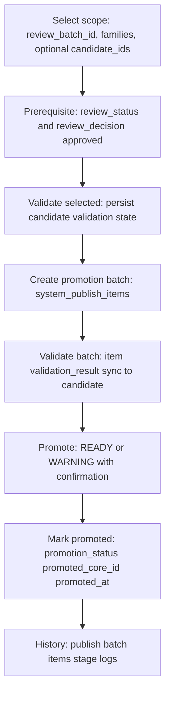

# Import-review direct-edit promotion contract

This document is the **prescriptive contract** for promoting import-review candidates into production core (and routing) tables after **direct-edit typed columns** are in place. All new promotion code, SQL, and dashboard flows must follow this contract.

**Related:**

- [naming-contract.md](./naming-contract.md) — how `name_mm`, `name_en`, and source names relate (validate/promote display only; not promote write fallbacks).
- [direct-edit-runtime-qa.md](./direct-edit-runtime-qa.md) — pre-promote PATCH persistence QA.
- [simple-promotion-runtime-qa.md](./simple-promotion-runtime-qa.md) — simplified validate → promote smoke + manual QA.

**Implementation anchors (target code, not runtime spec):**

- `apps/api/src/modules/import-review/import-review-promotion-config.ts`
- `apps/api/src/modules/import-review/import-review-candidate-column-registry.ts`

---

## 0. Purpose and scope

### Purpose

Define a **simple, safe, readable** promotion path:

```text
typed candidate columns → validate → promote → mark promoted → history
```

Operators work inside a **review batch** (`import_review.review_batches`) and move approved candidates into production via a **promotion (publish) batch** (`system.system_publish_batches` + `system.system_publish_items`).

### In scope

| Area | Detail |
|------|--------|
| Entity families | `buildings`, `places`, `roads`, `landuse`, `water_lines`, `water_polygons`, `admin_areas`, `routing_barriers`, `addresses` |
| Workflow | Select scope → validate → create promotion batch → validate batch items → promote → record history |
| Storage | Candidate typed columns, validation state, publish batch/items/logs, `promoted_core_id` / `promoted_at` |
| API prefix | `/api/import-review/promotion/*`, `/api/import-review/history/*` |

### Out of scope

| Area | Detail |
|------|--------|
| `import_transport` | Bus/transit promotion, GTFS export, OTP journey planning |
| Valhalla / routing engine builds | Belong to routing build pipeline **after** core streets are promoted |
| PMTiles / tile generation | Rendering only; not part of import-review promotion |
| `place_address_links` | May be validated elsewhere; **not** a promotion target table in this contract |
| `review_overrides` | Removed/dropped; must not be read or written by promotion |

### Explicit non-goals

- Hidden **effective** or **merge** logic for promote reads (`pickEffective*`, SQL `coalesce` chains from `normalized_data` for required fields).
- **Bus families** in import_review (`bus_stops`, `bus_routes`, `bus_route_variants`, `bus_route_stops`).
- Automatic point rewards, public write APIs, or dashboard-direct database access.

---

## 1. Principles

These rules are **normative**. Violations are contract bugs.

1. **Typed candidate columns are the only promoted source of truth.**  
   Values written via `PATCH /api/import-review/:family/:id` (and stored on `import_review.*_candidates`) are what promotion reads for geometry, FKs, names, class codes, and family-specific attributes.

2. **`normalized_data` and `source_refs` are original source context only.**  
   They preserve import/OSM lineage for audit, UI “source hint”, and copying into core `source_refs`. They must **not** satisfy required promote fields when typed columns are null.

3. **Promotion must not read `review_overrides`.**  
   The column is archived/removed (migration 082). No SQL, service, or UI path may depend on it.

4. **Promotion must not use hidden effective/merge logic.**  
   Forbidden for required promote attributes: `applyImportReviewEffectiveFields`, `nameExpr`-style coalesce, `buildingClassCodeExpr` with `normalized_data` fallback, `placeResolvedCategoryIdExpr` with JSON category ids, etc. Promotion SQL must reference **typed columns explicitly** (or documented target-column defaults that do not read `normalized_data`).

5. **Promotion must not call Valhalla, OTP, GTFS export, or PMTiles build.**  
   Road checks are PostGIS/schema/core-cross-check only. Production routing graph validation happens in the routing build pipeline after promotion.

6. **`routing_barriers` promotes to `routing.routing_barriers` only.**  
   Not `core.*`. Geometry and `barrier_type` come from typed candidate columns.

7. **Bus/transit stays disabled in import_review.**  
   API must reject with `409` / `TRANSPORT_PROMOTION_DEPRECATED` (“Transport promotion moved to Import Transport.”). Future transit promotion uses `import_transport` → `core_transport` → GTFS/OTP outside this contract.

---

## 2. Main flow

### Overview diagram



### Step-by-step

| Step | Operator action | System behavior | Persistence |
|------|-----------------|-----------------|-------------|
| 1 | Select **review batch**, **families**, optional **candidate ids** | Resolve scope; reject disabled bus families | — |
| 2 | Ensure candidates are **approved** | `review_status = approved` and `review_decision = approved` | Already on candidate |
| 3 | **Validate selected** | Run family validation rules | Candidate: `validation_status`, `validation_errors`, `validation_warnings`, `validated_at` (addresses: also `promotion_blockers` / `promotion_warnings` where applicable) |
| 4 | **Create promotion batch** (optional `dry_run`) | Insert `system.system_publish_batches`; insert `system.system_publish_items` for eligible candidates; set `promotion_status = batched` | Batch + items + candidate batched |
| 5 | **Validate batch** | Re-run rules on batch items; block/warn per item | Item: `validation_result`; **must sync** status/issues to candidate (contract requirement) |
| 6 | **Promote** | INSERT/UPDATE target tables; skip `BLOCKED` items | Core/routing rows + item `target_id` |
| 7 | **Mark promoted** | Update candidate promote fields | `promotion_status`, `promoted_core_id`, `promoted_at` |
| 8 | **History** | View batch detail, logs, item outcomes | `system_publish_stage_logs`, batch `summary` |

### Two validate moments

| Name | When | Canonical store | Notes |
|------|------|-----------------|-------|
| **Validate selected** | Before or after batch create; refresh after edits | **Candidate** row | Drives eligibility UI and batch inclusion |
| **Validate batch** | On an open promotion batch before promote | **Publish item** `validation_result` | Must **mirror** candidate validation so promote and eligibility never disagree |

### Promotion batch create

- **Input:** `review_batch_id`, `families[]`, `include_warnings` (optional), `allow_high_risk_families` (required when families include `roads`, `addresses`, `admin_areas`, `routing_barriers`), `dry_run` (optional).
- **Output (non–dry-run):** `system.system_publish_batches.id`, items in `system.system_publish_items`, candidates marked `promotion_status = batched`.
- **Dry-run:** Counts only; no writes.

### Promote

- Batch must be validated (`status = ready`, `validated_at` set, no blocking items).
- Promote **READY** items always.
- Promote **WARNING** items only when `confirm_warnings = true` and a non-empty `review_note` / `warning_confirmation_note`.
- Never promote **BLOCKED** items.

### Mark promoted

On successful core write per item:

```text
promotion_status     = 'promoted'
promoted_core_id     = <target row id>
promoted_at          = <timestamptz>
```

Publish batch: update `status`, `promoted_at`, `summary` (promotion result counts).

---

## 3. Supported actions

Three operator-facing actions. Implementation may map to one or more HTTP endpoints, but behavior must match.

### Validate selected

| Field | Value |
|-------|--------|
| **Scope** | `review_batch_id` + `families[]` + optional `candidate_ids[]` |
| **Effect** | Run blocking + warning rules; persist candidate validation state |
| **Does not** | Write to core; create publish batch |

### Promote selected

| Field | Value |
|-------|--------|
| **Scope** | Existing `publish_batch_id` + optional `publish_item_ids[]` or `candidate_ids[]` |
| **Effect** | Promote subset that are **READY**, or **WARNING** with confirmation |
| **Requires** | Batch validated; items not `BLOCKED` |

### Promote all ready in current scope

| Field | Value |
|-------|--------|
| **Scope** | `review_batch_id` + `families[]` + `include_warnings` |
| **Default orchestration** | (1) Validate selected → (2) Create promotion batch → (3) Validate batch → (4) Promote all non-blocked items |
| **Eligibility** | See §3.1 |

### 3.1 Eligibility for batch inclusion (“ready in scope”)

A candidate is eligible to enter a promotion batch when **all** hold:

| Check | Condition |
|-------|-----------|
| Review | `review_status = approved` AND `review_decision = approved` |
| Not promoted | `promotion_status` IS DISTINCT FROM `promoted` AND `promoted_core_id` IS NULL |
| Not protected | `match_status` IS DISTINCT FROM `manual_protected`; `auto_action` IS DISTINCT FROM `protect_manual` |
| Duplicates | `duplicate_candidate` / `possible_duplicate` only if `review_note` is non-empty (or merged per policy) |
| Not batched elsewhere | No row in `system.system_publish_items` linked to an **active** publish batch for same candidate |
| Validation | `validation_status = ready`, OR (`validation_status = warning` AND `include_warnings = true`) |

**High-risk families:** `roads`, `addresses`, `admin_areas`, `routing_barriers` require `allow_high_risk_families = true` on batch create.

---

## 4. Validation statuses

### Contract enum

Stored on **candidate** (`validation_status`) and mirrored on **publish item** (`validation_result.status`).

| Status | DB value | Meaning | Promotable |
|--------|----------|---------|------------|
| **READY** | `ready` | No blocking issues | Yes |
| **WARNING** | `warning` | Non-blocking issues present | Yes only with operator confirmation |
| **BLOCKED** | `blocked` | Blocking issues present | No |

Use lowercase in database columns and API JSON. Use **READY / WARNING / BLOCKED** in UI labels and this document’s tables.

### Issue storage

| Column | Content |
|--------|---------|
| `validation_errors` | JSON array of blocking issues (`severity: error`) |
| `validation_warnings` | JSON array of non-blocking issues (`severity: warning`) |

**Issue shape (minimum):**

```json
{
  "code": "MISSING_GEOM",
  "message": "Typed geom is required for promotion.",
  "severity": "error",
  "field": "geom",
  "stage": "validate_geometry"
}
```

### Status resolution

```text
if any blocking issue → BLOCKED
else if any warning issue → WARNING
else → READY
```

### Legacy mapping (implementers migrating code)

| Legacy value | Contract status |
|--------------|-----------------|
| `valid` | `ready` |
| `valid_with_warnings` | `warning` |
| `blocked`, `failed` | `blocked` |
| Publish item `valid` | `ready` |
| Publish item `warning` | `warning` |
| Publish item `blocked` | `blocked` |

---

## 5. Blocking rules by family

**Rule:** All conditions below inspect **typed columns only** unless marked “lineage” (which may use `external_id`, `local_staging_id`, `source_refs`).

### 5.1 Global blockers (all families)

| Code | Condition |
|------|-----------|
| `review_not_approved` | `review_decision` or `review_status` ≠ `approved` |
| `already_promoted` | `promotion_status = promoted` OR `promoted_core_id` IS NOT NULL |
| `manual_protected` | `match_status = manual_protected` OR `auto_action = protect_manual` |
| `duplicate_unconfirmed` | `match_status` IN (`duplicate_candidate`, `possible_duplicate`) AND empty `review_note` |
| `missing_candidate` | Publish item references missing candidate row |
| `active_publish_batch` | Candidate already in another active `system_publish_items` batch |
| `missing_lineage` | No `external_id`, no `local_staging_id`, and `source_refs` empty or `{}` |
| `invalid_confidence` | `confidence_score` NOT NULL AND outside 0–100 |

### 5.2 Places → `core.core_places`

| Code | Typed condition |
|------|-----------------|
| `place_geometry_missing` | No valid non-empty `point_geom` (and no other contract-approved typed point column for this family) |
| `place_category_missing` | `category_id` IS NULL |
| `place_admin_area_missing` | `admin_area_id` IS NULL (no admin inference from `normalized_data` at promote time) |
| `duplicate_core_place` | Active duplicate in `core.core_places` per spatial/name policy |
| `missing_lineage` | Global lineage rule |

### 5.3 Buildings → `core.core_map_buildings`

| Code | Typed condition |
|------|-----------------|
| `missing_geom` | `geom` IS NULL OR invalid polygon / wrong SRID / ST_IsEmpty |
| `invalid_geom` | `geom` fails ST_IsValid or wrong type (not Polygon/MultiPolygon) |
| `invalid_srid` | `geom` SRID ≠ 4326 |
| `missing_building_type_id` | `building_type_id` IS NULL OR not found in `ref.ref_building_types` |
| `duplicate_core_building` | Duplicate `external_id` or `local_staging_id` in active `core.core_map_buildings` |
| `missing_lineage` | Global lineage rule |

### 5.4 Roads → `core.core_streets`

| Code | Typed condition |
|------|-----------------|
| `GEOMETRY_MISSING` | `geom` IS NULL |
| `GEOMETRY_INVALID` | `geom` NOT ST_IsValid or empty |
| `INVALID_GEOMETRY_TYPE` | Not LineString / MultiLineString |
| `INVALID_SRID` | SRID ≠ 4326 |
| `ROAD_CLASS_MISSING` | `road_class_id` IS NULL when required for core street class |
| `DUPLICATE_EXTERNAL_ID_IN_CORE` | Duplicate active core street for `external_id` |
| `promotion_blocking_validation_errors` | Existing blocking codes in `validation_errors` from road routing validate (until unified validate clears or refreshes) |
| `missing_lineage` | Global lineage rule (roads may downgrade to warning in transitional code; contract: prefer warning if only `external_id` present) |

Blocking codes align with `apps/api/src/modules/import-review/import-review-road-promotion-policy.ts`.

### 5.5 Landuse → `core.core_map_landuse`

| Code | Typed condition |
|------|-----------------|
| `missing_geom` | `geom` IS NULL or invalid polygon |
| `invalid_geom` / `invalid_srid` | As for polygons |
| `landuse_class_missing` | `landuse_class_id` IS NULL OR invalid FK |
| `duplicate_core_landuse` | Duplicate in `core.core_map_landuse` |
| `missing_lineage` | Global lineage rule |

### 5.6 Water lines → `core.core_map_water_lines`

| Code | Typed condition |
|------|-----------------|
| `missing_geom` | Line geometry column NULL or invalid |
| `invalid_geom` / `invalid_srid` | Line/MultiLineString, SRID 4326, ST_IsValid |
| `missing_class_code` | `class_code` IS NULL or empty (required for promote) |
| `duplicate_core_water_line` | Duplicate in core |
| `missing_lineage` | Global lineage rule |

### 5.7 Water polygons → `core.core_map_water_polygons`

| Code | Typed condition |
|------|-----------------|
| `missing_geom` | Polygon geometry NULL or invalid |
| `invalid_geom` / `invalid_srid` | Polygon/MultiPolygon, SRID 4326 |
| `missing_class_code` | `class_code` IS NULL or empty (required for promote) |
| `duplicate_core_water_polygon` | Duplicate in core |
| `missing_lineage` | Global lineage rule |

### 5.8 Admin areas → `core.core_admin_areas`

| Code | Typed condition |
|------|-----------------|
| `missing_geom` | `geom` NULL or invalid polygon |
| `invalid_geom` / `invalid_srid` | Polygon rules |
| `missing_admin_level_id` | `admin_level_id` IS NULL |
| `missing_admin_name` | All of `name_mm`, `name_en`, `canonical_name` empty (at least one typed name required) |
| `empty_source_refs` | `source_refs` NULL or `{}` |
| `duplicate_core_admin_area` | Duplicate in core |
| `missing_lineage` | Global lineage rule |

### 5.9 Routing barriers → `routing.routing_barriers`

| Code | Typed condition |
|------|-----------------|
| `missing_point_geom` | `point_geom` or typed point `geom` NULL |
| `invalid_point_geom` | Point fails ST_IsValid |
| `invalid_srid` | SRID ≠ 4326 |
| `invalid_geom_type` | Not Point |
| `missing_barrier_type` | `barrier_type` IS NULL or empty (**no** `normalized_data` fallback) |
| `empty_source_refs` | `source_refs` NULL or `{}` |
| `duplicate_core_barrier` | Duplicate in `routing.routing_barriers` when detectable |

### 5.10 Addresses → `core.core_addresses`

| Code | Typed condition |
|------|-----------------|
| `missing_point_geom` | `point_geom` / `geom` missing |
| `review_not_approved` | Global |
| `validation_blocked` | `validation_status = blocked` |
| `promotion_blockers_present` | `promotion_blockers` JSON array non-empty |
| `address_strength_not_promotable` | `address_strength` NOT IN (`partial`, `strong`, `full`) |
| `duplicate_core_address` | Duplicate in `core.core_addresses` |
| `missing_required_component` | Required typed address components missing per address validation policy |

Addresses use `POST /api/import-review/addresses/validate` rules in `import-review-address-validation.ts`, restated here as **typed-column-only** (components table + candidate typed fields, not `normalized_data` inference).

### 5.11 Bus / transit

| Code | HTTP |
|------|------|
| `TRANSPORT_PROMOTION_DEPRECATED` | **409** — do not create batch or promote |

Families: `bus_stops`, `bus_routes`, `bus_route_variants`, `bus_route_stops`.

---

## 6. Warning rules by family

Warnings set `validation_status = warning`. Promotion requires **confirmation** (see §2).

### 6.1 Cross-family warnings

| Code | Condition |
|------|-----------|
| `low_confidence` | `confidence_score` < 40 |
| `weak_lineage` | `external_id` present but `source_refs` empty |
| `unsupported_merge_action` | `publish_action = merge` (merge not supported for promotion) |
| `missing_display_name` | No typed `name_en` and no typed `name_mm` but source name exists in UI context only → **WARNING**, not auto-fill from `normalized_data` |

### 6.2 Places

| Code | Condition |
|------|-----------|
| `linked_address_missing` | No linked address candidate |
| `linked_address_weak_or_partial` | Linked address strength weak/partial/none |
| `english_place_name_missing` | `name_en` empty |
| `myanmar_place_name_missing` | `name_mm` empty |
| `contact_info_missing` | No contact fields on typed columns |

### 6.3 Buildings

| Code | Condition |
|------|-----------|
| `class_code_without_building_type_id` | `class_code` set but `building_type_id` NULL (reviewer should set FK) |

### 6.4 Roads

| Code | Condition |
|------|-----------|
| `NAME_MISSING` | No typed road name fields; `canonical_name` empty |
| `SURFACE_MISSING` | `surface` NULL |
| `SPEED_KPH_MISSING` | `speed_kph` NULL |
| `connectivity_warning` | Routing continuity warning from `POST /roads/:id/validate-routing` (PostGIS/graph adjacency only; **not** Valhalla) |
| `empty_source_refs` | Optional traceability warning |

### 6.5 Landuse / water

| Code | Condition |
|------|-----------|
| `missing_display_name` | Both `name_en` and `name_mm` empty |
| `CLASS_CODE_MISSING` | Landuse: `class_code` empty but `landuse_class_id` set (informational only) |

### 6.6 Admin areas

| Code | Condition |
|------|-----------|
| `slug_generated` | `slug` empty; will be derived at promote from typed name (discouraged — prefer typed `slug`) |

### 6.7 Routing barriers

| Code | Condition |
|------|-----------|
| `barrier_impact_review` | Unusual `barrier_type` combination requiring manual ack |

### 6.8 Addresses

| Code | Condition |
|------|-----------|
| `address_strength_partial` | Strength partial |
| `missing_bilingual_component` | Locality component missing `en` or `my` where policy expects both |
| `low_confidence` | Below threshold |
| `duplicate_nearby_candidate` | Another address candidate within distance threshold |

---

## 7. Promotion target mapping

Authoritative mapping (from `IMPORT_REVIEW_PROMOTION_TARGETS`):

| Family | Candidate table | Target schema.table |
|--------|-----------------|---------------------|
| places | `import_review.place_candidates` | `core.core_places` |
| buildings | `import_review.building_candidates` | `core.core_map_buildings` |
| roads | `import_review.road_candidates` | `core.core_streets` |
| landuse | `import_review.landuse_candidates` | `core.core_map_landuse` |
| water_lines | `import_review.water_line_candidates` | `core.core_map_water_lines` |
| water_polygons | `import_review.water_polygon_candidates` | `core.core_map_water_polygons` |
| admin_areas | `import_review.admin_area_candidates` | `core.core_admin_areas` |
| routing_barriers | `import_review.routing_barrier_candidates` | **`routing.routing_barriers`** |
| addresses | `import_review.address_candidates` | `core.core_addresses` |

**Disabled in import_review:**

| Family | Redirect |
|--------|----------|
| `bus_stops` | `import_transport` (future) |
| `bus_routes` | `import_transport` |
| `bus_route_variants` | `import_transport` |
| `bus_route_stops` | `import_transport` |

**Publish action:** `insert` | `update` (from `match_status` / `matched_core_id`); `merge` is warning-only and not supported for promote.

---

## 8. Fallback policy

### 8.1 Required fields (typed only)

| Category | Examples | Policy |
|----------|----------|--------|
| Geometry | `geom`, `point_geom`, road centerline | **Typed column only.** NULL → BLOCKED. |
| Foreign keys | `category_id`, `building_type_id`, `landuse_class_id`, `road_class_id`, `admin_area_id` | **Typed column only.** No `normalized_data->>'category_id'`. |
| Enums / codes | `barrier_type`, `class_code` (when contract-required) | **Typed column only.** |
| Names (core write) | `name_en`, `name_mm`, place `primary_name`/`display_name` only if explicitly listed as typed promote columns | **Typed column only** for values written to core name fields. |

### 8.2 `normalized_data`

| Use | Allowed |
|-----|---------|
| Read for dashboard “imported/source” hints | Yes |
| Satisfy required FK, geometry, class, or name on promote | **No** |
| Post-promote audit keys (`promotion.publish_batch_id`, `promoted_at`) | Yes (write-only merge into stored JSON) |
| Block promotion when `normalized_data = {}` | **No** (empty import context is allowed if typed columns are complete) |

### 8.3 `source_refs`

| Use | Allowed |
|-----|---------|
| Copy/merge into core `source_refs` for lineage | Yes |
| Infer required promote fields | **No** |
| Block when empty | Only when global `missing_lineage` applies (no `external_id`, no `local_staging_id`, empty `source_refs`) |

### 8.4 Names and source labels

| Scenario | Status |
|----------|--------|
| Typed `name_en` or `name_mm` present | Use for core write → READY (other rules permitting) |
| No typed name; `canonical_name` or OSM tag would be used for **core write** | **BLOCKED** — reviewer must set typed name |
| No typed name; source name visible in UI only | **WARNING** — promote with confirmation |
| `display_name` / `primary_name` used for core write without typed `name_*` | **BLOCKED** for places unless those columns are the designated typed promote fields and explicitly set |

See [naming-contract.md](./naming-contract.md) for UI vs promote distinction.

### 8.5 Roads / barriers preview

Contract allows **geometry/preflight preview** during batch validate (SQL-only). Separate `road-dry-run` / `routing-barrier-dry-run` endpoints may remain as optional gates but are not required if batch validate includes equivalent checks.

---

## 9. History and audit requirements

Promotion must leave a complete audit trail.

### 9.1 Required artifacts

| Artifact | Table | Required fields / notes |
|----------|-------|-------------------------|
| Promotion batch | `system.system_publish_batches` | `id`, `review_batch_id`, `batch_name`, `status`, `validation_total`, `validation_done`, `validated_at`, `promoted_at`, `summary`, `created_at` |
| Promotion items | `system.system_publish_items` | `publish_batch_id`, `entity_family`, `review_candidate_table`, `review_candidate_id`, `publish_action`, `publish_status`, `validation_result`, `target_schema`, `target_table`, `target_id` (after promote), `error_message` (on failure) |
| Stage logs | `system.system_publish_stage_logs` | `publish_batch_id`, `stage_key`, `stage_status`, `message`, `progress_percent`, `started_at`, `finished_at` |
| Candidate state | `import_review.*_candidates` | `promotion_status`, `promoted_core_id`, `promoted_at`, `updated_at` |
| Direct-edit audit (forensics) | `import_review.review_candidate_edits` | Not required for promote success; links edits to `edit_type` / `after_data` |

### 9.2 Batch status lifecycle (contract)

```text
draft → validating → ready | blocked
ready → promoting → promoted | failed
blocked → (fix) → validating → ...
```

### 9.3 Dashboard history

| Page | Path |
|------|------|
| History index | `/dashboard/import-review/history` |
| Review batch detail | `/dashboard/import-review/history/review-batches/[id]` |
| Publish batch detail | `/dashboard/import-review/history/publish-batches/[id]` |

### 9.4 API history

| Method | Path |
|--------|------|
| GET | `/api/import-review/history/review-batches` |
| GET | `/api/import-review/history/review-batches/:id` |
| GET | `/api/import-review/history/publish-batches` |
| GET | `/api/import-review/history/publish-batches/:id` |
| GET | `/api/import-review/history/publish-batches/:id/items` |
| GET | `/api/import-review/history/publish-batches/:id/logs` |

---

## 10. Target API surface (minimal)

Consolidated endpoints for implementation. Legacy endpoints listed in Appendix A.

| Method | Path | Purpose |
|--------|------|---------|
| GET | `/api/import-review/promotion/eligibility` | Per-family counts: ready, warning, blocked, batched, promoted |
| POST | `/api/import-review/promotion/validate` | **Validate selected** (candidate scope) |
| POST | `/api/import-review/promotion/batches` | Create batch (`dry_run` optional) |
| POST | `/api/import-review/promotion/batches/:id/validate` | **Validate batch** (async) |
| GET | `/api/import-review/promotion/batches/:id/progress` | Validation/promotion progress |
| GET | `/api/import-review/promotion/batches/:id/logs` | Stage logs |
| POST | `/api/import-review/promotion/batches/:id/promote` | **Promote** (async; confirmation for warnings) |
| GET | `/api/import-review/promotion/batches/:id/verify` | Post-promote verification summary |
| GET | `/api/import-review/promotion/batches/:id` | Batch detail |

**Family-specific validate (may fold into `/promotion/validate`):**

| Method | Path | Notes |
|--------|------|-------|
| POST | `/api/import-review/roads/:id/validate-routing` | Road candidate refresh; must align with contract statuses |
| POST | `/api/import-review/addresses/validate` | Address batch validate |
| POST | `/api/import-review/places/validate` | Place batch validate |

**Deprecated for new UI (see Appendix A):** split `addresses/promote`, `places/promote`, `place-address-links/promote`, `promotion/ready`, `promotion/ready-candidates`, `promotion/batch-eligibility`.

---

## Appendix A — Implementation gaps (current code)

This appendix describes **today’s codebase** vs this contract. It is not normative.

| Gap | Current behavior | Contract target |
|-----|------------------|-----------------|
| Dual promote paths | [ImportReviewAddressDetailDrawer.tsx](../../apps/dashboard/src/features/import-review/components/ImportReviewAddressDetailDrawer.tsx) calls `addresses/promote` and `places/promote` outside publish batch | Single publish-batch promote |
| Validation split-brain | Eligibility reads candidate `validation_errors`; batch validate writes only `system_publish_items.validation_result` | Sync item results → candidate after batch validate |
| Status strings | `valid`, `valid_with_warnings`, `blocked`, item `valid`/`warning`/`blocked` | `ready`, `warning`, `blocked` |
| `normalized_data` in validate SQL | [import-review-promotion-validation-rules.ts](../../apps/api/src/modules/import-review/import-review-promotion-validation-rules.ts) coalesces `normalized_data` for places names, barrier type, building class hints | Typed columns only for blockers |
| `empty_normalized_data` blocker | Batch validate errors when `normalized_data = {}` | Remove; context-only JSON |
| Promote SQL fallbacks | [import-review-promotion-promote-sql.ts](../../apps/api/src/modules/import-review/import-review-promotion-promote-sql.ts): `nameExpr`, `buildingClassCodeExpr`, `placeExplicitCategoryIdExpr` | Explicit typed columns |
| Dead bus promote code | [import-review-promotion-promote.repo.ts](../../apps/api/src/modules/import-review/import-review-promotion-promote.repo.ts) still imports four `promote-bus-*` repos (~2.5k lines) | Delete; keep 409 guard only |
| Unused ready APIs | `getImportReviewPromotionReady` in [api.ts](../../apps/dashboard/src/lib/api.ts) unused by import-review dashboard | Remove or implement eligibility only |
| Separate dry-runs | Required `road-dry-run` / `routing-barrier-dry-run` before promote | Optional; prefer batch validate preview |
| Place validate | [import-review-place-validation.repo.ts](../../apps/api/src/modules/import-review/import-review-place-validation.repo.ts) does not persist `validation_status` | Persist full contract status |
| `review_overrides` | Removed from DB; some tests/docs still mention override paths | None |

---

## Appendix B — Related documents

| Document | Role |
|----------|------|
| [naming-contract.md](./naming-contract.md) | Name field meanings for UI and display |
| [direct-edit-runtime-qa.md](./direct-edit-runtime-qa.md) | PATCH typed columns before promotion |
| [import-review-promotion-config.ts](../../apps/api/src/modules/import-review/import-review-promotion-config.ts) | Family lists and target tables in code |
| [import-review-road-promotion-policy.ts](../../apps/api/src/modules/import-review/import-review-road-promotion-policy.ts) | Road blocking error codes |

---

## Appendix C — Contract checklist (implementers)

Before merging promotion changes:

- [ ] No `review_overrides` in SQL or services
- [ ] Required promote fields read typed columns only
- [ ] `validation_status` uses `ready` | `warning` | `blocked`
- [ ] Batch validate syncs to candidate validation columns
- [ ] `routing_barriers` writes only to `routing.routing_barriers`
- [ ] Bus families return `TRANSPORT_PROMOTION_DEPRECATED`
- [ ] No Valhalla/OTP/GTFS/PMTiles calls in import-review promotion module
- [ ] History: batch, items, logs, `promoted_core_id`, `promoted_at` populated on success
