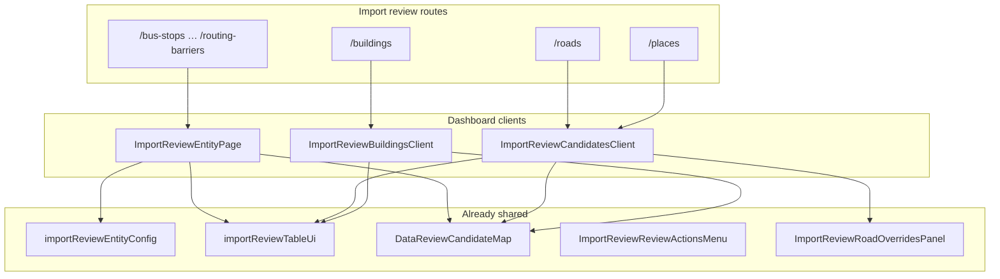

# Import Review UI Feature Matrix

Inspection report for **dashboard** import-review entity pages under `apps/dashboard`. Purpose: document current UI parity before refactoring. **No code changes** were made as part of this step.

**Shared scaffold (default):** `/import-review/{slug}` → `ImportReviewEntityPageShell` + entity config  
**Legacy (roads only):** `/import-review/roads` → `ImportReviewCandidatesClient` (routing-validation drawer)  
**Deprecated (unused by routes):** `ImportReviewBuildingsClient` — see `import-review-ui-consistency-checklist.md`

**Related (out of scope here):** `/data-review/{buildings,places,roads}` reuses the same clients with `showMapPreview={true}` (sticky sidebar map). `/import-review/history` is batch audit UI, not per-candidate comments.

**Last inspected:** 2026-05-20

**Entity UI config (source of truth):** [`apps/dashboard/src/features/import-review/config/importReviewEntityConfigs.ts`](../../apps/dashboard/src/features/import-review/config/importReviewEntityConfigs.ts) — re-exported from [`apps/dashboard/src/lib/importReviewEntityConfig.ts`](../../apps/dashboard/src/lib/importReviewEntityConfig.ts) for backward compatibility.

**API client & batch context:** [`apps/dashboard/src/features/import-review/api/importReviewApiClient.ts`](../../apps/dashboard/src/features/import-review/api/importReviewApiClient.ts), [`useImportReviewBatchContext`](../../apps/dashboard/src/features/import-review/hooks/useImportReviewBatchContext.ts).

---

## Files inspected

| Path | Role |
|------|------|
| `apps/dashboard/src/app/(admin)/import-review/buildings/page.tsx` | Buildings route |
| `apps/dashboard/src/app/(admin)/import-review/places/page.tsx` | Places route |
| `apps/dashboard/src/app/(admin)/import-review/roads/page.tsx` | Roads route |
| `apps/dashboard/src/app/(admin)/import-review/bus-stops/page.tsx` | Bus stops route |
| `apps/dashboard/src/app/(admin)/import-review/landuse/page.tsx` | Landuse route |
| `apps/dashboard/src/app/(admin)/import-review/water-lines/page.tsx` | Water lines route |
| `apps/dashboard/src/app/(admin)/import-review/water-polygons/page.tsx` | Water polygons route |
| `apps/dashboard/src/app/(admin)/import-review/addresses/page.tsx` | Addresses route |
| `apps/dashboard/src/app/(admin)/import-review/admin-areas/page.tsx` | Admin areas route |
| `apps/dashboard/src/app/(admin)/import-review/routing-barriers/page.tsx` | Routing barriers route |
| `apps/dashboard/src/app/(admin)/import-review/[family]/page.tsx` | Catch-all redirect / unknown family |
| `apps/dashboard/src/app/(admin)/import-review/layout.tsx` | Layout + `ImportReviewSubNav` |
| `apps/dashboard/src/app/(admin)/import-review/_components/ImportReviewEntityPage.tsx` | Shared entity page (7 families) |
| `apps/dashboard/src/app/(admin)/import-review/_components/ImportReviewBuildingsClient.tsx` | Buildings legacy client |
| `apps/dashboard/src/app/(admin)/import-review/_components/ImportReviewCandidatesClient.tsx` | Places + roads legacy client |
| `apps/dashboard/src/app/(admin)/import-review/_components/ImportReviewReviewActionsMenu.tsx` | Row actions dropdown |
| `apps/dashboard/src/app/(admin)/import-review/_components/ImportReviewRoadOverridesPanel.tsx` | Roads overrides + street editor map |
| `apps/dashboard/src/app/(admin)/import-review/_components/importReviewTableUi.tsx` | Sticky table chrome |
| `apps/dashboard/src/app/(admin)/import-review/_components/ImportReviewSubNav.tsx` | Entity nav links |
| `apps/dashboard/src/lib/importReviewEntityConfig.ts` | Per-entity slug, columns, flags |
| `apps/dashboard/src/lib/importReviewDrawerMapGeometry.ts` | Drawer/sidebar map inputs |
| `apps/dashboard/src/components/map/DataReviewCandidateMap.tsx` | Read-only preview map (basemap + vertices) |
| `apps/dashboard/src/app/(admin)/data-review/buildings/page.tsx` | Data-review variant (sidebar map) |
| `apps/dashboard/src/app/(admin)/data-review/places/page.tsx` | Data-review variant |
| `apps/dashboard/src/app/(admin)/data-review/roads/page.tsx` | Data-review variant |
| `docs/import-review/entity-coverage-matrix.md` | Pipeline/API coverage (cross-reference) |

---

## Implementation map (which client each route uses)

| Entity | Route | Client component | Config slug |
|--------|-------|------------------|-------------|
| Buildings | `/import-review/buildings` | `ImportReviewEntityPageShell` | `buildings` |
| Places | `/import-review/places` | `ImportReviewEntityPageShell` | `places` |
| Roads | `/import-review/roads` | `ImportReviewCandidatesClient` (`family="roads"`) | `roads` (`legacyDedicatedPage`) |
| Bus stops | `/import-review/bus-stops` | `ImportReviewEntityPageShell` | `bus-stops` |
| Landuse | `/import-review/landuse` | `ImportReviewEntityPageShell` | `landuse` |
| Water lines | `/import-review/water-lines` | `ImportReviewEntityPageShell` | `water-lines` |
| Water polygons | `/import-review/water-polygons` | `ImportReviewEntityPageShell` | `water-polygons` |
| Addresses | `/import-review/addresses` | `ImportReviewEntityPageShell` | `addresses` |
| Admin areas | `/import-review/admin-areas` | `ImportReviewEntityPageShell` | `admin-areas` |
| Routing barriers | `/import-review/routing-barriers` | `ImportReviewEntityPageShell` | `routing-barriers` |

---

## Feature matrix

Legend: **Yes** = present on `/import-review/{entity}`; **Partial** = limited or conditional; **No** = absent; **N/A** = not applicable for that entity/config.

| Feature | Buildings | Places | Roads | Bus stops | Landuse | Water lines | Water polygons | Addresses | Admin areas | Routing barriers |
|---------|-----------|--------|-------|-----------|---------|-------------|----------------|-----------|-------------|------------------|
| **Route exists** | Yes | Yes | Yes | Yes | Yes | Yes | Yes | Yes | Yes | Yes |
| **Uses reusable entity page** | No | No | No | Yes | Yes | Yes | Yes | Yes | Yes | Yes |
| **Filters** (scope, match/auto/review/decision, search, sort, page size) | Yes | Yes | Yes | Yes | Yes | Yes | Yes | Yes | Yes | Yes |
| **Entity-specific filter** (`class_code` / `promotion_status` / `include_promoted`) | Yes (`class_code`) | No | No | Partial (promotion only via shared filters) | Partial | Partial | Partial | Partial | Partial | Partial |
| **Server-side pagination** | Yes | Yes | Yes | Yes | Yes | Yes | Yes | Yes | Yes | Yes |
| **Table columns** (config or rich custom) | Yes (custom) | Yes (custom) | Yes (custom) | Yes (config) | Yes (config) | Yes (config) | Yes (config) | Yes (config) | Yes (config) | Yes (config) |
| **Sticky actions column** | Yes | Yes | Yes | Yes | Yes | Yes | Yes | Yes | Yes | Yes |
| **Selection checkboxes** | Yes | Yes | Yes | Yes* | Yes* | Yes* | Yes* | Yes* | Yes* | Yes* |
| **Bulk actions** | Yes (rich) | Yes | Yes | Yes* | Yes* | Yes* | Yes* | Yes* | Yes* | Yes* |
| **Bulk actions hidden until selection** | No (panel always visible) | No | No | Yes | Yes | Yes | Yes | Yes | Yes | Yes |
| **Detail drawer** | Yes (wide) | Yes (wide) | Yes (wide) | Yes (narrow) | Yes | Yes | Yes | Yes | Yes | Yes |
| **Map preview (drawer)** | Yes | Yes | Partial† | Yes | Yes | Yes | Yes | Yes | Yes | Yes |
| **Map preview (list sidebar)** | No‡ | No‡ | No‡ | No | No | No | No | No | No | No |
| **Map / Satellite / Hybrid modes** | Yes§ | Yes§ | Partial† | Yes§ | Yes§ | Yes§ | Yes§ | Yes§ | Yes§ | Yes§ |
| **Show vertices** | Yes§ | No (points) | Partial† | No (points) | Yes§ | Yes§ | Yes§ | No (points) | Yes§ | No (points) |
| **Geometry lazy-loaded** (list without geom; detail fetch) | No | No | No | Yes | Yes | Yes | Yes | Yes | Yes | Yes |
| **Override editor** | Yes (text fields) | No | Yes (road panel + geometry) | No | No | No | No | No | No | No |
| **Ref dropdown fields** | No | No | Yes (`road_class_id`) | No | No | No | No | No | No | No |
| **Validation panel** (structured UI) | Partial (JSON blocks) | No (alerts only on roads-style paths) | Yes (banners + routing) | No | No | No | No | No | No | No |
| **Review decision actions** (row menu + drawer save) | Yes | Yes | Yes | Yes | Yes | Yes | Yes | Yes | Yes | Yes |
| **Loading states** | Yes | Yes | Yes | Yes | Yes | Yes | Yes | Yes | Yes | Yes |
| **Error states** | Yes | Yes | Yes | Yes | Yes | Yes | Yes | Yes | Yes | Yes |
| **History/comments section** (per candidate) | No | No | No | No | No | No | No | No | No | No |
| **Notes / gaps** | Reference UI; not on shared page | No overrides; bulk always shown | `supportsBulkApproval: false` in config but UI still bulk-capable; street editor ≠ `DataReviewCandidateMap` | Thin drawer vs buildings | Same as bus-stops tier | Line geom + vertices in drawer | Polygon map | Address norm columns only | Admin level in table | Barrier type in table |

\* Checkbox/bulk gated by `supportsBulkApproval: true` in `importReviewEntityConfig` (all listed entity-page families). Roads config flag is `false` but **legacy** `ImportReviewCandidatesClient` still exposes bulk UI.

† Roads drawer uses `ImportReviewRoadOverridesPanel` + `StreetEditorMap` (editable geometry), not `DataReviewCandidateMap`. Basemap tabs exist on that panel; vertex UX differs from read-only preview.

‡ Sidebar map only on `/data-review/*` when `showMapPreview={true}`.

§ When `DataReviewCandidateMap` is rendered (buildings/places drawer; all entity-page drawers after geometry load). Places/points hide vertex toggle by design.

---

## Gap summary by entity

### Buildings (reference)

Has the fullest import-review experience: `class_code` filter, active filter chips, always-visible bulk panel with reject/ignore/needs-more-review, safe bulk dry-run/real, force override, rich drawer (normalized/source_refs/matched_core/f2_comparison), building override form, validation JSON, `Edit overrides` in row menu. List loads **with** geometry (`include_geometry: true`). No per-candidate history/comments.

### Places

Shares legacy client with roads: family-specific table columns, bulk panel always visible (approve + safe bulk only), drawer record + map for points, no override editor, no structured validation panel (roads-only approve guards do not apply). Filter options from summary endpoint (no `promotion_status` / `include_promoted`). List loads with geometry.

### Roads

Legacy client: routing validation banners, `ImportReviewRoadOverridesPanel` with `road_class_id` dropdown and editable line geometry, approve guards for validation errors/warnings and `matched_auto_update`. Bulk UI present despite `supportsBulkApproval: false` in config. Map UX is **editor-first**, not the same as buildings preview map.

### Bus stops, landuse, water lines, water polygons, addresses, admin areas, routing barriers

All use `ImportReviewEntityPage`: solid list/filter/pagination/drawer/decision flow and lazy geometry. Missing vs buildings: override editor, rich drawer metadata, validation panel, `class_code` filter (where relevant), expanded bulk actions (reject/ignore/safe bulk), bulk panel always hidden until selection, active filter chips, row menu “Edit overrides”, promotion filter parity, sidebar map on import-review routes.

---

## What should be extracted from the buildings page

Prioritize **behavior-agnostic shell** pieces that buildings, places, and entity-page families can share:

1. **Scope + filter bar** — snapshot/batch XOR, standard review filters, search, sort, limit, apply/clear, optional `class_code` / `include_promoted` slots driven by config.
2. **Active filter chips** — visual summary of applied URL params (buildings already has this).
3. **List table shell** — `ImportReviewTableFrame`, sticky ID/checkbox/actions, row surface coloring (`importReviewRowSurface`), config-driven columns from `importReviewEntityConfig`.
4. **Bulk actions region** — configurable action set (approve-only vs full decision set), optional hide-until-selection, force override + bulk note + `ImportReviewBulkDecisionResultPanel`.
5. **Detail drawer layout** — header, sections for record fields, JSON viewers (normalized_data, source_refs, matched_core_data, f2_comparison) behind collapsible sections.
6. **Review decision block** — decision select, note, save, read-only RBAC hint (`deriveImportReviewEditorUxCanMutate`).
7. **Map block** — wrapper around `DataReviewCandidateMap` + optional sidebar slot when `showMapPreview`.
8. **Override editor slot** — pluggable panel (buildings text overrides vs roads `ImportReviewRoadOverridesPanel`); wire `onEditOverrides` from `ImportReviewReviewActionsMenu` when `supportsOverrides`.
9. **Validation slot** — pluggable panel (JSON blocks vs road routing banners).
10. **Data hooks** — scope from URL (`importReviewSnapshot`), list fetch, filter options fetch, drawer detail fetch with `include_geometry`, patch decision/overrides (family API from config).

---

## What should be shared vs entity-specific

| Shared (all or most entities) | Entity-specific |
|------------------------------|-----------------|
| Scope query, batch ambiguity picker, pagination URL sync | Extra filters (`class_code` for buildings) |
| Standard review filters + sort + limit | Table columns (`importReviewEntityConfig.tableColumns`) |
| Sticky table chrome, row actions menu, RBAC gating | Bulk eligibility (`supportsBulkApproval`, safe bulk rules) |
| Drawer shell, decision PATCH, bulk family API | Override editor fields and PATCH shape |
| `DataReviewCandidateMap` for read-only preview | Roads: street editor, routing validate, ref dropdowns |
| Loading/error/empty states | Validation source (JSON vs routing API) |
| `ImportReviewSubNav` + overview links | Geometry kind / map layer type |
| | Risk-specific approve confirmations (duplicate, manual_protected, matched_auto_update) |

---

## Recommended implementation order

1. **Shared primitives (no route migrations)** — Extract hooks/components from `ImportReviewBuildingsClient` into `_components/import-review/` (filters, table, bulk region, drawer sections, map wrapper). Keep buildings page on legacy client until parity proven.
2. **Upgrade `ImportReviewEntityPage`** — Bring the seven config-driven routes to buildings-tier parity using shared primitives (drawer richness, optional overrides slot, validation JSON, promotion/`include_promoted`, bulk action config, active chips). Lowest risk; highest reach (7 entities).
3. **Places migration** — Move `/import-review/places` from `ImportReviewCandidatesClient` to enhanced entity page (or shared shell + `family=places`). Add override support only when API supports it (`supportsOverrides: false` today).
4. **Buildings migration** — Switch `/import-review/buildings` to shared shell with buildings override plugin; preserve `class_code` filter and full bulk set. Consider lazy geometry for performance after UX parity.
5. **Roads migration (last)** — Keep `ImportReviewRoadOverridesPanel` and routing validation as a **roads plugin** on the shared drawer; do not force roads into read-only `DataReviewCandidateMap` only. Align `supportsBulkApproval` config with actual UI/API.
6. **Data-review routes** — Once import-review unified, enable `showMapPreview` via shared prop on any entity that needs map-first layout.

---

## Architecture snapshot

---

## Cross-reference

Pipeline and API coverage (staging → Supabase → promotion) live in [`entity-coverage-matrix.md`](./entity-coverage-matrix.md). This document covers **dashboard UI behavior only**.
