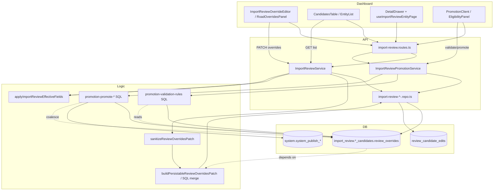

# Import-review override system — end-to-end map

This document maps the **current** override-based import-review workspace as implemented in the repo (read-only inspection). Column name is **`review_overrides`** (jsonb), not `override_json`.

**Prisma:** `apps/api/prisma/schema.prisma` does **not** model `import_review.*`; the API uses a dedicated Prisma client (`getImportReviewPrisma`) and raw SQL. Treat DB truth as migrations under `infrastructure/database/migrations/supabase/`.

**Scope inspected:**

- `apps/api/src/modules/import-review`
- `apps/dashboard/src/features/import-review`
- `apps/dashboard/src/app/(admin)/dashboard/import-review`
- `infrastructure/database/migrations`
- `apps/api/prisma/schema.prisma` (relevant only as “not used for import_review”)

---

## 1. Current system overview

### Mental model

```text
Pipeline upload → import_review.<family>_candidates rows
  ├── typed columns (name, geom, FK ids, …)     ← import/normalize snapshot
  ├── normalized_data / source_refs (jsonb)   ← immutable-ish source context
  └── review_overrides (jsonb)                ← reviewer PATCH shallow-merge

API list/detail → SQL row + applyImportReviewEffectiveFields()
  → response includes effective_* fields for display/validation UI

PATCH …/overrides → sanitize → allowlist → (roads: extra validator)
  → merge into review_overrides (+ roads: also update typed columns)

Promotion → system.system_publish_batches/items
  → promote SQL reads coalesce(review_overrides, columns, normalized_data)
```

### Flow (simple terms)

| Step | What happens |
|------|----------------|
| **List page** | Dashboard resolves scope (`review_batch_id` in URL preferred). `GET /api/import-review/{family}` (or legacy `/buildings`, `/places`, `/roads`). API returns **light list projection**: `review_overrides`, `normalized_data`, `validation_*` often **empty** on list; **effective_* names** still computed in SQL/mapper where configured. Default **hides** `promotion_status = promoted` unless `include_promoted=true`. |
| **Detail drawer** | Row click sets `drawerRow` from list, then refetches `GET …/{id}?include_geometry=false` (metadata), then optional geometry fetch. Shows **effective** values in override form via `readOverrideDraftValue` / API `effective_*`. |
| **Edit form save** | `PATCH …/overrides` with `{ review_overrides: { key: value \| null }, review_note? }`. Shallow merge: `null` deletes key; `{}` clears all. Non-road families: overrides only in JSON. **Roads:** also writes `canonical_name`, `road_class_id`, `surface`, `is_oneway`, `geom`, and persists routing `validation_*` on candidate. |
| **UI merged display** | Server: `applyImportReviewEffectiveFields` + `deriveImportReviewNames`. Client: `overrideEditorUtils` blends stored overrides, `effective_*`, and “imported” fallbacks. |
| **Validation** | **Batch:** `POST /promotion/batches/:id/validate` runs SQL in `import-review-promotion-validation-rules.ts` (uses override-aware SQL exprs). **Road per-candidate:** `POST /roads/:id/validate-routing` with `use_review_overrides`. **Address/place:** separate validate/promote services (components + overrides). Results stored in `validation_errors` / `validation_warnings` on candidate and on `system_publish_items`. |
| **Dry-run** | Create batch with `dry_run: true`; road/routing-barrier batch dry-runs; address `POST /addresses/promote-dry-run`. All use effective/coalesce logic in promote SQL. |
| **Promotion** | `POST /promotion/batches/:id/promote` → `ImportReviewPromotionPromoteRepository.promoteItem` → family-specific insert into `core.*` / `routing.*`. Updates candidate `promotion_status`, `promoted_core_id`, publish item status. |
| **Cleanup** | `POST /cleanup/promoted/dry-run` / `execute` — optional **hard delete** of promoted candidates (env-gated `ENABLE_IMPORT_REVIEW_PERMANENT_CLEANUP`). Not the same as list “hide promoted”. |
| **History** | `import_review.review_batches`, `import_review.review_candidate_edits`; promotion history via `system.system_publish_batches` + items + logs APIs under `/history/*`. |

### Important split: two road UIs

| Route | UI | Override editor |
|-------|-----|-----------------|
| `/dashboard/import-review/roads` | `ImportReviewEntityPage` + `ImportReviewOverrideEditor` | Generic override form → `PATCH /roads/:id/overrides` |
| `/dashboard/data-review/roads` | `ImportReviewCandidatesClient` + `ImportReviewRoadOverridesPanel` | Street map editor, routing validation, `confirm_acknowledge_routing_warnings` |

This duplication is a major consistency risk (see §8).

---

## 2. Data storage map

### Schemas / tables

| Table | Purpose | Key columns | Data kind |
|-------|---------|-------------|-----------|
| **`import_review.review_batches`** | One uploaded review package | `batch_name`, `source_snapshot_version`, `entity_families[]`, `status`, counters in `summary` | **Batch metadata** (not per-candidate edits) |
| **`import_review.building_candidates`** | Building review rows | Common review cols + `name`, `building_type_id`, `geom`, … | Original in columns + `normalized_data`; edits in **`review_overrides`** |
| **`import_review.place_candidates`** | POI review | `primary_name`, `category_id`, `point_geom`, scores | Same pattern |
| **`import_review.road_candidates`** | Road review | `canonical_name`, `road_class_id`, `surface`, `is_oneway`, `geom`, `length_m`, `routing_status` | Overrides **and** typed columns updated on road PATCH |
| **`import_review.address_candidates`** | Address review | `full_address`, `point_geom`, `admin_area_id`, workflow cols | Overrides + **`import_review.address_components`** (separate edit path) |
| **`import_review.admin_area_candidates`** | Admin boundaries | `admin_level_id`, `parent_id`, `slug`, `geom` | Overrides |
| **`import_review.landuse_candidates`** | Landuse polygons | `class_code`, `landuse_class_id`, `geom` | Overrides (+ typed `landuse_class_id` column) |
| **`import_review.water_line_candidates`** | Water lines | `class_code`, `waterway_class`, `geom` | Overrides |
| **`import_review.water_polygon_candidates`** | Water polygons | `class_code`, `water_class`, `geom` | Overrides |
| **`import_review.routing_barrier_candidates`** | Barriers | `barrier_type`, `class_code`, `geom` | Overrides |
| **`import_review.bus_*_candidates`** | Bus entities | Family-specific cols | Overrides; **promotion disabled** (moved to `import_transport`) |
| **`import_review.review_candidate_edits`** | Audit trail | `edit_type`, `before_data`, `after_data`, `candidate_table`, `candidate_id` | **Audit** (`override_update`, `decision_change`, …) |
| **`import_review.review_comments`**, **`review_tasks`** | Collaboration | — | Optional; not central to overrides |
| **`import_review.address_components`** | Structured address parts | `component_type_code`, values, confidence | **Edited data** (PATCH `/addresses/:id/components`), not `review_overrides` |
| **`system.system_publish_batches`** | Promotion batch | `source_review_batch_id`, `status`, validation counters, `summary` | **Promotion state** |
| **`system.system_publish_items`** | Per-candidate promote job | `entity_family`, `candidate_id`, `publish_status`, `target_id`, validation JSON | **Promotion + validation snapshot** |
| **`system.system_publish_logs`** | Promotion run log | — | **History** (via history API) |

### Common candidate columns (all `*_candidates` in migration `024`)

| Column | Role |
|--------|------|
| `normalized_data`, `source_refs` | **Source/original context** from pipeline |
| **`review_overrides`** | **Reviewer edits** (jsonb shallow-merge) |
| `review_status`, `review_decision`, `review_note`, `reviewed_*` | **Review workflow** |
| `validation_warnings`, `validation_errors` | **Cached validation** (esp. roads) |
| `promotion_status`, `promoted_core_id`, `promoted_at` | **Promotion state** |
| `matched_core_*`, `f1_comparison`, `f2_comparison` | Match/preview metadata |

**There is no separate `hidden` column** for cleanup; list hiding uses `promotion_status <> 'promoted'` filter.

### Prisma

**Not modeled in `schema.prisma`** — import-review DB access is raw SQL via `getImportReviewPrisma`. Inspect `apps/api/src/lib/import-review-prisma.ts` and migrations for live columns (later migrations e.g. `032`, `046`, `054`, `056` add address/landuse behavior).

### Primary migration

- `infrastructure/database/migrations/supabase/024_create_import_review_schema.sql` — defines `import_review` schema, all `*_candidates` tables with `review_overrides`, audit tables, and `system.system_publish_*` alignment.

---

## 3. Override logic map

| File / function | What it does | Called by | If removed |
|-----------------|--------------|-----------|------------|
| **`import-review-overrides-allowlist.ts`** — `IMPORT_REVIEW_OVERRIDE_ALLOWLIST`, `unsupportedOverrideKeys` | Allowed PATCH keys per family | `sanitize`, validator | Arbitrary JSON keys; security/data corruption |
| **`import-review-overrides-sanitize.ts`** — `sanitizeReviewOverridesPatch` | Normalizes types, maps aliases (`parent_admin_area_id` → `parent_id`), strips display-only keys | `ImportReviewService.prepareValidatedOverridesPatch` | Bad types in DB |
| **`import-review-overrides-normalize.ts`** | Per-field normalizers (ids, scores, booleans, geom) | sanitize, road validator | Invalid stored values |
| **`import-review-overrides-validator.ts`** — `assertValidStoredReviewOverrides` | Post-merge allowlist check | approve flow, after road save | Invalid overrides promoted |
| **`import-review-overrides-merge.ts`** — `applyReviewOverridesPatch`, `buildReviewOverridesMergeExpr` | In-memory + SQL `jsonb` merge | repos on PATCH | Broken PATCH semantics |
| **`import-review-legacy-name-overrides.ts`** — `normalizeLegacyNameOverrides`, `buildPersistableReviewOverridesPatch` | Migrates `name`/`name_local` → `name_mm`/`name_en` | all override saves, approve | Legacy keys linger; display bugs |
| **`import-review-effective-values.ts`** — `pickEffective*`, `applyImportReviewEffectiveFields`, SQL helpers | Computes `effective_*` on API responses | `mapBuildingRow` in service | List/detail show wrong values |
| **`import-review-name-fields.ts`** — `deriveImportReviewNames` | Bilingual name precedence | effective-values, promotion SQL `nameExpr` | Wrong names in UI/promotion |
| **`import-review-candidate-column-registry.ts`** — `effectiveAdminAreaIdExpr`, landuse exprs | SQL effective FK/class for lists/eligibility | list SQL, promotion validation | Eligibility/list wrong |
| **`import-review-promotion-promote-sql.ts`** — `nameExpr`, `mapClassCodeExpr`, `buildingClassCodeExpr` | Promotion INSERT SELECT | **Promotion writes wrong core data** |
| **`import-review-road-overrides-validator.ts`** — `buildImportReviewRoadOverrideOutcome` | Geom/class/routing warnings; merged overrides | `patchRoadReviewOverrides` | Roads break save/promotion |
| **`import-review-road-routing-validation.ts`** — `runImportReviewRoadRoutingValidation` | Connectivity/duplicate checks | validate-routing endpoint | Stale routing validation |
| **`import-review-essential-fields.ts`** + **`import-review-essential-defaults.ts`** | Required fields; auto-fill defaults into overrides on save/approve | override save, approve | “Ready” vs blocked mismatch |
| **`import-review-promotion-eligibility-sql-helpers.ts`** | Effective geom/name SQL for eligibility buckets | eligibility APIs | Wrong blocked/ready counts |
| **`import-review-promotion-validation-rules.ts`** | Large SQL rule set using overrides | batch validate | Wrong batch validation |
| **Dashboard `overrideEditorUtils.ts`** | Form init, `buildOverridePatch`, imported vs effective reads | `ImportReviewOverrideEditor` | UI saves wrong diff |
| **Dashboard `importReviewRoadOverridesPayload.ts`** | Road-specific PATCH body | `ImportReviewRoadOverridesPanel` | Road save failures / wrong payload |
| **Dashboard `importReviewClassificationFields.ts`** | class_code / admin level effective reads | override editor | Landuse/admin display bugs |

**Addresses:** primary structured edits go to **`import_review.address_components`** via `import-review-address-components-mutation.service.ts`; `review_overrides` still allowed for some fields per allowlist but workflow is split.

---

## 4. API route map

**Prefix:** `/api/import-review` (`apps/api/src/app.ts`). **Auth:** admin guard on all routes (`import-review-admin.guard.ts`).

| Method | Path | Handler file | Reads `review_overrides` | Writes `review_overrides` | Uses effective/merged | Dashboard caller |
|--------|------|--------------|--------------------------|---------------------------|----------------------|------------------|
| GET | `/summary` | `import-review.service` | — | — | — | `useImportReviewSummary`, batch context |
| GET | `/batches` | service | — | — | — | `ImportReviewBatchPicker` |
| GET | `/options`, `/reference-options` | service | — | — | — | form/reference hooks |
| GET | `/buildings`, `/buildings/:id`, `/buildings/filter-options` | service | list strips JSON; detail full | — | yes (`mapBuildingRow`) | buildings entity page |
| PATCH | `/buildings/:id/overrides` | service | yes | **yes** | yes | `ImportReviewOverrideEditor` |
| PATCH | `/buildings/:id/decision` | service | — | — | — | review actions |
| POST | `/buildings/bulk-decision` | service | — | — | — | bulk bar |
| GET | `/places`, PATCH decision | service | same | overrides via family route for generic | yes | places page |
| GET | `/roads`, `/roads/dry-run-summary` | service | yes | — | yes | roads list, dry-run badges |
| PATCH | `/roads/:id/overrides` | service | yes | **yes** (+ typed cols) | yes | `ImportReviewRoadOverridesPanel`, generic editor |
| POST | `/roads/:id/validate-routing` | service | yes (`use_review_overrides`) | writes `validation_*` | effective geom/class | road panel |
| PATCH | `/roads/:id/decision` | service | — | — | — | review actions |
| GET/PATCH/POST | `/:family`, `/:family/:id`, `/:family/:id/overrides`, `/:family/:id/decision`, `/:family/bulk-decision` | `registerImportReviewFamilyRoutes` | yes | **yes** (generic) | yes | most entity pages |
| GET | `/promotion/ready`, `/ready-candidates` | `import-review-promotion.service` | yes (SQL) | — | yes | promotion UI |
| GET | `/promotion/eligibility`, `/eligibility/details`, `/batch-eligibility` | promotion service | yes | — | yes | `ImportReviewPromotionClient`, details drawer |
| GET/POST | `/promotion/batches…` (create, validate, promote, progress, logs, verify) | promotion service | yes | — | yes | promotion batch pages |
| POST/GET | `/promotion/batches/:id/road-dry-run` | road dry-run service | yes | — | yes | `ImportReviewPromotionRoadDryRunPanel` |
| POST/GET | `/promotion/batches/:id/routing-barrier-dry-run` | barrier dry-run | yes | — | yes | routing barrier panel |
| POST | `/cleanup/promoted/dry-run`, `/execute` | cleanup service | — | deletes rows | — | cleanup panel |
| GET | `/history/review-batches…`, `/history/publish-batches…` | history service | optional | — | — | history clients |
| PATCH | `/addresses/:id/components` | address components | — | — | recomputes address response | `ImportReviewAddressDetailDrawer` |
| PATCH | `/addresses/:id/matches`, `/place-status` | address workflow | — | — | — | address drawer |
| POST | `/addresses/validate`, `/places/validate`, `/place-address-links/validate` | validation services | yes | — | effective | address/place flows |
| POST | `/addresses/promote-dry-run`, `/promote`, `/places/promote*`, `/place-address-links/promote*` | split promotion services | yes | — | effective | separate from batch promotion |

**PATCH body (typical):** `{ review_overrides: Record<string, unknown>, review_note?: string }`

**Response:** `ImportReviewBuildingListItem` (shared DTO for all families) with `review_overrides`, `effective_*`, `has_overrides`, `overridden_fields`.

**Route registration:** `apps/api/src/modules/import-review/import-review.routes.ts`

---

## 5. Dashboard UI map

### Page shell / navigation

| Component | Role | API |
|-----------|------|-----|
| `app/(admin)/dashboard/import-review/layout.tsx`, `ImportReviewSubNav` | Shell, nav | — |
| `useImportReviewBatchContext` | Resolves `review_batch_id` / snapshot; syncs URL | `GET /summary` (409 ambiguity) |
| `ImportReviewBatchPicker`, `ImportReviewBatchScopeBar` | Batch selection | `/batches`, URL params |

### List / table

| Component | Data | Display |
|-----------|------|---------|
| `ImportReviewEntityPage` + `ImportReviewCandidatesTable` | `useImportReviewEntityList` → list API | Mostly **row columns** + some effective formatters (roads: `importReviewRoadListDisplay`) |
| `ImportReviewCandidatesClient` | Legacy roads list (`/data-review/roads`) | **Raw** `name_mm`/`name_en` in table (roads config notes effective not unified) |

### Filters

| Component | API |
|-----------|-----|
| `ImportReviewFiltersPanel` | filter-options per family |
| `useImportReviewFamilyFilterOptions` | `GET /{family}/filter-options` |

### Detail drawer

| Component | API | Values shown |
|-----------|-----|--------------|
| `ImportReviewDetailDrawer` | detail + geometry fetch | Summary: mixed; overrides section below |
| `ImportReviewAddressDetailDrawer` | address-specific | Components + overrides |
| `CandidateSummarySection` | — | Often **effective** names |
| `CandidateOverrideSection` → `ImportReviewOverrideEditor` | PATCH overrides | Form: **draft effective**; “Imported:” line: imported fallback |
| `CandidateValidationSection` | row `validation_*` | Stored JSON messages |
| `ImportReviewRoadOverridesPanel` | road PATCH + validate-routing | **Effective** editor state; map geometry |

### Promotion

| Component | API |
|-----------|-----|
| `ImportReviewPromotionClient` | eligibility, create batch |
| `ImportReviewPromotionEligibilityPanel` | `GET /promotion/eligibility` |
| `ImportReviewPromotionEligibilityDetailsDrawer` | `GET /promotion/eligibility/details` |
| `ImportReviewPromotionBatchDetailClient` | batch progress, validate, promote |
| `ImportReviewPromotionRoadDryRunPanel`, `ImportReviewPromotionRoutingBarrierDryRunPanel` | dry-run endpoints |
| `ImportReviewPromotionCleanupPanel` | cleanup endpoints |

### Hooks (central)

- `useImportReviewEntityPage` — list, drawer detail refetch, `patchEntityOverrides`, scope in URL
- `useImportReviewEntityList` — paginated list query keys
- `importReviewQueryKeys` — cache invalidation after promotion

### API client wrapper

- `apps/dashboard/src/features/import-review/api/importReviewApiClient.ts` — `getEntityCandidates`, `patchEntityOverrides`, `patchEntityDecision`, etc.

---

## 6. Promotion flow map

**Mechanism:** `system.system_publish_batches` + `system.system_publish_items` → `ImportReviewPromotionPromoteRepository.promoteItem` → family repos.

**Config:** `import-review-promotion-config.ts` — targets and tiers.

| Family | Candidate table | Core target | Override application | Validation blockers | Cleanup |
|--------|-----------------|-------------|----------------------|---------------------|---------|
| **buildings** | `building_candidates` | `core.core_map_buildings` | `buildingClassCodeExpr`, `nameExpr`, geom from effective geom SQL | `import-review-promotion-validation-rules` (area, overlap, class) | optional delete if promoted + env flag |
| **places** | `place_candidates` | `core.core_places` | Names/category/admin from overrides+columns; `placeResolvedCategoryIdExpr` | category, geom, duplicates | same |
| **landuse** | `landuse_candidates` | `core.core_map_landuse` | `landuseClassIdExpr`, class_code overrides | area, class, geom | same |
| **water_lines** | `water_line_candidates` | `core.core_map_water_lines` | `mapClassCodeExpr`, waterway_class in overrides | class, geom | same |
| **water_polygons** | `water_polygon_candidates` | `core.core_map_water_polygons` | `mapClassCodeExpr`, water_class | class, geom | same |
| **roads** | `road_candidates` | `core.core_streets` | **Heavy:** `import-review-promotion-promote-roads.repo.ts`, `hasRoadPromotionBlockingErrorsSql`, routing policy | routing validation errors, class, geom, env flags for bulk | same |
| **admin_areas** | `admin_area_candidates` | `core.core_admin_areas` | parent/level/slug/geom overrides | hierarchy, geom; bulk env cap | same |
| **addresses** | `address_candidates` + `address_components` | `core.core_addresses` | **Separate** `import-review-address-promotion.service` (not only overrides) | match workflow, components | same |
| **routing_barriers** | `routing_barrier_candidates` | `routing.routing_barriers` | barrier_type, class_code, geom overrides | barrier-specific SQL + dry-run | same |
| **bus_*** | `bus_*_candidates` | — | N/A | **Disabled** — `ImportReviewTransportPromotionDeprecatedError` | N/A |

**Normal promotion families:** `buildings`, `places`, `landuse`, `water_lines`, `water_polygons`

**High-risk promotion families:** `roads`, `addresses`, `admin_areas`, `routing_barriers`

**After promotion:** candidate `promotion_status='promoted'`, `promoted_core_id` set; list hidden unless `include_promoted`.

---

## 7. Validation and dry-run map

| Flow | Uses raw or effective? | Main files | Errors stored |
|------|------------------------|------------|---------------|
| **Per-candidate (roads)** | **Effective** when `use_review_overrides: true` | `import-review-road-routing-validation.ts`, `persistRoadRoutingValidation` | `road_candidates.validation_errors/warnings` |
| **Batch validate** | **Effective** via SQL exprs in rules | `import-review-promotion-validation-rules.ts`, `import-review-promotion-validation.repo.ts` | `system_publish_items` validation fields + candidate JSON |
| **Promotion eligibility** | **Effective** (SQL helpers) | `import-review-promotion-eligibility*.ts` | Returned in API only (counts + details) |
| **Road batch dry-run** | **Effective** | `import-review-promotion-road-dry-run.service.ts` | Batch `summary` / per-item dry-run result |
| **Routing barrier dry-run** | **Effective** | routing-barrier dry-run module | Batch summary |
| **Address validate/promote** | Components + overrides | `import-review-address-validation.service.ts`, promotion service | Response + DB on promote |

### Why UI shows blocked / warning / ready inconsistently

1. **List projection clears** `review_overrides` / `validation_*` but may still show SQL-derived **effective** list fields → detail shows full overrides/validation.
2. **Eligibility** uses SQL effective rules; **drawer** uses last-fetched row + client form — can lag after save if cache not invalidated.
3. **Roads:** batch dry-run status vs per-row `validation_status` / `routing_status` vs eligibility bucket — three sources.
4. **Essential defaults** injected on save/approve into overrides — user didn’t type them but eligibility sees them.
5. **Two road UIs** (import-review vs data-review) call different save/validate flows.

---

## 8. Bug and complexity diagnosis

| Symptom | Likely causes |
|---------|----------------|
| **Saved edit not visible** | List `is_list_projection` zeroes `review_overrides` (`mapBuildingRow` in `import-review.service.ts`); table shows raw columns not `effective_*`; React Query list not invalidated after PATCH (`useImportReviewEntityPage` save handler). |
| **List vs detail different values** | List light projection vs detail full row; roads table uses raw `name_*` (`config/entities/roads.ts` TODO); client `readImportedValue` vs server `effective_*`. |
| **Validation uses old values** | Stale `validation_*` on row until re-validate; batch validate not re-run after override save; eligibility cached in promotion page state. |
| **Promotion uses old values** | Publish items created **before** edit; promote SQL reads DB at promote time — if item snapshot stale, check whether validation re-runs; roads need typed columns + overrides both updated (road PATCH does both). |
| **Apply button no-op** | Missing `review_batch_id` in scope (`useImportReviewBatchContext` / mutationScope); promoted row blocks PATCH; road warnings pending (`ImportReviewRoadOverridesWarningsPendingError`) without confirm. |
| **Batch id in URL but no auto-load** | `useImportReviewEntityPage` requires `routeActive` + `apiScopeQuery`; batch context `enabled: false` on wrong route; snapshot-only URL needs summary resolve (`resolveSnapshotScope`). |
| **Road edit save failing** | `buildImportReviewRoadOverrideOutcome` errors; unknown `road_class_id`; geom invalid; generic editor missing `confirm_acknowledge_routing_warnings` / `routing_validation_tolerance_meters`. |
| **Eligibility card not loading** | `ImportReviewPromotionEligibilityPanel` needs `reviewBatchId` + selected families; auth token; `normalizePromotionEligibilityResponse` mismatch. |
| **Blocked/warning detail list empty** | Details drawer query filters (`import-review-promotion-eligibility-details-filters.ts`); wrong bucket param; family guard excludes deprecated bus. |

---

## 9. Dependency graph



**Hard dependency on `review_overrides`:** PATCH save path, `applyImportReviewEffectiveFields`, almost all promotion SQL (`nameExpr`, class codes, geom), eligibility SQL, road routing validation, essential-default injection, audit `override_update`.

### Quick reference: core service entry points

- List/detail mapping: `mapBuildingRow` → `applyImportReviewEffectiveFields` in `import-review.service.ts`
- Override save (generic): `patchCandidateOverrides` / `patchBuildingReviewOverrides`
- Override save (roads): `patchRoadReviewOverrides` → `buildImportReviewRoadOverrideOutcome`
- Promotion: `ImportReviewPromotionPromoteRepository.promoteItem` + family repos using `import-review-promotion-promote-sql.ts`

---

## 10. Refactor risk assessment

| Category | Items |
|----------|--------|
| **SAFE to keep** | `review_batches`, publish batch tables, audit `review_candidate_edits`, scope resolution, admin guard, history APIs, `normalized_data`/`source_refs` immutability pattern, promotion batch orchestration shell |
| **NEEDS CHANGE for direct edit** | `ImportReviewService.patch*Overrides`, all repos’ `buildReviewOverridesMergeExpr`, `mapBuildingRow` / list projection, `ImportReviewOverrideEditor`, promotion SQL (`import-review-promotion-promote-sql.ts` + family repos), eligibility SQL, road validator, dashboard `overrideEditorUtils` |
| **MUST NOT DELETE yet** | `review_overrides` column, merge helpers, effective-values (until columns backfilled), both road UIs until unified, address `address_components` path |
| **DELETE LATER** | `import-review-legacy-name-overrides.ts`, allowlist keyed by override JSON, `buildPersistableReviewOverridesPatch`, duplicate effective computation on client, `ImportReviewCandidatesClient` after road port |
| **UNKNOWN / manual DB** | Row counts with non-empty `review_overrides` per family; whether any tooling writes overrides outside API; `routing_status` / validation JSON backfill state |

---

## 11. Direct-edit migration plan

### Target design

```text
Old: columns_import + review_overrides + merge → effective
New: columns_review (authoritative) + source_refs/normalized_data (read-only context)
     + review_candidate_edits (audit)
Promotion/validation/eligibility read columns_review only
```

### Phases

| Phase | Action |
|-------|--------|
| **0** | Backup; SQL inventory: `review_overrides` keys per family, promoted vs open, mismatches vs typed columns (esp. roads). |
| **1** | Add `review_overrides_archive jsonb` or history table snapshot; trigger/API copies JSON before mutation. |
| **2** | Migration: for each allowlist key, `UPDATE` typed column from effective coalesce; document unresolved keys. |
| **3** | API: `PATCH /:family/:id` field updates (replace overrides PATCH); stop writing `review_overrides` except archive. |
| **4** | Dashboard: bind form to candidate columns; remove `buildOverridePatch`; single road editor. |
| **5** | Rewire validation/promotion SQL to columns only; remove `review_overrides->>` from promote SQL. |
| **6** | Delete merge/effective/allowlist code paths. |
| **7** | `DROP` or freeze `review_overrides` after guard queries show zero reliance. |

---

## 12. Exact next prompts (for Cursor Agent mode)

### 1) SQL inspection prompt

```text
Read AGENTS.md. In Ask/Agent mode, run read-only SQL against import_review (Supabase or local Postgres) and produce a report:
- Per *_candidates table: count rows, count non-empty review_overrides, top 20 json keys by frequency
- For roads: count where review_overrides->>'geom' is set but geom column differs (or null)
- For each family: count promotion_status='promoted' with non-empty review_overrides
- List candidates where typed column (e.g. building_type_id) disagrees with effective coalesce from review_overrides
Output as markdown tables. Do not modify data.
```

### 2) SQL migration prompt (archive + merge)

```text
Read AGENTS.md and infrastructure/database/migrations/supabase/024_create_import_review_schema.sql.
Create migration 082_import_review_archive_and_merge_review_overrides.sql that:
1) Adds review_overrides_archive jsonb to each import_review.*_candidates table (or single audit table — pick one pattern and document)
2) Backfills archive from current review_overrides where jsonb != '{}'
3) For each key in apps/api/.../import-review-overrides-allowlist.ts, UPDATE typed columns using the same coalesce order as import-review-effective-values.ts / import-review-promotion-promote-sql.ts
4) Includes verification SELECTs as comments
Do not drop review_overrides. No API changes in this step.
```

### 3) API refactor prompt

```text
Read AGENTS.md. Implement Phase 3 only: direct candidate column PATCH for import-review generic families.
- Add PATCH /api/import-review/:family/:id with Zod body for editable fields (from allowlist, mapped to columns)
- Write columns directly; append import_review.review_candidate_edits with before/after
- Stop writing review_overrides on new path; keep old PATCH /overrides as deprecated shim calling same service
- Update mapBuildingRow to prefer columns over review_overrides for display
- Typecheck apps/api. List changed files and test commands.
```

### 4) Dashboard refactor prompt

```text
Read AGENTS.md. Refactor import-review entity drawer only (not promotion page):
- ImportReviewOverrideEditor saves via new column PATCH API
- Form initializes from candidate columns, shows source_refs/normalized_data as read-only "Imported"
- Unify roads: port ImportReviewRoadOverridesPanel geometry/confirm into entity drawer OR route data-review to entity page
- Fix React Query invalidation so list and detail match after save
Typecheck apps/dashboard. No DB migrations.
```

### 5) Final cleanup prompt

```text
Read AGENTS.md. After Phase 5 API promotion reads columns only (assume done):
- Remove import-review-overrides-merge.ts, legacy-name-overrides, effective-values override merge (keep name derivation from columns)
- Remove review_overrides from OpenAPI list projection stripping if columns are authoritative
- Add migration 083_drop_review_overrides.sql guarded by DO block checking zero non-empty overrides and no code references (grep)
- Update tests in import-review-overrides*.test.ts
Provide deletion checklist and rollback note.
```

---

## Related docs in this repo

| Doc | Topic |
|-----|--------|
| `docs/import-review/END_TO_END_INSPECTION.md` | Earlier end-to-end inspection |
| `docs/import-review/promotion-checkbox-flow-qa.md` | Promotion UI QA |
| `docs/import-review/import-review-current-status.md` | Status snapshot |
| `docs/import-review/entity-coverage-matrix.md` | Entity coverage |
| `infrastructure/database/migrations/import-review/010_road-promotion-blocker-breakdown.sql` | Road blocker SQL |

---

*Generated from codebase inspection. No application code was changed when this document was added.*
