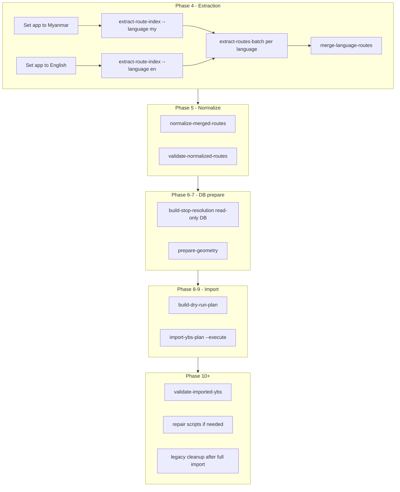

# Transport JSON import pipeline (YBS Go → Supabase)

This folder contains the **full offline pipeline** for importing YBS Go bus route and stop data into CoreMap PostgreSQL (`transport.*` schema via Supabase).

```text
Android YBS Go app (visible UI)
        ↓  ADB + TypeScript (Phase 4)
   Myanmar + English JSON files
        ↓  merge + normalize (Phase 4b–5)
   Clean merged/normalized JSON
        ↓  stop resolution + geometry (Phase 6–7)
   Import-ready artifacts
        ↓  dry-run plan + execute (Phase 8–9)
   transport.* tables in Supabase
        ↓  validate + repair + cleanup (Phase 10+)
   Production-ready bus data
```

**Technology:** All pipeline scripts are **TypeScript** run with `npx tsx`.  
**Database access:** Only scripts under `ybs-supabase-import/` connect to PostgreSQL. Earlier phases are file-only or read-only SELECT.  
**Output location:** `tmp/transport-imports/` (gitignored — never commit raw extraction data).

Canonical AI skill: [`docs/ai/skills/transport-data-extraction/SKILL.md`](../../docs/ai/skills/transport-data-extraction/SKILL.md)

---

## What this pipeline does

| Step | Goal |
|------|------|
| Extract | Read visible route list + stop names from YBS Go on a phone |
| Merge languages | Combine Myanmar and English extractions into one route file |
| Normalize | Clean text, fix sequences, flag bad stop placeholders |
| Stop resolution | Decide reuse vs create for each physical stop (read DB) |
| Geometry | Build temporary straight-line route paths and stop points |
| Import plan | Build full insert/update plan with duplicate + protection checks |
| Import execute | Write routes, variants, stops, paths into `transport.*` |
| Validate | 21-check audit per imported route |
| Repair / cleanup | Fix names, geometry, legacy pre-YBS data |

---

## Languages: Myanmar + English

YBS Go shows route and stop text in **two app languages**. The pipeline extracts **both** separately, then merges them.

| Language | Folder | App setting | Primary fields extracted |
|----------|--------|-------------|--------------------------|
| **Myanmar** (`my`) | `my/routes/` | Burmese UI | `stop_name_my`, `area_text_my`, Myanmar route title |
| **English** (`en`) | `en/routes/` | English UI | `stop_name_en`, `area_text_en`, English route title |

### Why two languages?

- Myanmar text is required for CoreMap local names (`name_mm`, Myanmar labels).
- English text improves search and dashboard display (`name_en`).
- The merge step aligns stops **by sequence** in each direction (`outbound`, `inbound`) and produces one file per route with both languages on each stop row.

### Merge output (schema v3)

```bash
npx tsx tools/data-pipeline/transport-json-import/ybs-extraction/merge-language-routes.ts \
  --run tmp/transport-imports/ybs-all
```

Writes: `merged/routes/{route_code}.json`

Each merged stop row contains:

```json
{
  "sequence": 1,
  "stop_name_my": "ဆူးလေဘူတာ",
  "stop_name_en": "Sule Pagoda",
  "area_text_my": "ကျောက်တံတား",
  "area_text_en": "Kyauktada"
}
```

Merge blocks routes when Myanmar and English stop **counts differ** per direction (`LANGUAGE_DIRECTION_STOP_COUNT_MISMATCH`). No translation is invented — only paired visible text from the app.

### English route display name

`english-route-name.ts` builds `route_name_en` from English endpoint stop names when the app does not provide a clean title (e.g. `Origin · Destination` pattern).

---

## Repository folder structure

```text
tools/data-pipeline/transport-json-import/
├── README.md                 ← this file
│
├── ybs-extraction/           Phase 4 — ADB UI extraction (no DB)
│   ├── adb.ts                ADB shell: dump XML, tap, safe swipe
│   ├── parse-ui-xml.ts       Parse TextViews, detect screen, parse stops
│   ├── extract-route-index.ts    Stage 7: scroll route list
│   ├── extract-current-route.ts  Stage 8: extract open route stops
│   ├── extract-routes-batch.ts   Stage 8 batch
│   ├── merge-language-routes.ts  Merge my + en
│   └── README.md
│
├── ybs-normalize/            Phase 5 — JSON cleanup (no DB)
│   ├── normalize-merged-routes.ts
│   ├── normalization-rules.ts
│   ├── route-display-names.ts
│   └── README.md
│
├── ybs-db-prepare/           Phase 6–7 — stop match + geometry (read-only DB)
│   ├── build-stop-resolution.ts
│   ├── prepare-geometry.ts
│   ├── supabase-stop-match.ts
│   └── README.md
│
└── ybs-supabase-import/      Phase 8–10 + repair + cleanup
    ├── lib/                  shared executor, types, cleanup helpers
    ├── import/               plan + execute + orchestrator
    ├── validate/             post-import checks
    ├── repair/               in-place DB fixes
    ├── cleanup/              test routes + legacy bus cleanup
    ├── generators/           command-sheet markdown generators
    ├── test/                 YBS-1/YBS-2 reference harness
    ├── docs/YBS-IMPORT-WORKFLOW.md
    └── README.md
```

---

## Data folder structure (on disk)

Default run root: `tmp/transport-imports/ybs-all/`

```text
tmp/transport-imports/ybs-all/
├── route-index/
│   ├── route-index-my.json          all routes seen in Myanmar list scroll
│   └── route-index-en.json          all routes seen in English list scroll
│
├── my/routes/YBS-1.json             per-route Myanmar extraction
├── en/routes/YBS-1.json             per-route English extraction
│
├── merged/routes/YBS-1.json         my+en combined (schema v3) ← import input
│
├── normalized/routes/YBS-1.json     Phase 5 cleaned output
│
├── db-prep/
│   ├── stop-usages.json
│   ├── stop-candidates.json
│   ├── stop-resolution-plan.json
│   └── routes-with-geometry.json
│
├── supabase-dry-run/plan.json       Phase 8 full import plan
├── supabase-import/                 Phase 9 per-route results
└── reports/                         phase reports (.json + .md)
```

Per-batch imports use a separate **run-root**, e.g. `tmp/transport-imports/ybs-one-at-a-time/YBS-1/`.

---

## End-to-end flow (all phases)



---

## Phase 4 — Extraction (ADB, no database)

**How it works**

1. Connect Android phone via USB (`adb`).
2. Open YBS Go route list manually on the phone.
3. Script dumps UI XML: `adb shell uiautomator dump`.
4. `parse-ui-xml.ts` reads `TextView` nodes → route names, stop pairs, fares.
5. Script scrolls stop list / route list with **safe swipes only** (never pull-to-refresh).
6. Saves JSON + debug XML + screenshots under `tmp/transport-imports/ybs-all/`.

**Hard safety rule:** Never refresh the YBS route list. Pull-to-refresh causes broken placeholder stops (`မှတ်တိုင် အမှတ်`) and infinite loading.

### Stage 7 — Route index

```bash
npx tsx tools/data-pipeline/transport-json-import/ybs-extraction/extract-route-index.ts \
  --run tmp/transport-imports/ybs-all --language my

npx tsx tools/data-pipeline/transport-json-import/ybs-extraction/extract-route-index.ts \
  --run tmp/transport-imports/ybs-all --language en
```

### Stage 8 — Route detail (per route)

```bash
# Open route on phone first, or use open-route.ts + batch
npx tsx tools/data-pipeline/transport-json-import/ybs-extraction/extract-routes-batch.ts \
  --run tmp/transport-imports/ybs-all \
  --language my \
  --from-index \
  --skip-existing
```

Repeat for `--language en`.

### Merge languages

```bash
npx tsx tools/data-pipeline/transport-json-import/ybs-extraction/merge-language-routes.ts \
  --run tmp/transport-imports/ybs-all
```

Detail: [`ybs-extraction/README.md`](ybs-extraction/README.md)

---

## Phase 5 — Normalization (file only, no database)

**Purpose:** Turn raw merged JSON into consistent, validated files ready for stop resolution.

**Script:** `ybs-normalize/normalize-merged-routes.ts`

### What normalization does

| Rule | Example |
|------|---------|
| Trim whitespace | `"  YBS-1  "` → `"YBS-1"` |
| Empty string → `null` | `""` → `null` |
| `N/A` → `null` | broken English metadata removed |
| Set `route_code` | from `route_code_candidate` |
| Keep only `outbound` + `inbound` | drops invalid directions |
| Renumber stop sequence | starts at 1 per direction |
| Detect dirty stops | blocks `မှတ်တိုင် အမှတ်`, `Bus Details`, `Bus Stops` |
| Add quality metadata | `normalization_status`, score, warnings |

### Status values

| Status | Meaning | Can import? |
|--------|---------|-------------|
| `ready_for_phase6` | Clean | Yes |
| `needs_manual_fix` | Warnings only | Review first |
| `blocked_invalid_structure` | Missing code, zero stops, bad sequence | No |
| `blocked_dirty_stop_data` | Placeholder stop text | No |

```bash
npx tsx tools/data-pipeline/transport-json-import/ybs-normalize/normalize-merged-routes.ts \
  --run tmp/transport-imports/ybs-all

npx tsx tools/data-pipeline/transport-json-import/ybs-normalize/validate-normalized-routes.ts \
  --run tmp/transport-imports/ybs-all
```

**No translation.** Names come only from extraction. Detail: [`ybs-normalize/README.md`](ybs-normalize/README.md)

---

## Phase 6 — Stop resolution (read-only database)

**Purpose:** One physical bus stop → one `transport.stops` row shared by many routes.

**Script:** `ybs-db-prepare/build-stop-resolution.ts`

### Steps

1. Collect every stop usage from all route variants.
2. Normalize matching keys: `normalized_name_my`, `normalized_name_en`, area fields.
3. Group into **stop candidates** (same 4-part key = same physical stop).
4. Query Supabase (SELECT only) for existing stops and `source_links`.
5. Decide per candidate: `reuse_existing_stop`, `create_new_stop`, `needs_manual_review`, `blocked_conflict`.

### Match priority

1. Exact `source_links` match (`stop:ybs_go:…`)
2. Myanmar + English name + compatible area
3. Myanmar name + area
4. English name + area
5. Ambiguous → manual review

Protected rows (`reviewed`, `verified`, `manual_protected`) are never overwritten.

```bash
npx tsx tools/data-pipeline/transport-json-import/ybs-db-prepare/build-stop-resolution.ts \
  --run tmp/transport-imports/ybs-all
```

Detail: [`ybs-db-prepare/README.md`](ybs-db-prepare/README.md)

---

## Phase 7 — Placeholder geometry (file only)

**Purpose:** `transport.stops.geom` and `transport.route_paths.geom` are required NOT NULL. YBS extraction has no GPS — this phase creates **temporary straight-line geometry** for review.

**Script:** `ybs-db-prepare/prepare-geometry.ts`

- Route path: straight line between first and last stop anchor.
- Stops: interpolated along the line by sequence (`ST_LineInterpolatePoint` logic in TS).
- Stored metadata: `geom_status: auto_approximate`, `path_kind: corridor_estimate`, `confidence_score: 5`.
- `review_status`: routes `imported_unreviewed`, paths/stops `needs_review`.

```bash
npx tsx tools/data-pipeline/transport-json-import/ybs-db-prepare/prepare-geometry.ts \
  --run tmp/transport-imports/ybs-all
```

Output: `db-prep/routes-with-geometry.json`

---

## Phase 8 — Dry-run import plan (read-only database)

**Purpose:** Build a complete insert/update plan **without writing**.

**Script:** `ybs-supabase-import/import/build-dry-run-plan.ts`

The plan includes:

- `import_batches` row
- operator, route, route_names (my + en), variants
- stops, stop_names, route_stops, route_paths, fares
- `source_links` for every entity
- blockers, conflicts, warnings

### Source lineage (required for every import)

| Field | Value |
|-------|-------|
| `source_name` | `external_ybs_app` |
| `source_kind` | `ybs_go` |
| Route external_id | `route:ybs_go:YBS-1` |
| Stop external_id | `stop:ybs_go:YBS-1:outbound:seq:1` |

```bash
npx tsx tools/data-pipeline/transport-json-import/ybs-supabase-import/import/build-dry-run-plan.ts \
  --run tmp/transport-imports/ybs-all
```

---

## Phase 9 — Execute import (database writes)

**Purpose:** Apply the plan for **one route per transaction**.

**Scripts:**

- `import/import-ybs-plan.ts` — single route
- `import/run-ybs-import-workflow.ts` — orchestrator (phases 5–10)
- `import/bulk-import-ybs.ts` — alternate batch importer

### Import order (one transaction per route)

```text
import_batches → operators → routes → route_names → route_variants
→ stops → stop_names → route_stops → route_paths → fares → source_links
```

### Review status on insert

| Entity | Default status |
|--------|----------------|
| routes, variants, operators | `imported_unreviewed` |
| stops, route_paths | `needs_review` |

Never set `verified` on import.

### Safety

| Rule | Flag |
|------|------|
| Default | dry-run (no writes) |
| Execute | `--execute` |
| Confirm | `--confirm-import` |
| All routes | also `--confirm-all-routes` |
| Placeholder geometry | `--allow-placeholder-geometry` |
| High-risk routes | `--allow-high-risk` |

```bash
# Single route execute
npx tsx tools/data-pipeline/transport-json-import/ybs-supabase-import/import/import-ybs-plan.ts \
  --run tmp/transport-imports/ybs-all \
  --route-code YBS-1 \
  --execute
```

Detail: [`ybs-supabase-import/README.md`](ybs-supabase-import/README.md)

---

## Recommended: orchestrator (Phases 5–10 in one command)

When merged JSON already exists, use the orchestrator instead of running each phase manually.

```bash
# Dry-run
npx tsx tools/data-pipeline/transport-json-import/ybs-supabase-import/import/run-ybs-import-workflow.ts \
  --source-dir tmp/transport-imports/ybs-all/merged/routes \
  --routes YBS-1 \
  --run-root tmp/transport-imports/ybs-one-at-a-time/YBS-1 \
  --dry-run \
  --allow-placeholder-geometry \
  --allow-high-risk

# Execute (manual — review dry-run report first)
npx tsx tools/data-pipeline/transport-json-import/ybs-supabase-import/import/run-ybs-import-workflow.ts \
  --source-dir tmp/transport-imports/ybs-all/merged/routes \
  --routes YBS-1 \
  --run-root tmp/transport-imports/ybs-one-at-a-time/YBS-1 \
  --execute \
  --allow-placeholder-geometry \
  --allow-high-risk \
  --confirm-import
```

**All routes (146):** add `--all-routes` and use `--confirm-all-routes` on execute.

Batch recipes: [`ybs-supabase-import/docs/YBS-IMPORT-WORKFLOW.md`](ybs-supabase-import/docs/YBS-IMPORT-WORKFLOW.md)

---

## Phase 10 — Validation (read-only database)

**Script:** `validate/validate-imported-ybs.ts` — **21 checks** per route:

- route + source_link exists
- my/en `route_names`
- outbound + inbound variants with source_links
- route_stops sequence contiguous from 1
- every stop has geom + name + source_link
- no placeholder stop names
- route_path geom exists
- public tile visibility rules

```bash
npx tsx tools/data-pipeline/transport-json-import/ybs-supabase-import/validate/validate-imported-ybs.ts \
  --run-root tmp/transport-imports/ybs-one-at-a-time/YBS-1 \
  --route-code YBS-1
```

**All routes audit:**

```bash
npx tsx tools/data-pipeline/transport-json-import/ybs-supabase-import/validate/validate-all-imported-bus.ts \
  --source-dir tmp/transport-imports/ybs-all/merged/routes \
  --run-root tmp/transport-imports/ybs-import-audit-5
```

---

## Post-import tasks

### Repair (in-place DB fixes)

| Task | Script |
|------|--------|
| Broken display names | `repair/repair-ybs-route-names.ts` or `repair/repair-imported-route-names.ts` |
| Name quality audit | `repair/report-route-name-quality.ts` |
| Scattered map markers | `repair/repair-route-stop-review-geometry.ts` |
| **Manual real stop coordinates (all YBS placeholder stops)** | `reports/report-placeholder-bus-stops.ts` + `repair/update-placeholder-stop-geometry.ts` |
| Shared in/out stop_id | `repair/split-opposite-direction-stops.ts` |
| Wrong source_link entity_id | `repair/repair-stop-source-link-targets.ts` |

All repair scripts default to dry-run. Pass `--execute` to write.

### Manual placeholder stop geometry (bus, JSON + command)

Same pattern as train import: list placeholder stops, edit one JSON file, apply with a repair script.

Follow the `transport-data-extraction` skill for safe review rules. Do not overwrite `verified` or `manual_protected` stops.

```bash
# 1) Read-only report (all YBS placeholder / manual_reviewed bus stops)
npx tsx tools/data-pipeline/transport-json-import/ybs-supabase-import/reports/report-placeholder-bus-stops.ts

# Optional: only stops used on one route
npx tsx tools/data-pipeline/transport-json-import/ybs-supabase-import/reports/report-placeholder-bus-stops.ts \
  --route-code YBS-1

# 2) Generate editable template (current lon/lat + TODO notes)
npx tsx tools/data-pipeline/transport-json-import/ybs-supabase-import/reports/report-placeholder-bus-stops.ts \
  --write-input-template

# 3) Edit coordinates in:
#    tmp/transport-imports/reviewed-stop-geometry.json

# 4) Dry-run, then execute
npx tsx tools/data-pipeline/transport-json-import/ybs-supabase-import/repair/update-placeholder-stop-geometry.ts
npx tsx tools/data-pipeline/transport-json-import/ybs-supabase-import/repair/update-placeholder-stop-geometry.ts --execute
```

Input JSON shape (one object per stop):

```json
[
  {
    "stop_id": 12345,
    "name_en": "Example Stop",
    "lon": 96.12345,
    "lat": 16.78901,
    "review_note": "manual map pin / OSM / app screenshot"
  }
]
```

The update script writes:

- `transport.stops.geom` and `normalized_data.geometry_status = manual_reviewed`
- `transport.route_stops.review_geom` for YBS usages (map display prefers `review_geom` when set)

Reports:

- `tmp/transport-imports/reports/placeholder-bus-stops-review.json`
- `tmp/transport-imports/reports/update-placeholder-stop-geometry.json`

### Test route cleanup

Remove one YBS test import to re-import cleanly:

```bash
npx tsx tools/data-pipeline/transport-json-import/ybs-supabase-import/cleanup/cleanup-test-ybs-route.ts \
  --route-code YBS-2 \
  --require-status imported_unreviewed \
  --execute
```

### Legacy bus cleanup (after full Phase B import)

Removes **pre-YBS legacy bus routes** (no `route:ybs_go:%` source link). Bus mode only.

```text
1. cleanup/report-legacy-cleanup-candidates.ts   (read-only)
2. cleanup/cleanup-legacy-bus-routes.ts --dry-run
3. cleanup/cleanup-legacy-bus-routes.ts --execute --confirm-legacy-route-cleanup
4. validate/validate-legacy-route-cleanup.ts --expect-zero
5. cleanup/report-orphan-legacy-stops.ts
6. cleanup/cleanup-orphan-legacy-stops.ts --dry-run
7. cleanup/cleanup-orphan-legacy-stops.ts --execute --confirm-orphan-stop-cleanup
```

Reports: `tmp/transport-imports/legacy-cleanup/`

---

## Prerequisites

### Environment

```bash
# Required for phases 6+ (read or write)
# In apps/api/.env:
SUPABASE_DIRECT_DATABASE_URL=postgresql://...
# or DATABASE_URL=postgresql://...
```

### Phase 4 only

- `adb` in PATH
- YBS Go (`com.ybsgo.app`) on connected Android device
- USB debugging enabled
- Route list open on phone before scripts run

### Database rules (CoreMap architecture)

- **Only** `ybs-supabase-import/` scripts write to `transport.*`
- Dashboard and web app never connect directly to PostgreSQL for imports
- All imports use `import_batches` + `source_links` for audit trail
- Protected rows (`reviewed`, `verified`, `manual_protected`) are never silently overwritten

---

## Typical production order

```text
1. Extract Myanmar + English (Phase 4)
2. Merge languages
3. Import via orchestrator — dry-run, review, execute (Phases 5–9)
4. Validate all routes (Phase 10)
5. Repair names/geometry if validation fails
6. Legacy cleanup (only after all YBS routes imported)
7. Manual review in transport dashboard (geometry, names, verification)
```

---

## Quick reference — which script for which job

| I want to… | Script |
|------------|--------|
| Extract route list | `ybs-extraction/extract-route-index.ts` |
| Extract route stops | `ybs-extraction/extract-routes-batch.ts` |
| Merge my + en | `ybs-extraction/merge-language-routes.ts` |
| Clean JSON | `ybs-normalize/normalize-merged-routes.ts` |
| Match stops to DB | `ybs-db-prepare/build-stop-resolution.ts` |
| Add placeholder geometry | `ybs-db-prepare/prepare-geometry.ts` |
| Build import plan | `ybs-supabase-import/import/build-dry-run-plan.ts` |
| Import one route | `ybs-supabase-import/import/import-ybs-plan.ts` |
| Import full workflow | `ybs-supabase-import/import/run-ybs-import-workflow.ts` |
| Validate import | `ybs-supabase-import/validate/validate-imported-ybs.ts` |
| Remove test route | `ybs-supabase-import/cleanup/cleanup-test-ybs-route.ts` |
| Remove legacy bus data | `ybs-supabase-import/cleanup/cleanup-legacy-bus-routes.ts` |

---

## Related documentation

| File | Topic |
|------|-------|
| [`ybs-extraction/README.md`](ybs-extraction/README.md) | ADB safety, Stage 7/8, screen detection |
| [`ybs-normalize/README.md`](ybs-normalize/README.md) | Normalization status values |
| [`ybs-db-prepare/README.md`](ybs-db-prepare/README.md) | Stop matching, geometry rules |
| [`ybs-supabase-import/README.md`](ybs-supabase-import/README.md) | Phase 8–10, external IDs |
| [`ybs-supabase-import/docs/YBS-IMPORT-WORKFLOW.md`](ybs-supabase-import/docs/YBS-IMPORT-WORKFLOW.md) | Batch command recipes |
| [`docs/ai/skills/transport-data-extraction/SKILL.md`](../../docs/ai/skills/transport-data-extraction/SKILL.md) | AI agent rules for this workflow |
